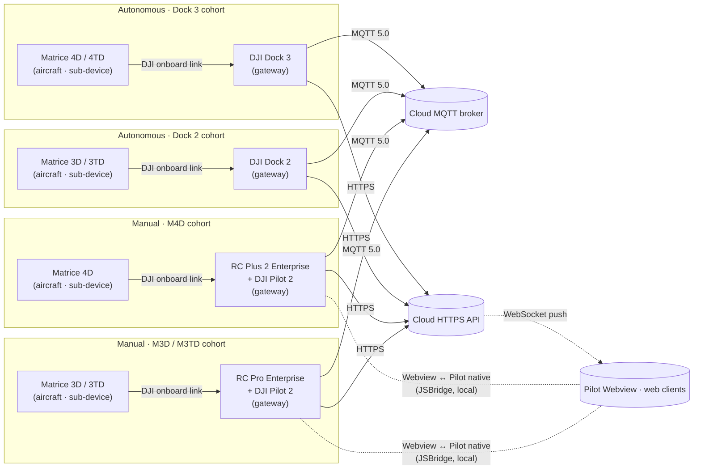

# Architecture Overview

Orientation to the shape of the DJI Cloud API — transports, the device-edge-cloud model, the thing model, topic taxonomy, and how the in-scope devices connect.

This document establishes shared vocabulary for the rest of the corpus. It links to canonical catalogs rather than duplicating them: when a detail has a canonical home (HTTP envelope, MQTT envelope, WebSocket envelope, device enums, topic list), the home is cited and the detail is not restated here.

---

## 1. In-scope devices

This corpus covers the wire contract for two parallel device cohorts:

**Current generation (Dock 3 cohort)**
- **DJI Dock 3**
- **Matrice 4D** (M4D)
- **Matrice 4TD** (M4TD)
- **RC Plus 2 Enterprise** running DJI Pilot 2 — the RC paired with the M4D. Distinct from the earlier RC Plus Enterprise; `DeviceEnum.java` in `dji_cloud_dock3/` carries both `RC_PLUS` and `RC_PLUS_2` as separate entries.

**Older generation (Dock 2 cohort)**
- **DJI Dock 2**
- **Matrice 3D** (M3D)
- **Matrice 3TD** (M3TD)
- **RC Pro Enterprise** running DJI Pilot 2 — the RC paired with the M3D / M3TD. `DeviceTypeEnum.RC_PRO` (type 144) in `dji_cloud_dock3/`.

Out of scope: Dock 1, Matrice 30 / 30T, Matrice 300 / 350 RTK, Mavic 3 Enterprise, Matrice 400 — and all server-side implementation choices. See [`/CLAUDE.md`](../../CLAUDE.md) for the full scope contract.

## 2. Source coverage note

The two DJI documentation sources in this repo are different **versions** of the Cloud API docs:

- `Cloud-API-Doc/` is **Cloud API v1.11.3**. It predates Dock 3 and the Matrice 4 family. Its `docs/{en,cn}/` trees have zero mentions of `Dock 3`, `M4D`, or `M4TD`.
- `DJI_Cloud/*.txt` is a **Cloud API v1.15** extraction from `developer.dji.com/doc/cloud-api-tutorial/en/`. Sixty-seven files produced by two pipelines — hand-driven MHTML dumps (`extract_mhtml.py`) plus a headless Playwright scrape of the entire `/api-reference/` section on 2026-04-18 (`scrape_api_reference.py`). See [`../SOURCES.md`](../SOURCES.md) §3 for the full file inventory. Every captured file was sourced from a page carrying the `Cloud API v1.15` navigation header (the extractor strips that header during conversion). This is the only in-repo DJI-written source that names our in-scope devices — `Cloud-API-Doc/` (v1.11.3) has zero matches for `Dock 3`, `M4D`, or `M4TD`.

Authority ranking and conflict-resolution policy for this mismatch are in [`../SOURCES.md`](../SOURCES.md); the open-question entry is [`OQ-001`](../OPEN-QUESTIONS.md#oq-001--source-version-mismatch-between-cloud-api-doc-v1113-and-dji_cloud-v115).

Every architecture statement in this document that is specific to Dock 3 / M4D / M4TD cites `DJI_Cloud/*.txt`. Statements that describe generic Cloud API architecture (transports, thing model, topic taxonomy) cite `Cloud-API-Doc/` where the language is identical across versions.

## 3. The device-edge-cloud model

DJI's own framing (verbatim):

> the Cloud API is an interface set based on the DJI industrial drones. The overall idea adopts the layering of the device-edge-cloud architecture similar to the Internet of Things. The drone cannot be directly connected to the third-party cloud platform. It needs to connect to the gateway device first such as DJI RC Plus, DJI Dock, and then indirectly connect to the cloud through the DJI Pilot 2 in the remote controller and the DJI Dock.

— `[Cloud-API-Doc/docs/en/10.overview/20.product-architecture.md]`

Two architectural roles matter for every topic, payload, and workflow in this corpus:

- **Gateway device** — the device that terminates the network connection to the cloud. For the in-scope devices that is either a **Dock 3** or an **RC Plus 2 Enterprise running DJI Pilot 2**.
- **Sub-device** — the aircraft (M4D or M4TD). It is addressable on the wire but does not itself hold the connection.

The distinction surfaces directly in topic formatting — see §7.

DJI's own proper-noun definitions for these and other terms used throughout the corpus are in `[Cloud-API-Doc/docs/en/10.overview/40.basic-concept/10.proper-noun.md]`; they are not restated here.

## 4. In-scope gateway topologies

Four distinct gateway topologies — two autonomous (Dock 2 / Dock 3) and two manual (RC Pro / RC Plus 2).

Notes on this diagram:

- Autonomous topologies run without an RC in the loop — the Dock holds the cloud connection and the aircraft is its sub-device.
- Manual topologies carry the aircraft as the sub-device but the gateway role shifts to the RC + Pilot 2 combo. JSBridge only applies to manual topologies (no Pilot in the autonomous Dock paths).
- JSBridge is a **local** Webview ↔ Pilot-native bridge inside the RC, not a server-facing protocol. See §5.4.
- Media transports (RTMP / GB28181 / WebRTC / Agora) are separate data-plane streams that run alongside the control plane shown here; see §5.5.
- The two dock generations use **the same** MQTT envelope, topic taxonomy, HTTPS conventions, and WebSocket conventions — divergence between them is at the content level (different properties in OSD / state, different services, different events), not the transport level. See §7 and per-path MQTT catalogs (Phase 4).

## 5. Transports

DJI's framing (verbatim):

> DJI Cloud API mainly uses the HTTPS, WebSocket and MQTT protocol commonly used in the industry to abstract the capability of the drone into an Internet of things device.

— `[Cloud-API-Doc/docs/en/10.overview/10.product-introduction.md]`

The transports are catalogued in detail in Phase 2–5 docs. This section states what each one is used for and where its canonical definition lives.

### 5.1 MQTT 5.0

The bidirectional control-plane protocol between the gateway device and the cloud. Carries the thing-model traffic: device properties (OSD / state), services (command/response), events, property sets, requests, and DRC (real-time flight control).

- Protocol: **MQTT 5.0** (`[Cloud-API-Doc/docs/en/10.overview/40.basic-concept/20.mqtt.md]`).
- Topic prefixes: `sys/` (basic lifecycle) and `thing/` (thing model).
- Envelope and topic taxonomy: canonical in [`mqtt/README.md`](../mqtt/) (Phase 2) and per-topic docs (Phase 4). Not restated here.
- v1.15 topic list for the in-scope devices: `[DJI_Cloud/DJI_CloudAPI-TopicDefinitions.txt]`.

### 5.2 HTTPS

The request/response plane for resource management (workspaces, waylines, media, livestream lifecycle, devices, users) and for the credential-exchange step in the Pilot topology.

- URI form, headers, status-code mapping, response envelope: canonical in `[Cloud-API-Doc/docs/en/10.overview/40.basic-concept/40.https.md]`, recast as the corpus HTTP protocol reference in [`http/README.md`](../http/) (Phase 2) and per-endpoint docs (Phase 3). Not restated here.
- Auth: token via `X-Auth-Token` header; issued during the Pilot Webview login exchange (see §8).

### 5.3 WebSocket

Server-to-client push channel used for near-real-time notifications to DJI Pilot 2 and cloud web clients (device topology updates, HMS events, livestream state changes, etc.).

- Envelope (`biz_code`, `version`, `timestamp`, `data`) and URL delivery path: canonical in `[Cloud-API-Doc/docs/en/10.overview/40.basic-concept/50.websocket.md]`, recast as the corpus WebSocket protocol reference in [`websocket/README.md`](../websocket/) (Phase 2) and per-message docs (Phase 5). Not restated here.

### 5.4 JSBridge (local, not server-facing)

JSBridge is the two-way communication mechanism between a DJI Pilot 2 Webview and its Pilot native host, not a wire protocol between a device and the cloud:

> Through JSBridge, the Web end can call the Native side's Java interface, and the Native side can also call the Web side's JavaScript interface through JSBridge, realizing the two-way call to each other.
>
> — `[Cloud-API-Doc/docs/en/10.overview/40.basic-concept/60.jsbridge.md]`

It appears in the RC-paired topology because that is where Pilot 2 runs. It does not apply to the Dock 3 topology (no Pilot, no Webview). DJI publishes a JSBridge API spec — captured verbatim as `[DJI_Cloud/DJI_CloudAPI_Pilot-JSBridge.txt]` — describing the Webview-to-native calls available inside Pilot 2. Those calls do not themselves cross the network to the cloud; they configure or extract state the Pilot then uses to talk to the cloud over MQTT/HTTPS/WebSocket. See [`device-annexes/rc-m4d.md`](../device-annexes/) (Phase 10) for the RC-specific JSBridge interface surface. No canonical JSBridge catalog will live under a transport directory — the catalog belongs with the RC annex.

### 5.5 Media transports

Live video from the Dock or aircraft is not carried over MQTT. It flows over a separate media transport negotiated at stream start. The in-scope transports are **RTMP**, **GB28181**, **WebRTC**, and **Agora**. The control signaling that starts and stops these streams lives in the MQTT services catalog and the HTTPS livestream endpoints; the media-plane protocol specifics live in [`livestream-protocols/`](../livestream-protocols/) (Phase 7).

## 6. Thing model

DJI's summary of the thing model (verbatim):

> The Thing Model TSL (Thing Specification Language) is a JSON formatted file. It is an entity in physical space, such as drones, cameras, DJI Docks, etc. In the cloud, the digital representation describes what the entity is, what it can do, and what information it can provide to the public in three dimensions: properties, services, and events.
>
> — `[Cloud-API-Doc/docs/en/10.overview/40.basic-concept/30.thing-model.md]`

The three dimensions (property / service / event) map onto MQTT topic families:

- **Properties** → `thing/product/{device_sn}/osd` (high-frequency push), `thing/product/{device_sn}/state` (on-change push), and `thing/product/{gateway_sn}/property/set` (cloud-initiated set).
- **Services** → `thing/product/{gateway_sn}/services` and `.../services_reply`.
- **Events** → `thing/product/{gateway_sn}/events` and `.../events_reply`.

Per-device thing-model content — property lists, service signatures, event taxonomies — is canonical in [`device-properties/`](../device-properties/) (Phase 6). The overall topic-to-dimension mapping is cataloged in [`mqtt/README.md`](../mqtt/) (Phase 2). Neither is restated here.

## 7. Topic taxonomy (structural only)

The topic namespace has two roots (verbatim from `[Cloud-API-Doc/docs/en/10.overview/40.basic-concept/20.mqtt.md]`):

| Category          | Topic prefix | Explanation                                                                                                                                         |
| ----------------- | ------------ | --------------------------------------------------------------------------------------------------------------------------------------------------- |
| Basic Topic       | `sys/`       | Any device has common cloud functionality, such as device registration, device lifecycle status updates and so on.                                   |
| Thing Model Topic | `thing/`     | The Topic that supports the implementation of the functions defined by each device thing model mainly revolves around Property, Service, and Event. |

One architectural distinction is worth calling out here because it is not explicit in DJI's own overview: different thing-model topic families are parameterized by **different serial numbers**. The v1.15 topic catalog at `[DJI_Cloud/DJI_CloudAPI-TopicDefinitions.txt]` (lines 213–229) shows:

- `thing/product/{device_sn}/osd` and `thing/product/{device_sn}/state` — addressed by the **sub-device SN** (e.g., the aircraft's SN when the aircraft is the property source).
- `thing/product/{gateway_sn}/services`, `.../events`, `.../requests`, `.../property/set`, `.../drc/up`, `.../drc/down`, and `sys/product/{gateway_sn}/status` — addressed by the **gateway SN** (Dock 3 or RC).

A cloud implementation therefore has to know, for every device it sees, which gateway owns it — a mapping the gateway itself publishes on `sys/product/{gateway_sn}/status` (topology updates). The full authoritative topic catalog is [`mqtt/README.md`](../mqtt/) (Phase 2) and per-topic docs (Phase 4). This document only states the `device_sn` vs `gateway_sn` convention; it does not restate the topic list.

## 8. Authentication and binding

Two mechanisms operate together:

1. **License-backed device binding to an organization.** Dock 3 and Pilot both verify a DJI-issued License before being allowed to bind to a third-party cloud's organization. The binding is driven by MQTT `method` calls on `thing/product/{gateway_sn}/requests` — specifically `config` (License parameters), `airport_bind_status`, `airport_organization_get`, and `airport_organization_bind`. The canonical sequence for the Dock case is `[Cloud-API-Doc/docs/en/30.feature-set/20.dock-feature-set/10.dock-access-to-cloud.md]`; the v1.15 Dock 3-specific counterpart is `[DJI_Cloud/DJI_CloudAPI-Dock3-DeviceManagement.txt]`. The corpus workflow is [`workflows/device-binding.md`](../workflows/) (Phase 9).
2. **Per-request HTTPS auth.** After the Pilot Webview login, the cloud returns a token that Pilot carries on every subsequent HTTPS request as the `X-Auth-Token` header. Same header convention applies to any Dock-originated HTTPS call. Canonical header list: `[Cloud-API-Doc/docs/en/10.overview/40.basic-concept/40.https.md]`.

TLS terms apply to both MQTT and HTTPS links:

> DJI Pilot 2 and DJI Dock support certificates issued by Godaddy. If developers need data security encryption, they can use the same certification authority certificate as DJI to achieve MQTT SSL authentication.
>
> — `[Cloud-API-Doc/docs/en/30.feature-set/20.dock-feature-set/10.dock-access-to-cloud.md]`

## 9. Online, disconnected, offline

DJI distinguishes three states (verbatim):

> Indicates the network status of the device, which can be divided into online, disconnected and offline. Disconnected for the persistent connection of the device without notification, can be understood as the network caused by offline. Offline is triggered by human consciousness, such as task completion, gateway device shutdown and other actions triggered.
>
> — `[Cloud-API-Doc/docs/en/10.overview/40.basic-concept/10.proper-noun.md]`

State transitions are published on `sys/product/{gateway_sn}/status` (topology + lifecycle) — canonical in the MQTT catalog.

## 10. What this document is not

- Not a schema reference. Envelopes, topic payloads, HTTP request/response bodies, and WebSocket message bodies are defined in the transport catalogs (Phase 2–5). Never duplicate them here.
- Not a device catalog. Device `type`/`sub_type` enums for in-scope and older devices are canonical in [`device-properties/README.md`](../device-properties/) (Phase 6). Never list enums here.
- Not a workflow reference. Binding, wayline execution, livestream, HMS, firmware, DRC, and other choreographies live in [`workflows/`](../workflows/) (Phase 9).
- Not a runtime behavior reference. State transitions, retry behavior, and error semantics attach to specific topics and endpoints and live in their respective catalog entries.

## 11. Source provenance summary

Sources this document draws on directly:

| Source | Role in this doc |
|---|---|
| `[Cloud-API-Doc/docs/en/10.overview/10.product-introduction.md]` | Core ideology quote (§5) |
| `[Cloud-API-Doc/docs/en/10.overview/20.product-architecture.md]` | Device-edge-cloud model quote (§3) |
| `[Cloud-API-Doc/docs/en/10.overview/40.basic-concept/10.proper-noun.md]` | Proper-noun definitions (§3, §9) |
| `[Cloud-API-Doc/docs/en/10.overview/40.basic-concept/20.mqtt.md]` | MQTT 5.0 reference and topic-prefix table (§5.1, §7) |
| `[Cloud-API-Doc/docs/en/10.overview/40.basic-concept/30.thing-model.md]` | Thing-model TSL quote (§6) |
| `[Cloud-API-Doc/docs/en/10.overview/40.basic-concept/40.https.md]` | HTTPS envelope + `X-Auth-Token` header (§5.2, §8) |
| `[Cloud-API-Doc/docs/en/10.overview/40.basic-concept/50.websocket.md]` | WebSocket envelope pointer (§5.3) |
| `[Cloud-API-Doc/docs/en/10.overview/40.basic-concept/60.jsbridge.md]` | JSBridge definition quote (§5.4) |
| `[Cloud-API-Doc/docs/en/30.feature-set/20.dock-feature-set/10.dock-access-to-cloud.md]` | Dock binding sequence + TLS quote (§8) |
| `[DJI_Cloud/DJI_CloudAPI-TopicDefinitions.txt]` | v1.15 topic list for the `device_sn` vs `gateway_sn` distinction (§7) |
| `[DJI_Cloud/DJI_CloudAPI-Dock3-DeviceManagement.txt]` | Dock 3-specific v1.15 binding reference (§8) |

No information from these sources is paraphrased when a verbatim quote would carry the same load. Where a quote is used, it is fenced as a blockquote and immediately followed by a provenance citation.

Third-party material in `dji_cloud_dock3/` is not cited in this document. Its enum definitions are noted in `device-properties/` (Phase 6) as corroboration only; it is never authoritative.
