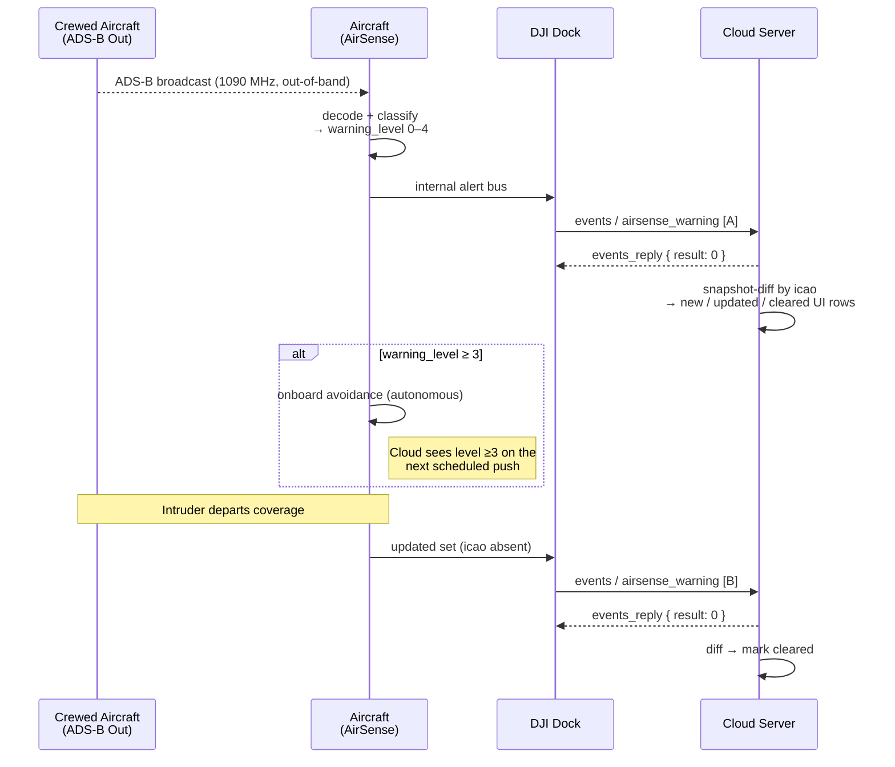

# AirSense ADS-B traffic alerting

How the aircraft reports detected nearby crewed aircraft — their identity, position, heading, and relative altitude — so the cloud can raise operator alerts and the flight controller can trigger avoidance logic at higher severity levels. AirSense is DJI's ADS-B receiver product on M3 and M4 Enterprise airframes; the cloud path is a single `airsense_warning` event pushed over the dock link.

Part of the Phase 9 workflow catalog. Wire-level schema lives in Phase 4f.

---

## Scope

| Aspect | Value |
|---|---|
| Cohorts | **Dock 2 + M3D / M3TD** and **Dock 3 + M4D / M4TD**. AirSense is an aircraft-resident ADS-B receiver; only dock-connected aircraft surface warnings over the Cloud API. Pilot-path does not carry `airsense_warning`. |
| Direction | Device → cloud push. `need_reply: 1` — cloud must acknowledge with `events_reply`. |
| Transports | **MQTT** only. ADS-B 1090 MHz receive happens on the aircraft itself; no RF data reaches the cloud, only the decoded warning payload. |
| Preceding workflow | [`dock-bootstrap-and-pairing.md`](dock-bootstrap-and-pairing.md) + [`device-binding.md`](device-binding.md). AirSense does not require flight-mode entry — warnings can fire anytime the aircraft is powered and an airborne crewed aircraft is nearby. |
| Related catalog entries | Phase 4f event: [`airsense_warning`](../mqtt/dock-to-cloud/events/airsense_warning.md). |

## Overview

AirSense receives ADS-B broadcasts from nearby crewed aircraft, evaluates their proximity and trajectory against the drone's current position, and classifies the encounter on a five-level severity scale. Whenever the classification transitions — a new intruder enters, an existing intruder's level changes, or an intruder exits — the aircraft pushes the **current active set** of intruder structs as an `airsense_warning` event. Behaviour mirrors [`hms`](../mqtt/dock-to-cloud/events/hms.md) at the snapshot level: there is no separate "clear" message; an ICAO absent from the next push is no longer a threat.

Unlike HMS, however, each push carries a meaningful `warning_level` per intruder that the flight controller may act on autonomously:
- Levels **`0`–`2`** (No danger / Level One / Level Two) are informational — the cloud displays them but the flight controller takes no autonomous action.
- Levels **`3`–`4`** (Level Three / Level Four) are proximity hazards. DJI's v1.15 Dock 3 documentation notes that levels `3` and above "should trigger avoidance" — the aircraft's onboard avoidance logic reacts without waiting for the cloud.

The cloud's job is to render the intruder set on the operator's map, correlate against known flight geometry, and escalate to the human operator when levels rise.

## Actors

| Actor | Role |
|---|---|
| **Crewed aircraft** | Broadcasting 1090 MHz ADS-B Out. Not a protocol peer — it just exists in the sky. |
| **Aircraft AirSense receiver** | Decodes ADS-B Out broadcasts, computes proximity, classifies severity. |
| **Aircraft flight controller** | Consumes the in-process classification; at level `≥3` may initiate avoidance independent of cloud. |
| **DJI Dock** | Relays the warning event upstream. |
| **Cloud Server** | Parses the warning array, updates operator UI, correlates with mission state. Acknowledges with `events_reply`. |

## Sequence



Payloads (verbatim from [`events/airsense_warning.md`](../mqtt/dock-to-cloud/events/airsense_warning.md) — DJI source):

**[A]** — active-set push on `thing/product/{gateway_sn}/events`:

```json
{
  "bid": "xxxxxxxx-xxxx-xxxx-xxxx-xxxxxxxxxx",
  "data": [
    {
      "altitude": 100,
      "altitude_type": 1,
      "distance": 100,
      "heading": 89.1,
      "icao": "B-5931",
      "latitude": 12.23,
      "longitude": 12.23,
      "relative_altitude": 80,
      "vert_trend": 0,
      "warning_level": 3
    }
  ],
  "need_reply": 1,
  "tid": "xxxxxxxx-xxxx-xxxx-xxxx-xxxxxxxxxx",
  "timestamp": 16540709686556,
  "method": "airsense_warning"
}
```

Field legend (non-obvious enums):

- `warning_level` — `0` No danger · `1` Level One · `2` Level Two · `3` Level Three (aircraft triggers onboard avoidance) · `4` Level Four.
- `altitude_type` — `0` ellipsoidal · `1` altitude above sea level.
- `vert_trend` — `0` relative altitude unchanged · `1` increasing (closing vertically) · `2` decreasing.
- `distance` — metres, horizontal.
- `relative_altitude` — metres, positive = intruder above the drone.
- `timestamp` — 14 digits in DJI's own example (canonical epoch-ms is 13 digits; carried-forward source typo, see [`flight_areas_drone_location.md`](../mqtt/dock-to-cloud/events/flight_areas_drone_location.md#source-inconsistencies-flagged-by-djis-own-example)).

`events_reply` envelope: `{ "data": { "result": 0 }, "tid": ..., "bid": ..., "timestamp": ..., "method": "airsense_warning" }`.

**[B]** — clear push: same envelope as [A]; `data` array now omits the departed intruder's struct. No explicit "cleared" field — the cloud discovers the clear via snapshot diff by `icao`.

## Step-by-step

### 1. ADS-B receive on the aircraft

AirSense-equipped aircraft (M3 Enterprise, M4 Enterprise families) include a 1090 MHz ADS-B Out receiver. The Cloud API doesn't model this physical layer — it surfaces only the decoded and classified warnings. Aircraft without AirSense hardware never emit `airsense_warning` regardless of environment.

### 2. Severity classification

The aircraft classifies each decoded intruder on this scale:

| `warning_level` | Label | Meaning |
|---|---|---|
| `0` | No danger | Far / diverging. Informational — cloud may suppress if noisy. |
| `1` | Level One | Caution. |
| `2` | Level Two | Advisory — aircraft not yet reacting. |
| `3` | Level Three | Proximity hazard. Aircraft may initiate avoidance. |
| `4` | Level Four | Imminent conflict. Aircraft avoidance is likely active. |

DJI does not publish the distance / relative-altitude / closure-rate thresholds that drive the classification — treat the levels as authoritative and the raw geometry as diagnostic.

### 3. Event push (`method: airsense_warning`)

- **Topic:** `thing/product/{gateway_sn}/events`. **Method:** `airsense_warning`. Full schema: [`airsense_warning.md`](../mqtt/dock-to-cloud/events/airsense_warning.md).
- **`data` is an array, not an object.** Unusual for the corpus — most events wrap their content in a struct. Each array element is one detected airplane. Absent a specific bound in DJI's documentation, treat the array as unbounded but typically small (0–3 intruders in any single push).
- **`need_reply: 1`** — cloud must acknowledge with `{ result: 0 }` on `events_reply`. The reply is transport-level only; it does not propagate back to the flight controller.
- Per-intruder fields the cloud must render:

| Field | Meaning |
|---|---|
| `icao` | ICAO civil-aviation transponder address — unique identifier of the crewed aircraft. The cloud's persistence key across pushes. |
| `warning_level` | See level table above. |
| `latitude` / `longitude` | WGS-84 position, 6-decimal precision. Cloud draws on the same map as the drone. |
| `altitude` | Absolute altitude, meters. Interpretation per `altitude_type`. |
| `altitude_type` | `0` = ellipsoidal altitude; `1` = altitude above mean sea level. Cloud must distinguish to compare against its own altitude model. |
| `heading` | True-north referenced, 0–360°, 1-decimal precision. |
| `relative_altitude` | Positive = intruder above the drone, negative = below, meters. Drives most of the cloud's "is this a threat?" visualization. |
| `vert_trend` | `0` = unchanging, `1` = closing vertically, `2` = diverging vertically. Independent signal from `warning_level`; useful for trend arrows in the UI. |
| `distance` | Horizontal distance drone-to-intruder, meters. |

### 4. Cloud-side snapshot diff

Similar to HMS, each `airsense_warning` push is a full snapshot of the active intruder set. The cloud diffs by `icao`:

| Transition | UI action |
|---|---|
| `icao` present now, absent previously | New intruder — raise toast, plot on map. |
| `icao` present both pushes | Persistent — update position / level / trend. |
| `icao` absent now, present previously | Cleared — remove from active set. |

Cloud UIs typically retain cleared intruders in a short-lived history (past 60 s) so operators can see what just flew away.

### 5. Events-reply acknowledgement

- **Topic:** `thing/product/{gateway_sn}/events_reply`. Same `tid` / `bid` as the incoming event.
- **Payload:** `{ data: { result: 0 } }`. Non-zero is reserved for a transport-level error only.
- The reply does **not** travel down to the flight controller. Autonomous avoidance at level `≥3` is local to the aircraft and is already in progress by the time the cloud has acknowledged.

## Variants

### No-hardware cohort

AirSense is not universal across DJI airframes. Cloud implementers should not treat `airsense_warning` as guaranteed to arrive on any given flight — absent hardware, no events fire. For the in-scope cohorts:
- **M3D / M3TD** — AirSense-equipped.
- **M4D / M4TD** — AirSense-equipped.
- Other airframes (not in scope) vary.

The cloud cannot query hardware presence directly over the corpus wire; observing `airsense_warning` within the first hour after bind is the practical test.

### `data` shape is an array

A single multi-intruder scenario produces one event with multiple array elements, not multiple events. The cloud must iterate `data[]` and the envelope carries a single `bid` / `tid` for the whole set. DJI's example always shows a single-element array but the shape is a list per the schema. An empty array is a valid cleared-set signal (no intruders in range).

### Level-3+ onboard avoidance

Cloud may observe the aircraft's path diverging from the planned wayline after a level-`3+` warning lands — the flight controller is executing its onboard avoidance. The cloud has no direct signal that avoidance is active; it must infer from telemetry. Wayline execution is not interrupted in the MQTT-visible sense (no `flighttask_*` state change), just re-routed in space.

### Altitude-type mismatch

`altitude_type: 0` (ellipsoidal) vs `1` (MSL) matters for cloud-side vertical separation math. If the cloud computes vertical separation from its own map elevation (usually MSL), it must convert ellipsoidal intruder altitudes via a geoid model before comparing. The `relative_altitude` field bypasses this — it is already drone-relative.

## Error paths

AirSense is a one-way push with a simple transport-level ack, so most error modes are cloud-side parsing or rendering:

| Failure | Signal | Handling |
|---|---|---|
| `events_reply` not sent within MQTT timeout | Aircraft / dock treats as transport error | Dock may retry the push (typical MQTT at-least-once). Cloud should be idempotent on `icao` — duplicate deliveries drive identical diff results. |
| Cloud parse failure (malformed array) | No MQTT signal | Log + drop — next push resupplies. Do not infer state from partial parse. |
| `icao` stale in cloud UI after real clearance (missed push) | Visual staleness | Cloud should age-out intruders not seen in N seconds (DJI does not publish push cadence; 10–15 s is a reasonable aging horizon). |
| Operator UI swamped by low-level noise | UX | Consider filtering `warning_level < 2` from non-expert views. `≥3` should never be filtered — those are the actionable ones. |

No BC error-code module governs AirSense — it is event-only.

## DJI source quirks

Carried inline for implementer awareness (full detail in [`airsense_warning.md`](../mqtt/dock-to-cloud/events/airsense_warning.md)):

- **`warning_level` label drift**: v1.11 + v1.15 Dock 2 use "Alarm level"; v1.15 Dock 3 uses "Warning level". Enum values (`0`–`4`) stable; only the human-readable label differs.
- **Pervasive 14-digit timestamp typo** in all DJI examples (`16540709686556`). Canonical MQTT timestamps in the corpus are 13-digit epoch-millisecond (`1654070968655`); cloud should emit / accept 13-digit.
- **`data`-as-array is non-standard for this corpus.** Carry this awareness into parsing — the wrapping shape is not `data.list[]` (which would be the HMS-style pattern), it is bare `data[]`.

## Provenance

| Source | Role |
|---|---|
| `[DJI_Cloud/DJI_CloudAPI-Dock2-AirSense.txt]` | v1.15 Dock 2 AirSense wire (Phase 4f). |
| `[DJI_Cloud/DJI_CloudAPI-Dock3-AirSense.txt]` | v1.15 Dock 3 AirSense wire (Phase 4f) — adds the level-≥3-avoidance note. |
| `[Cloud-API-Doc/docs/en/60.api-reference/20.dock-to-cloud/00.mqtt/20.dock/10.dock2/120.airsense.md]` | v1.11 canonical Dock 2 method reference. No Cloud-API-Doc feature-set page for AirSense — choreography here is synthesized from the method schema and observed behaviour. |
| [`master-docs/mqtt/dock-to-cloud/events/airsense_warning.md`](../mqtt/dock-to-cloud/events/airsense_warning.md) | Phase 4f event schema. |
