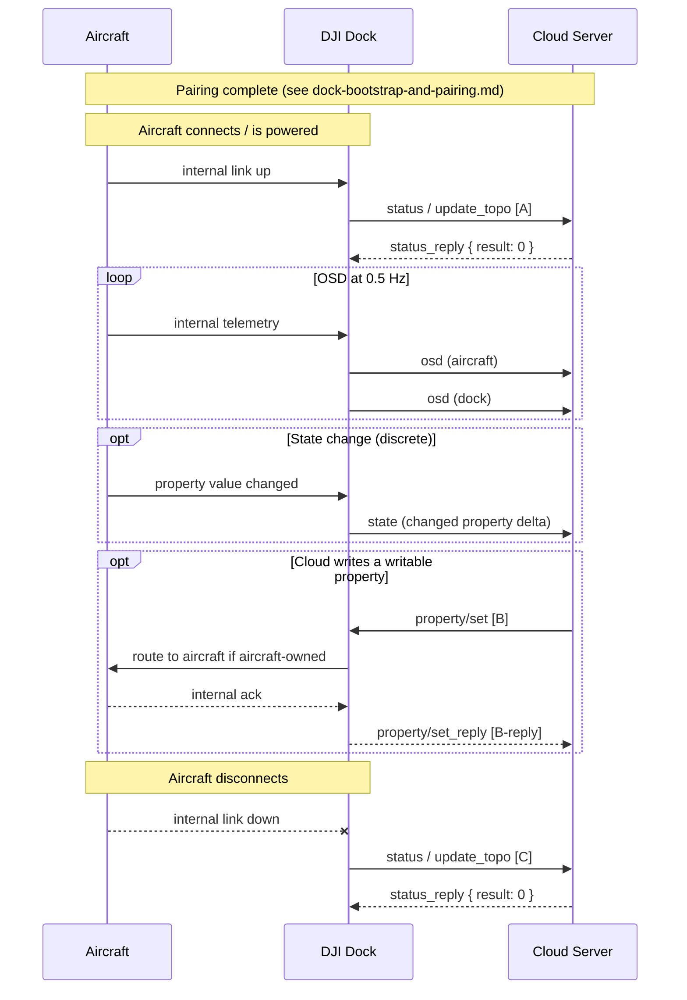
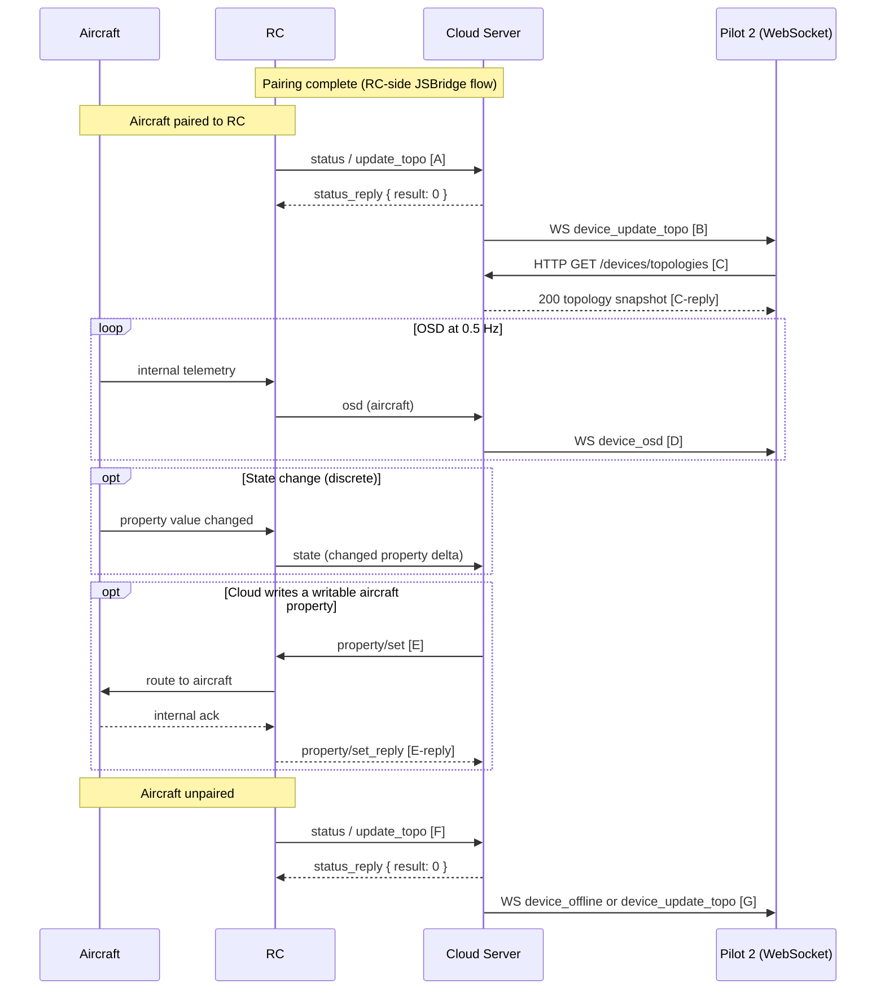

# Device binding and topology lifecycle

What the cloud and devices do, on the wire, after pairing completes and while the workspace is active. Covers the topology-maintenance loop (pair / unpair, online / offline), OSD telemetry, state-change events, and writable property sets. This is the always-on traffic every cohort produces — dock path and pilot path alike.

Part of the Phase 9 workflow catalog. Schema bodies live in Phase 4 (MQTT) / Phase 5 (WebSocket) / Phase 6 (device properties).

---

## Scope

| Aspect | Value |
|---|---|
| Cohorts | **All in-scope cohorts** — Dock 2 cohort (dock-path), Dock 3 cohort (dock-path), RC Pro Enterprise (pilot-path), RC Plus 2 Enterprise (pilot-path). |
| Direction | Mostly device-initiated push. `property/set` is the one cloud-initiated path. |
| Transports | **MQTT** for wire traffic. **WebSocket** for cloud → Pilot-2 change signals. **HTTP** for Pilot-2 topology read-back. |
| Preceding workflow | [`dock-bootstrap-and-pairing.md`](dock-bootstrap-and-pairing.md) for docks. RC pairing runs a JSBridge-driven flow — see [`remote-control-handoff.md`](remote-control-handoff.md) *(pending Phase 9c)*. |
| Related catalog entries | [`update_topo` dock-path](../mqtt/dock-to-cloud/status/update_topo.md), [`update_topo` pilot-path](../mqtt/pilot-to-cloud/status/update_topo.md), [`osd/` dock](../mqtt/dock-to-cloud/osd/README.md) / [pilot](../mqtt/pilot-to-cloud/osd/README.md), [`state/` dock](../mqtt/dock-to-cloud/state/README.md) / [pilot](../mqtt/pilot-to-cloud/state/README.md), [`property-set/` dock](../mqtt/dock-to-cloud/property-set/README.md) / [pilot](../mqtt/pilot-to-cloud/property-set/README.md), [`device-properties/`](../device-properties/README.md), [WebSocket situation-awareness](../websocket/situation-awareness/), [HTTP topology](../http/device/topology.md) |

## Overview

Once a gateway (dock or RC) has paired against the cloud, it assumes responsibility for four ongoing duties:

1. **Topology maintenance.** Any time the sub-device composition changes — aircraft attached, aircraft detached — the gateway re-publishes a full `update_topo` snapshot.
2. **OSD telemetry.** High-rate (0.5 Hz) push of flight-envelope / battery / position / camera telemetry on the `osd` topic. Lossy by design; no reply expected.
3. **State-change events.** Lower-rate push on the `state` topic when a property changes value (mode code, firmware version, SIM-slot switch, etc.).
4. **Property-set response.** When the cloud writes to a writable property (accessMode `rw`), the gateway routes the change to the device and returns a result envelope.

The cloud's responsibility is to consume these feeds, reconcile its workspace view, and push change signals to any attached Pilot 2 UI so it can re-read topology via HTTP.

## Actors

| Actor | Role |
|---|---|
| **Gateway** | Dock 2 / Dock 3 for dock-path; RC Plus 2 / RC Pro for pilot-path. Owns `{gateway_sn}` on every topic. |
| **Sub-device** | Aircraft (M3D / M3TD / M4D / M4TD). Reports telemetry through the gateway under `{device_sn}` = aircraft SN on the `osd` / `state` topics; does not own any MQTT topic directly. |
| **Cloud Server** | Consumes push; publishes property-set commands; relays change signals to any WebSocket clients (Pilot 2). |
| **Pilot 2 (optional)** | WebSocket subscriber (pilot-path only — the WebSocket surface is Pilot-to-Cloud only per [`websocket/README.md`](../websocket/README.md)). Receives `device_*` change signals; reads current topology via HTTP. |

## Sequence

### Dock-path



Payloads (verbatim from Phase 4 method docs — DJI source):

**[A]** — `update_topo` on `sys/product/{gateway_sn}/status`, full-snapshot with paired sub-device (verbatim from [`dock-to-cloud/status/update_topo.md`](../mqtt/dock-to-cloud/status/update_topo.md)):

```json
{
  "tid": "xxxxxxxx-xxxx-xxxx-xxxx-xxxxxxxxxx",
  "bid": "xxxxxxxx-xxxx-xxxx-xxxx-xxxxxxxxxx",
  "method": "update_topo",
  "timestamp": 1234567890123,
  "data": {
    "domain": "3",
    "type": 119,
    "sub_type": 0,
    "device_secret": "secret",
    "nonce": "nonce",
    "thing_version": "1.1.2",
    "sub_devices": [
      {
        "sn": "drone001",
        "domain": "0",
        "type": 60,
        "sub_type": 0,
        "index": "A",
        "device_secret": "secret",
        "nonce": "nonce",
        "thing_version": "1.1.2"
      }
    ]
  }
}
```

`status_reply` envelope: `{ "tid": ..., "bid": ..., "method": "update_topo", "timestamp": ..., "data": { "result": 0 } }`.

**[B]** — `property/set` on `thing/product/{gateway_sn}/property/set`. Envelope carries one or more `property_key: value` pairs; Dock 3 example for `air_transfer_enable` (verbatim from [`device-properties/dock3.md`](../device-properties/dock3.md) §6):

```json
{
  "tid": "xxxxxxxx-xxxx-xxxx-xxxx-xxxxxxxxxx",
  "bid": "xxxxxxxx-xxxx-xxxx-xxxx-xxxxxxxxxx",
  "timestamp": 1643268212187,
  "data": {
    "air_transfer_enable": true
  }
}
```

**[B-reply]** — `property/set_reply` on `thing/product/{gateway_sn}/property/set_reply`. Per-property `result`:

```json
{
  "tid": "xxxxxxxx-xxxx-xxxx-xxxx-xxxxxxxxxx",
  "bid": "xxxxxxxx-xxxx-xxxx-xxxx-xxxxxxxxxx",
  "timestamp": 1643268212187,
  "data": {
    "air_transfer_enable": {
      "result": 0
    }
  }
}
```

**[C]** — `update_topo` aircraft-disconnect push. Same envelope as **[A]**; `sub_devices` is now empty (verbatim from [`dock-to-cloud/status/update_topo.md`](../mqtt/dock-to-cloud/status/update_topo.md)):

```json
{
  "tid": "xxxxxxxx-xxxx-xxxx-xxxx-xxxxxxxxxx",
  "bid": "xxxxxxxx-xxxx-xxxx-xxxx-xxxxxxxxxx",
  "method": "update_topo",
  "timestamp": 1234567890123,
  "data": {
    "domain": "3",
    "type": 119,
    "sub_type": 0,
    "device_secret": "secret",
    "nonce": "nonce",
    "thing_version": "1.1.2",
    "sub_devices": []
  }
}
```

Field legend (non-obvious enums):

- `data.domain` / `sub_devices[].domain` — device namespace; `"0"` = aircraft, `"3"` = dock gateway. Full enum per Phase 6 [`device-properties/`](../device-properties/README.md).
- `data.type` / `sub_type` — product-family identifiers; `119` = dock family (example), `60` = M3-series aircraft (example).
- `sub_devices[].index` — channel index on the gateway (e.g., `"A"`).
- `property/set_reply.data.<key>.result` — `0` success · `1` fail · `2` time exceed · other = refer to [`error-codes/`](../error-codes/) (Phase 8).
- `air_transfer_enable` — Dock 3 writable `bool` — `true` enables rapid photo upload during flight; see Dock 3 §3 and Dock 2 §3 for the full 3-key dock writable surface.

OSD and state payloads in the `loop` / `opt` blocks are omitted here — the full per-device surface (37 OSD + 12 state properties on Dock 3, plus aircraft-side OSD / state) lives in Phase 6 [`device-properties/`](../device-properties/README.md).

### Pilot-path



Payloads (verbatim from Phase 4 / Phase 5 / Phase 3 method docs — DJI source):

**[A]** — `update_topo` on `sys/product/{gateway_sn}/status`. RC acts as gateway; `sub_devices[0]` is the paired aircraft (verbatim from [`pilot-to-cloud/status/update_topo.md`](../mqtt/pilot-to-cloud/status/update_topo.md)):

```json
{
  "tid": "xxxxxxxx-xxxx-xxxx-xxxx-xxxxxxxxxx",
  "bid": "xxxxxxxx-xxxx-xxxx-xxxx-xxxxxxxxxx",
  "method": "update_topo",
  "timestamp": 1234567890123,
  "data": {
    "domain": "3",
    "type": 119,
    "sub_type": 0,
    "device_secret": "secret",
    "nonce": "nonce",
    "thing_version": "1.1.2",
    "sub_devices": [
      {
        "sn": "drone001",
        "domain": "0",
        "type": 60,
        "sub_type": 0,
        "index": "A",
        "device_secret": "secret",
        "nonce": "nonce",
        "thing_version": "1.1.2"
      }
    ]
  }
}
```

`status_reply` envelope: `{ "tid": ..., "bid": ..., "method": "update_topo", "timestamp": ..., "data": { "result": 0 } }`.

**[B]** — WebSocket push (verbatim from [`websocket/situation-awareness/device_update_topo.md`](../websocket/situation-awareness/device_update_topo.md)). Content-free trigger; Pilot 2 reacts by firing **[C]**:

```json
{
  "biz_code": "device_update_topo",
  "version": "1.0",
  "timestamp": 146052438362,
  "data": {}
}
```

**[C]** — `GET /manage/api/v1/workspaces/{workspace_id}/devices/topologies`. Request body: none; `x-auth-token` header only (see [`http/device/topology.md`](../http/device/topology.md)).

**[C-reply]** — `200 OK` (verbatim from [`http/device/topology.md`](../http/device/topology.md)):

```json
{
  "code": 0,
  "message": "success",
  "data": {
    "list": [
      {
        "hosts": [
          {
            "sn": "drone01",
            "device_model": {
              "key": "0-60-0",
              "domain": "0",
              "type": "60",
              "sub_type": "0"
            },
            "online_status": true,
            "device_callsign": "Rescue aircraft",
            "user_id": "string",
            "user_callsign": "string",
            "icon_urls": {
              "normal_icon_url": "resource://pilot/drawable/tsa_aircraft_others_normal",
              "selected_icon_url": "resource://pilot/drawable/tsa_aircraft_others_pressed"
            }
          }
        ],
        "parents": [
          {
            "sn": "rc02",
            "online_status": true,
            "device_model": {
              "key": "2-56-0",
              "domain": "2",
              "type": "56",
              "sub_type": "0"
            },
            "device_callsign": "Remote controller",
            "user_id": "string",
            "user_callsign": "string",
            "icon_urls": {
              "normal_icon_url": "resource://pilot/drawable/tsa_aircraft_others_normal",
              "selected_icon_url": "resource://pilot/drawable/tsa_aircraft_others_pressed"
            }
          }
        ]
      }
    ]
  }
}
```

**[D]** — WebSocket push carrying the re-projected aircraft OSD (verbatim from [`websocket/situation-awareness/device_osd.md`](../websocket/situation-awareness/device_osd.md)):

```json
{
  "biz_code": "device_osd",
  "version": "1.0",
  "timestamp": 146052438362,
  "data": {
    "host": {
      "latitude": 113.44444,
      "longitude": 23.45656,
      "height": 44.35,
      "attitude_head": 90,
      "elevation": 40,
      "horizontal_speed": 0,
      "vertical_speed": 2.3
    },
    "sn": "string"
  }
}
```

Note: DJI's example swaps the `latitude` / `longitude` values — see [`device_osd.md` source inconsistencies](../websocket/situation-awareness/device_osd.md#source-inconsistencies-flagged-by-djis-own-example). Real wire traffic follows the field names.

**[E]** — `property/set` on `thing/product/{gateway_sn}/property/set`. Pilot-path `{gateway_sn}` is the RC; the RC routes aircraft-targeted property writes through to the aircraft. RCs own 0 gateway-level writable properties — every pilot-path `property/set` targets an aircraft property. Envelope carries `property_key: value` pairs. Schema shell: [`pilot-to-cloud/property-set/README.md`](../mqtt/pilot-to-cloud/property-set/README.md); aircraft-path writable keys per [`device-properties/m4d.md`](../device-properties/m4d.md) §3 / [`m3d.md`](../device-properties/m3d.md) §3.

Schematic (DJI's canonical `data` shell):

```json
{
  "tid": "xxxxxxxx-xxxx-xxxx-xxxx-xxxxxxxxxx",
  "bid": "xxxxxxxx-xxxx-xxxx-xxxx-xxxxxxxxxx",
  "timestamp": 1643268212187,
  "data": {
    "property_key": "property_value"
  }
}
```

**[E-reply]** — `property/set_reply` on `thing/product/{gateway_sn}/property/set_reply`. Per-property `result`:

```json
{
  "tid": "xxxxxxxx-xxxx-xxxx-xxxx-xxxxxxxxxx",
  "bid": "xxxxxxxx-xxxx-xxxx-xxxx-xxxxxxxxxx",
  "timestamp": 1643268212187,
  "data": {
    "property_key": {
      "result": 0
    }
  }
}
```

**[F]** — `update_topo` unpair push. Same envelope as **[A]**; `sub_devices` is now empty (verbatim from [`pilot-to-cloud/status/update_topo.md`](../mqtt/pilot-to-cloud/status/update_topo.md)):

```json
{
  "tid": "xxxxxxxx-xxxx-xxxx-xxxx-xxxxxxxxxx",
  "bid": "xxxxxxxx-xxxx-xxxx-xxxx-xxxxxxxxxx",
  "method": "update_topo",
  "timestamp": 1234567890123,
  "data": { "sub_devices": [] }
}
```

**[G]** — WebSocket push. Same shape as **[B]** but `biz_code` is `device_offline` when a gateway goes offline entirely, or `device_update_topo` when only the sub-device membership changed (verbatim from [`websocket/situation-awareness/device_offline.md`](../websocket/situation-awareness/device_offline.md)):

```json
{
  "biz_code": "device_offline",
  "version": "1.0",
  "timestamp": 146052438362,
  "data": {}
}
```

Field legend (non-obvious enums):

- `data.domain` — `"0"` aircraft, `"2"` RC gateway, `"3"` dock gateway (distinguishes gateway cohort).
- `data.type` / `sub_type` — `56` = RC family (example), `60` = M3-series aircraft (example), `119` = dock family. Full enum per Phase 6 [`device-properties/`](../device-properties/README.md).
- `hosts[]` vs `parents[]` (topology reply) — `hosts` = sub-devices (aircraft); `parents` = gateways (Dock / RC).
- `biz_code` (WebSocket) — `device_online` / `device_offline` / `device_update_topo` are all **content-free triggers** with empty `data`. Pilot 2 does not branch on the code; it always re-reads topology via **[C]**. `device_osd` is the only situation-awareness push that carries a payload.
- `property/set_reply.data.<key>.result` — `0` success · `1` fail · `2` time exceed · other = refer to [`error-codes/`](../error-codes/) (Phase 8).

OSD and state payloads in the `loop` / `opt` blocks are omitted here — the full per-device surface (aircraft OSD / state, RC state) lives in Phase 6 [`device-properties/`](../device-properties/README.md).

## Step-by-step

### 1. Topology push on pair / unpair

- **Topic:** `sys/product/{gateway_sn}/status`. **Method:** `update_topo`.
- **Full-snapshot semantics.** Every `update_topo` is the complete current topology, not a delta. An empty `sub_devices` array means no aircraft paired.
- **Dock vs RC.** Payload schema is identical; only `{gateway_sn}` and `sub_devices[0].sn` differ. Schema body: [dock-path](../mqtt/dock-to-cloud/status/update_topo.md) · [pilot-path](../mqtt/pilot-to-cloud/status/update_topo.md).
- **Cloud fan-out.** The cloud converts each `update_topo` into one or more situation-awareness WebSocket pushes for any Pilot 2 subscribers: [`device_online`](../websocket/situation-awareness/device_online.md), [`device_offline`](../websocket/situation-awareness/device_offline.md), [`device_update_topo`](../websocket/situation-awareness/device_update_topo.md). Pilot 2 uses these as triggers to re-read [HTTP topology](../http/device/topology.md) rather than parsing the WebSocket body.

### 2. OSD telemetry at 0.5 Hz

- **Topic:** `thing/product/{device_sn}/osd`. No method key; raw struct in `data`.
- `{device_sn}` is the **reporting** device's SN — a dock reports both its own dock OSD under the dock SN and the aircraft's OSD under the aircraft SN; the two streams are on separate topics.
- **No reply.** OSD is fire-and-forget. The cloud's default subscribe QoS is 1 per [OQ-003](../OPEN-QUESTIONS.md#oq-003--mqtt-qos-retain-and-clean-session-settings-are-not-specified-in-djis-published-documentation), meaning the broker caps delivery at QoS 1 even if devices publish higher.
- **Payload catalog.** Per Phase 6: dock-path property set differs from pilot-path for the same aircraft (17 dock-path-exclusive properties, 1 pilot-path-exclusive, occasional type drift on shared properties). Full matrix: [`device-properties/README.md`](../device-properties/README.md). Per-device payload bodies: [`device-properties/dock2.md`](../device-properties/dock2.md), [`dock3.md`](../device-properties/dock3.md), [`m3d.md`](../device-properties/m3d.md), [`m3td.md`](../device-properties/m3td.md), [`m4d.md`](../device-properties/m4d.md), [`m4td.md`](../device-properties/m4td.md), [`rc-plus-2.md`](../device-properties/rc-plus-2.md), [`rc-pro.md`](../device-properties/rc-pro.md).
- **Cloud fan-out.** For pilot-path OSD, the cloud pushes [`device_osd`](../websocket/situation-awareness/device_osd.md) to WebSocket subscribers.

### 3. State-change events (push on change)

- **Topic:** `thing/product/{device_sn}/state`. Direction: up.
- Published when a `state` property (pushMode `1`) changes value. Not all properties participate — the `device-properties/` per-device files mark each property's pushMode.
- State pushes carry only the changed field(s), not the full state snapshot. Cloud should treat the payload as a delta applied over last known state.
- Per Phase 6a: Dock 2 state: 12 properties; Dock 3 state: 12 (same). Per Phase 6b: aircraft state (pilot-path baseline): 8 properties; dock-path adds 10 more. Per Phase 6c: RC state: 5 properties each.

### 4. Writable property sets (cloud-initiated)

- **Topic (down):** `thing/product/{gateway_sn}/property/set`. **Reply (up):** `thing/product/{gateway_sn}/property/set_reply`.
- Writable property surface per Phase 6 (Phase 4i speculative lists were corrected at 6a/6c):
  - **Dock gateway (Dock 2 + Dock 3):** 3 writable properties — `silent_mode`, `user_experience_improvement`, `air_transfer_enable`.
  - **Aircraft dock-path:** 6 writable — `height_limit`, `night_lights_state`, `distance_limit_status`, `obstacle_avoidance`, `rth_altitude`, `rth_mode`.
  - **Aircraft pilot-path (baseline):** 3 writable — `height_limit`, `night_lights_state`, `camera_watermark_settings`. **M4D adds 3 more pilot-path writable:** `commander_flight_height`, `commander_flight_mode`, `commander_mode_lost_action` (per Phase 6b).
  - **RC gateway (RC Plus 2 + RC Pro):** **0 writable.** The `property/set` topic on an RC SN is only used for aircraft-targeted writes (the aircraft's writable surface travels with the aircraft regardless of gateway).
- **Single-field writes only.** DJI's feature-set page calls this out: writing a nested struct (e.g., `distance_limit_status` has `state` and `distance_limit` fields) requires two separate `property/set` commands, one per field.
- Schema shells: [dock-path `property-set/`](../mqtt/dock-to-cloud/property-set/README.md) · [pilot-path `property-set/`](../mqtt/pilot-to-cloud/property-set/README.md).

### 5. Cloud → Pilot 2 change fan-out

- Applies to pilot-path only (WebSocket is Pilot-to-Cloud only).
- Every `update_topo` that represents a topology delta converts to `device_online` / `device_offline` / `device_update_topo` WebSocket messages ([`websocket/situation-awareness/`](../websocket/situation-awareness/)).
- Pilot 2 treats WebSocket push as a **change signal** (trigger), then re-reads authoritative topology from HTTP [`/manage/api/v1/workspaces/{workspace_id}/devices/topologies`](../http/device/topology.md). The WebSocket body carries enough to identify which device changed, not the full topology.

## Variants

### Dock 2 cohort vs Dock 3 cohort

- No divergence in topology / OSD / state wire shape. Property content differs slightly — Dock 3 adds `self_converge_coordinate` (OSD); aircraft mode-code and position-quality enums extend on newer firmware (see Phase 6a / 6b drift sections). The choreography itself is unchanged.

### Dock-path vs pilot-path for the same aircraft

- Not a symmetric view. Per Phase 6b: the same aircraft under a dock reports 17 dock-path-exclusive OSD properties that never appear on the pilot-path feed, plus 1 pilot-path-exclusive. Type drift on a handful of shared fields (e.g. `latitude` / `longitude` `double` vs `float`). A cloud handling both surfaces should treat them as two independent feeds of the same aircraft identity.

### RC writable surface is zero

- Per Phase 6c: neither RC Plus 2 nor RC Pro owns any gateway-level writable property. The `property/set` topic on an RC SN exists only as a route for aircraft-targeted writes (the aircraft's writable surface travels with the aircraft).

## Error paths

| Failure | Signal | Handling |
|---|---|---|
| Missed OSD messages | No wire-level signal — fire-and-forget | Cloud tolerates gaps; next OSD cycle recovers state. |
| Unknown property in `property/set` | `set_reply.result: <non-zero>` | Treat as rejected. Likely a client bug or firmware drift. |
| Write to read-only property | `set_reply.result: <non-zero>` (error) | Caller bug — check Phase 6 `accessMode` before issuing. |
| Topology reported without binding | Cloud receives `update_topo` but no matching org binding | Cloud should reject / log — indicates a misconfigured dock that skipped [`dock-bootstrap-and-pairing.md`](dock-bootstrap-and-pairing.md). |

## Provenance

| Source | Role |
|---|---|
| `[Cloud-API-Doc/docs/en/30.feature-set/20.dock-feature-set/20.dock-device-management.md]` | v1.11 DJI feature-set page — workflow narrative + Mermaid sequence this doc tracks for the dock path. |
| `[DJI_Cloud/DJI_CloudAPI-Dock2-Device-Management.txt]` · `[DJI_Cloud/DJI_CloudAPI-Dock3-DeviceManagement.txt]` | v1.15 dock-path `update_topo`. |
| `[DJI_Cloud/DJI_CloudAPI_RC-Plus-2-Enterprise-Device-Management.txt]` · `[DJI_Cloud/DJI_CloudAPI_RC-Pro-Enterprise-Device-Management.txt]` | v1.15 pilot-path `update_topo`. |
| `[DJI_Cloud/DJI_CloudAPI-TopicDefinitions.txt]` · `[DJI_Cloud/DJI_CloudAPI-PilotToCloud-Topic-Definition.txt]` | v1.15 topic-level definitions (OSD / state / property-set). Pilot OSD example copy-paste flagged as [OQ-002](../OPEN-QUESTIONS.md#oq-002--pilot-to-cloud-osd-struct-example-appears-to-be-a-copy-paste-of-the-dock-osd-example). |
| [`master-docs/device-properties/`](../device-properties/) | Phase 6 authoritative per-device property surfaces (dock gateway / aircraft / RC). |
| [`master-docs/mqtt/`](../mqtt/) | Phase 4 wire schema. |
| [`master-docs/websocket/situation-awareness/`](../websocket/situation-awareness/) | Phase 5 cloud → Pilot-2 change signals. |
| [`master-docs/http/device/topology.md`](../http/device/topology.md) | Phase 3 topology read-back endpoint. |
