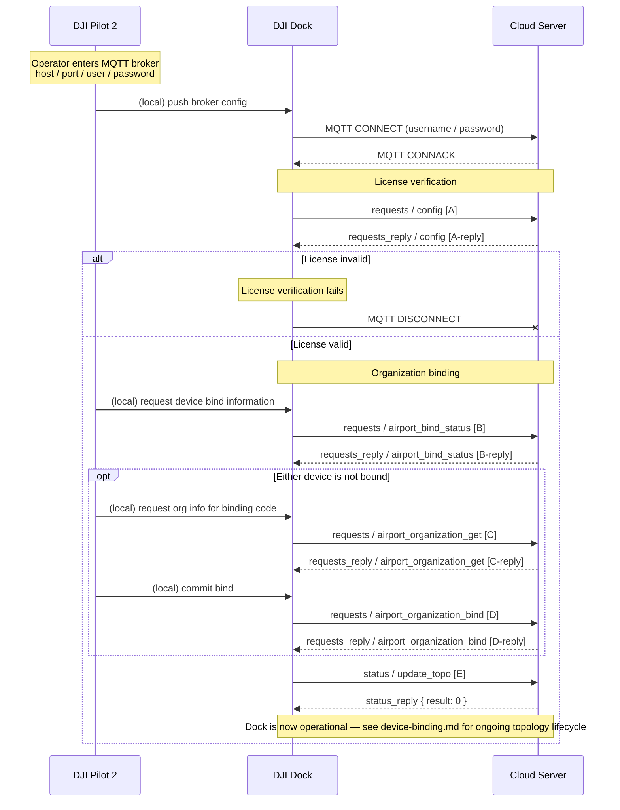

# Dock bootstrap and pairing

The cold-start sequence a DJI Dock runs, end-to-end, from cable-up through joining a cloud workspace. Covers MQTT connection establishment, License verification, and organization binding. The dock is unusable for operational traffic (waylines, DRC, livestream, HMS) until every step in this workflow has succeeded.

Part of the Phase 9 workflow catalog. Wire-level payload schemas live in the Phase 2/4 transport catalogs and are linked inline — this doc owns choreography only.

---

## Scope

| Aspect | Value |
|---|---|
| Cohorts | **Dock 2 + Dock 3**. Identical workflow, identical payloads. |
| Out-of-scope | Pilot-to-cloud (RC) pairing — runs a JSBridge-driven flow, not the `config` / `airport_*` MQTT methods. See [remote-control-handoff.md](remote-control-handoff.md) *(pending Phase 9c)* for the RC side. |
| Direction | Device-initiated. The cloud responds but never prompts. |
| Transports | MQTT only. |
| Related Phase 4 catalog entries | [`config`](../mqtt/dock-to-cloud/requests/config.md), [`airport_bind_status`](../mqtt/dock-to-cloud/requests/airport_bind_status.md), [`airport_organization_get`](../mqtt/dock-to-cloud/requests/airport_organization_get.md), [`airport_organization_bind`](../mqtt/dock-to-cloud/requests/airport_organization_bind.md), [`update_topo`](../mqtt/dock-to-cloud/status/update_topo.md) |

## Overview

A dock ships with DJI-issued firmware but no cloud affiliation. For the dock to appear inside a cloud workspace and accept commands, three gates must pass:

1. **Transport.** The dock establishes an authenticated MQTT session against the cloud broker. Credentials (host, port, username, password) are configured by an operator through DJI Pilot 2 on the RC attached to the dock during setup.
2. **License.** The dock fetches `app_id` / `app_key` / `app_license` from the cloud via the [`config`](../mqtt/dock-to-cloud/requests/config.md) request-reply. If the cloud's reply contains an invalid DJI-issued License, subsequent binding requests are rejected and the dock disconnects.
3. **Organization binding.** The dock (and its sub-device aircraft, as a tuple) declare their intended organization using a device-binding-code redemption. This is what makes the dock visible inside a specific cloud workspace.

After these three gates, the dock publishes its topology on [`update_topo`](../mqtt/dock-to-cloud/status/update_topo.md) and operational traffic begins. Ongoing topology maintenance is covered in [`device-binding.md`](device-binding.md).

## Preconditions

- Cloud broker is reachable at the host/port Pilot 2 was configured with.
- Cloud has provisioned a DJI-issued App in the DJI Developer site and knows its `app_id` / `app_key` / `app_license` values to serve on the `config` reply.
- The operator has a device-binding-code for each device (dock + aircraft). Binding codes come from the cloud UI after workspace / organization setup.
- The aircraft is cabled inside the dock and powered so the dock can report it as a sub-device.

## Actors

| Actor | Role |
|---|---|
| **DJI Pilot 2** | Mobile/tablet app running on the RC attached to the dock during setup. Hosts the broker-credential and binding-code UI; issues JSBridge commands to itself to trigger the dock's `airport_*` requests. |
| **DJI Dock** | Gateway device. Publishes MQTT as `{gateway_sn}` = dock SN. Runs the `config` / `airport_*` request exchanges. |
| **Aircraft** | Sub-device. Does not publish directly — its SN rides inside the dock's `airport_organization_bind` request and its topology appears under the dock's `update_topo.sub_devices[]`. |
| **Cloud Server** | Terminates MQTT. Serves License parameters on the `config` reply. Accepts organization binding; owns the binding-code-to-organization mapping. |

## Sequence



Payloads (verbatim from Phase 4 method docs — DJI source):

**[A]** — request `config` on `thing/product/{gateway_sn}/requests`:

```json
{
  "tid": "6a7bfe89-c386-4043-b600-b518e10096cc",
  "bid": "42a19f36-5117-4520-bd13-fd61d818d52e",
  "gateway": "sn",
  "timestamp": 1667803298000,
  "method": "config",
  "data": {
    "config_scope": "product",
    "config_type": "json"
  }
}
```

- `config_scope` — documented value `"product"` (only value in v1.15).
- `config_type` — documented value `"json"` (only value in v1.15).

**[A-reply]** — `requests_reply` on `thing/product/{gateway_sn}/requests_reply`:

```json
{
  "tid": "6a7bfe89-c386-4043-b600-b518e10096cc",
  "bid": "42a19f36-5117-4520-bd13-fd61d818d52e",
  "gateway": "sn",
  "timestamp": 1667803298000,
  "method": "config",
  "data": {
    "app_id": "123456",
    "app_key": "app_key",
    "app_license": "app_license",
    "ntp_server_host": "host_url",
    "ntp_server_port": 456
  }
}
```

- `ntp_server_port` — default `123` if omitted.
- `app_id` type drift: v1.11 example shows integer `123456`; v1.15 example shows string `"123456"` — v1.15 string form matches the documented type and is canonical.

**[B]** — request `airport_bind_status` on `thing/product/{gateway_sn}/requests`:

```json
{
  "tid": "xxxxxxxx-xxxx-xxxx-xxxx-xxxxxxxxxx",
  "bid": "xxxxxxxx-xxxx-xxxx-xxxx-xxxxxxxxxx",
  "timestamp": 1654070968655,
  "data": {
    "devices": [
      { "sn": "drone-sn" },
      { "sn": "dock-sn" }
    ]
  }
}
```

**[B-reply]** — `requests_reply` on `thing/product/{gateway_sn}/requests_reply`:

```json
{
  "tid": "xxxxxxxx-xxxx-xxxx-xxxx-xxxxxxxxxx",
  "bid": "xxxxxxxx-xxxx-xxxx-xxxx-xxxxxxxxxx",
  "timestamp": 1654070968655,
  "data": {
    "result": 0,
    "output": {
      "bind_status": [
        {
          "sn": "12345",
          "is_device_bind_organization": true,
          "organization_id": "12345678",
          "organization_name": "12345",
          "device_callsign": "Device organization callsign"
        },
        {
          "sn": "12345",
          "is_device_bind_organization": true,
          "organization_id": "12345678",
          "organization_name": "12345",
          "device_callsign": "Device organization callsign"
        }
      ]
    }
  }
}
```

- `is_device_bind_organization` — `true` if already bound; `false` drives the opt-block binding flow [C] → [D].

**[C]** — request `airport_organization_get` on `thing/product/{gateway_sn}/requests`:

```json
{
  "tid": "xxxxxxxx-xxxx-xxxx-xxxx-xxxxxxxxxx",
  "bid": "xxxxxxxx-xxxx-xxxx-xxxx-xxxxxxxxxx",
  "timestamp": 1654070968655,
  "data": {
    "device_binding_code": "device_binding_code",
    "organization_id": "organization_id"
  }
}
```

**[C-reply]** — `requests_reply` on `thing/product/{gateway_sn}/requests_reply`:

```json
{
  "tid": "xxxxxxxx-xxxx-xxxx-xxxx-xxxxxxxxxx",
  "bid": "xxxxxxxx-xxxx-xxxx-xxxx-xxxxxxxxxx",
  "timestamp": 1654070968655,
  "data": {
    "result": 0,
    "output": {
      "organization_name": "organization_name"
    }
  }
}
```

**[D]** — request `airport_organization_bind` on `thing/product/{gateway_sn}/requests`:

```json
{
  "tid": "xxxxxxxx-xxxx-xxxx-xxxx-xxxxxxxxxx",
  "bid": "xxxxxxxx-xxxx-xxxx-xxxx-xxxxxxxxxx",
  "timestamp": 1654070968655,
  "data": {
    "bind_devices": [
      {
        "device_binding_code": "device_binding_code",
        "device_callsign": "dock-device-callsign",
        "device_model_key": "3-1-0",
        "organization_id": "organization_id",
        "sn": "dock-sn"
      },
      {
        "device_binding_code": "device_binding_code",
        "device_callsign": "drone-device-callsign",
        "device_model_key": "0-67-0",
        "organization_id": "organization_id",
        "sn": "drone-sn"
      }
    ]
  }
}
```

- `device_model_key` — e.g., `3-1-0` for a dock, `0-67-0` for an M4D aircraft. Full enum in Phase 6 (`device-properties/`).

**[D-reply]** — `requests_reply` on `thing/product/{gateway_sn}/requests_reply`:

```json
{
  "tid": "xxxxxxxx-xxxx-xxxx-xxxx-xxxxxxxxxx",
  "bid": "xxxxxxxx-xxxx-xxxx-xxxx-xxxxxxxxxx",
  "timestamp": 1654070968655,
  "data": {
    "result": 0,
    "output": {
      "err_infos": [
        { "sn": "dock-sn",  "err_code": 210231 },
        { "sn": "drone-sn", "err_code": 210231 }
      ]
    }
  }
}
```

- Even when top-level `result: 0`, individual devices in `err_infos[]` can carry non-zero `err_code`. Cloud must walk the array to detect partial failure.
- Error code reference: Phase 8 [`error-codes/`](../error-codes/README.md).

**[E]** — status push `update_topo` on `sys/product/{gateway_sn}/status` (first-time topology — gateway and sub-device online):

```json
{
  "tid": "xxxxxxxx-xxxx-xxxx-xxxx-xxxxxxxxxx",
  "bid": "xxxxxxxx-xxxx-xxxx-xxxx-xxxxxxxxxx",
  "method": "update_topo",
  "timestamp": 1234567890123,
  "data": {
    "domain": "3",
    "type": 119,
    "sub_type": 0,
    "device_secret": "secret",
    "nonce": "nonce",
    "thing_version": "1.1.2",
    "sub_devices": [
      {
        "sn": "drone001",
        "domain": "0",
        "type": 60,
        "sub_type": 0,
        "index": "A",
        "device_secret": "secret",
        "nonce": "nonce",
        "thing_version": "1.1.2"
      }
    ]
  }
}
```

- `domain` / `type` / `sub_type` — device-class enums resolved via Phase 6 (`device-properties/`).
- `sub_devices[]` — empty array = no sub-device attached. Every `update_topo` is a full snapshot, not a delta.
- `status_reply` envelope: `{ "data": { "result": 0 }, "tid": ..., "bid": ..., "timestamp": ..., "method": "update_topo" }`.

## Step-by-step

1. **MQTT connect (cloud-agnostic).** The dock opens a TCP (or TLS) socket to the cloud's MQTT broker and performs the MQTT 5.0 CONNECT handshake. Authentication material (username / password) was configured locally by Pilot 2; the broker itself is the trust anchor at this stage. No DJI-specific envelope is used. See [`mqtt/README.md` §2](../mqtt/README.md) for broker-side QoS and retain behavior (demo evidence, per [OQ-003](../OPEN-QUESTIONS.md#oq-003--mqtt-qos-retain-and-clean-session-settings-are-not-specified-in-djis-published-documentation)).

2. **License retrieval via `config`.** The dock publishes on `thing/product/{gateway_sn}/requests` with `method: config` and a fixed payload `{config_scope: "product", config_type: "json"}` — neither field carries any actual selector today; they are enumerations reserving room for future scope/format variants. The cloud's `requests_reply` carries the DJI App credentials: `app_id`, `app_key`, `app_license`, plus `ntp_server_host` and optional `ntp_server_port` (default `123`). Schema body: [`config.md`](../mqtt/dock-to-cloud/requests/config.md).

3. **License verification (dock-side).** The dock verifies the `app_license` against DJI's issued License for the `app_id`. Verification is local to the dock — the cloud's only role is delivering the values. If verification fails, the dock tears down the MQTT connection and retries on the next cold-start; no binding will be attempted.

4. **Pre-check binding state via `airport_bind_status`.** Pilot 2's UI asks the dock (over a local JSBridge-style channel) whether the dock + aircraft are already bound. The dock issues `airport_bind_status` with `devices: [{sn: dock_sn}, {sn: drone_sn}]`. The cloud replies per-device with `is_device_bind_organization`, and if bound, the current `organization_id`, `organization_name`, and `device_callsign`. Schema body: [`airport_bind_status.md`](../mqtt/dock-to-cloud/requests/airport_bind_status.md).

5. **Resolve binding-code to organization via `airport_organization_get` (only if not already bound).** When either device returns `is_device_bind_organization: false`, Pilot 2 prompts the operator for a device-binding code (or Pilot 2 already holds one from its UI flow). The dock issues `airport_organization_get` with the binding code; the cloud returns the human-readable `organization_name` associated with that code. This is a read-only confirmation step — the operator can eyeball the name before committing. Schema body: [`airport_organization_get.md`](../mqtt/dock-to-cloud/requests/airport_organization_get.md).

6. **Commit the binding via `airport_organization_bind`.** The dock issues `airport_organization_bind` with a `bind_devices` array — typically two elements, one per device (dock + aircraft). Each element carries `sn`, `device_binding_code`, `organization_id`, `device_callsign`, and `device_model_key`. The cloud replies with a top-level `result` and `output.err_infos[]` — per-device error codes are carried even on partial success, so a `result: 0` does not imply every device in the array bound successfully. Check `err_infos` per-device. Error code reference: [`error-codes/README.md`](../error-codes/README.md). Schema body: [`airport_organization_bind.md`](../mqtt/dock-to-cloud/requests/airport_organization_bind.md).

7. **First topology push via `update_topo`.** Once bound, the dock publishes its current topology on `sys/product/{gateway_sn}/status`. The cloud's view of the workspace is now populated — the dock appears online with its sub-device aircraft. The cloud replies on `status_reply` with `{result: 0}`. Schema body: [`update_topo.md`](../mqtt/dock-to-cloud/status/update_topo.md).

At this point operational traffic begins: OSD telemetry at 0.5 Hz, state events on change, and the dock becomes a valid target for services commands. The rest of topology lifecycle (pair / unpair, online / offline transitions, property push and set) is documented in [`device-binding.md`](device-binding.md).

## Variants

### Already-bound startup path

If step 4 returns `is_device_bind_organization: true` for both devices, the operator is not prompted; steps 5 and 6 are skipped. The dock proceeds directly to step 7 (first topology push). This is the typical warm-restart path after the first successful bind.

### License-verification failure

If step 3 fails (the `config` reply does not carry a valid DJI-issued License), the dock disconnects MQTT. The DJI v1.11 feature-set page calls this out explicitly in the [`dock-access-to-cloud.md` sequence diagram](../../Cloud-API-Doc/docs/en/30.feature-set/20.dock-feature-set/10.dock-access-to-cloud.md). No binding is attempted on this connection.

### Binding partial failure

`airport_organization_bind` with two devices can succeed for one and fail for the other. Example: the dock binds with `err_code: 0` but the aircraft binds with `err_code: 210231`. The cloud's top-level `result` reflects the overall outcome but each device's status is in `output.err_infos[]`. Callers must walk `err_infos` to detect partial failure.

### Dock 2 vs Dock 3 parity

v1.15 source extracts for both cohorts show identical payloads for `config`, `airport_*`, and `update_topo`. No per-cohort divergence observed. The v1.11 `dock-access-to-cloud.md` feature-set page is the authoritative workflow narrative for both cohorts per [OQ-001 resolution](../OPEN-QUESTIONS.md#oq-001--source-version-mismatch-between-cloud-api-doc-v1113-and-dji_cloud-v115).

## Postconditions

- The dock and its paired aircraft are bound to a cloud-known organization.
- The MQTT session is authenticated and operational-traffic-ready.
- The cloud's workspace view includes the dock as online with its sub-device aircraft.
- The dock has usable `ntp_server_host` / `port` for clock sync.

## Error paths

| Failure | Signal | Handling |
|---|---|---|
| MQTT CONNACK non-zero | MQTT transport | Dock retries with backoff. Broker credentials may be wrong. |
| `config` reply returns invalid License | Dock-side verification | Dock disconnects MQTT; operator must fix App provisioning. |
| `airport_bind_status` returns error | `result: <non-zero>` on `requests_reply` | Transient broker / cloud failure — Pilot 2 shows an error; operator retries. |
| `airport_organization_get` returns invalid binding code | `result: <non-zero>` | Binding code is wrong, expired, or belongs to a different organization class. Operator re-enters the code. |
| `airport_organization_bind` partial failure | `err_infos[].err_code != 0` | Device-level error. The dock retries the binding for the failing device only; the successful device stays bound. Error code reference: [`error-codes/README.md`](../error-codes/README.md). |

## Provenance

| Source | Role |
|---|---|
| `[Cloud-API-Doc/docs/en/30.feature-set/20.dock-feature-set/10.dock-access-to-cloud.md]` | v1.11 DJI feature-set page — authoritative workflow narrative + Mermaid sequence diagram this doc tracks. No v1.15 equivalent exists; per [OQ-001](../OPEN-QUESTIONS.md#oq-001--source-version-mismatch-between-cloud-api-doc-v1113-and-dji_cloud-v115) the v1.11 workflow prose is the only DJI-authored choreography source. |
| `[DJI_Cloud/DJI_CloudAPI-Dock2-Configuration-Update.txt]` · `[DJI_Cloud/DJI_CloudAPI-Dock3-Configuration-Update.txt]` | v1.15 `config` method — identical payloads across cohorts. |
| `[DJI_Cloud/DJI_CloudAPI-Dock2-Organization-Management.txt]` · `[DJI_Cloud/DJI_CloudAPI-Dock3-Organization-Management.txt]` | v1.15 `airport_*` methods — identical payloads across cohorts. |
| `[DJI_Cloud/DJI_CloudAPI-Dock2-Device-Management.txt]` · `[DJI_Cloud/DJI_CloudAPI-Dock3-DeviceManagement.txt]` | v1.15 `update_topo` — identical payloads across cohorts. |
| [`master-docs/mqtt/dock-to-cloud/requests/`](../mqtt/dock-to-cloud/requests/) + [`status/`](../mqtt/dock-to-cloud/status/) | Phase 4 wire-level schemas; canonical for all payload bodies. |
