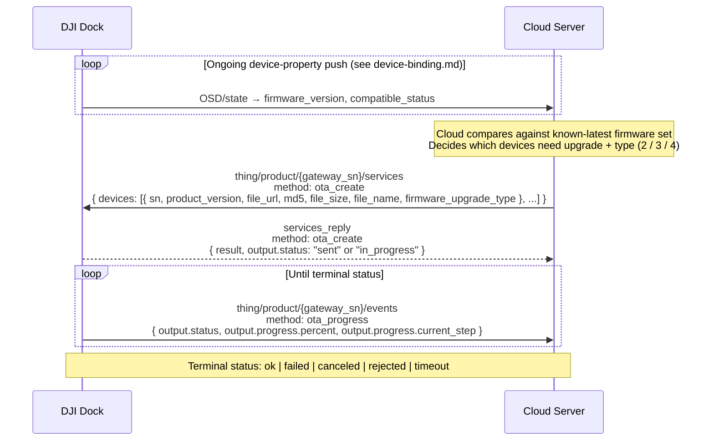
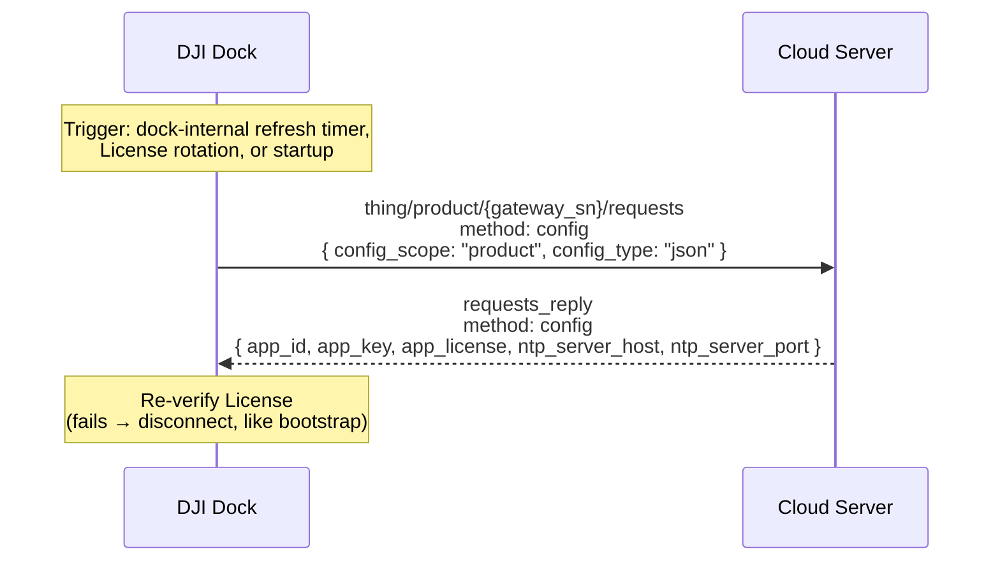

# Firmware upgrade and configuration refresh

The two maintenance choreographies that keep a dock (and its aircraft) current: firmware OTA and cloud-side `config` refresh (License / NTP). Both are cloud-initiated for firmware, device-initiated for config, and both ride MQTT.

Part of the Phase 9 workflow catalog. Schema bodies live in Phase 4 transport catalogs.

---

## Scope

| Aspect | Value |
|---|---|
| Cohorts | **Dock 2 + Dock 3**. Firmware payload identical except `firmware_upgrade_type` enum (Dock 3 adds `4 = psdk update`). Config identical across cohorts. Pilot-path RCs do not receive OTA via this flow; Pilot 2 upgrades are out-of-band. |
| Direction | **Firmware:** cloud-initiated. **Config:** device-initiated. |
| Transports | MQTT only. |
| Preceding workflow | [`dock-bootstrap-and-pairing.md`](dock-bootstrap-and-pairing.md) — License + NTP are first fetched there; this doc covers post-bootstrap refreshes. |
| Related catalog entries | [`ota_create`](../mqtt/dock-to-cloud/services/ota_create.md), [`ota_progress`](../mqtt/dock-to-cloud/events/ota_progress.md), [`config`](../mqtt/dock-to-cloud/requests/config.md) |
| Device-property inputs | `firmware_version` (OSD), `compatible_status` (state). Phase 6 per-device docs. |

## Overview

DJI's feature-set page for firmware frames it as a three-step loop: (1) the dock reports its firmware state via device properties, (2) the cloud compares against a known-latest firmware set that it maintains itself, (3) if a gap exists, the cloud issues an OTA task with URL + MD5 + size, and the dock streams progress events back until it reaches a terminal state.

The "config update" surface is thinner — the `config` method is the same bootstrap-time method, just re-invoked by the device on demand. It is the only way a dock refreshes its App License / NTP after cold start. There is no cloud-pushed equivalent.

## Firmware upgrade

### Actors

| Actor | Role |
|---|---|
| **DJI Dock** | Gateway. Reports firmware state via OSD/state properties; receives `ota_create`; pushes `ota_progress` events. Owns the download-and-apply step internally. |
| **Aircraft** | Sub-device. Firmware can be upgraded as a separate entry in the `ota_create` `devices[]` array. The dock stages the artifact and applies it during the flight cycle. |
| **PSDK payload (Dock 3 only)** | Third entry-type in `ota_create` when `firmware_upgrade_type: 4`. |
| **Cloud Server** | Maintains the firmware package catalog (DJI-provided firmware installers hosted on the cloud's own storage), issues `ota_create`, consumes progress events. |

### Sequence

### Step-by-step — firmware

1. **Firmware-property reporting.** The dock publishes `firmware_version` and `compatible_status` through the standard OSD/state channels described in [`device-binding.md`](device-binding.md). These are Phase 6 properties — see the dock2.md / dock3.md / aircraft docs for the exact positions in the property tables.
2. **Cloud-side version diff.** The cloud is responsible for maintaining the authoritative firmware catalog (per DJI's feature-set note: "users need to maintain the firmware installation package, firmware version and other information in the cloud server by themselves"). No DJI endpoint exposes the latest firmware list — the cloud pulls from DJI's download center and caches locally.
3. **Priority: `standard` > `consistency`.** Per DJI's feature-set note: a standard (`firmware_upgrade_type: 3`) upgrade outranks a consistency (`: 2`) upgrade. If the dock is at `1.x` and the latest is `2.x`, issue a standard upgrade; it implicitly fixes any consistency gap because the new firmware replaces the entire module set. Only if the top-level `firmware_version` matches but a module is out-of-sync does a consistency upgrade apply.
4. **Issue `ota_create`.** Cloud publishes on `thing/product/{gateway_sn}/services` with the devices array. Typical size is 2: one aircraft + one dock. Dock 3 can include a third entry with `firmware_upgrade_type: 4` for a PSDK payload upgrade. The cloud picks a `bid` — this `bid` is the correlation key for every subsequent `ota_progress`. Schema body: [`ota_create.md`](../mqtt/dock-to-cloud/services/ota_create.md).
5. **Dock ACK.** The dock replies on `services_reply` with `output.status` of `sent` or `in_progress`. This is a transport ACK, not a completion signal.
6. **Progress events stream.** The dock publishes `ota_progress` on `thing/product/{gateway_sn}/events` repeatedly until it reaches a terminal state. Each event echoes the originating `bid`. `output.progress.percent` is `0`–`100`; `output.progress.current_step` toggles between `download_firmware` and `upgrade_firmware`. Schema body: [`ota_progress.md`](../mqtt/dock-to-cloud/events/ota_progress.md).
7. **Terminal state.** `output.status` of `ok` = success, `failed` / `canceled` / `rejected` / `timeout` = terminal failure. `paused` is non-terminal — the dock can return to `in_progress`.

### Variants — firmware

#### Dock 2 vs Dock 3 enum widening

- Dock 2 (v1.11 + v1.15): `firmware_upgrade_type` accepts `{2, 3}`.
- Dock 3 (v1.15): `firmware_upgrade_type` accepts `{2, 3, 4}` — `4` is PSDK update, new in Dock 3 source.
- Label drift: v1.11/Dock 2 calls these "upgrade" ("Consistency upgrade", "Regular upgrade"); Dock 3 source calls them "update" ("Consistency update", "Standard update"). Field name stable as `firmware_upgrade_type`.

#### `step_key` → `current_step` rename

- v1.11 source (Cloud-API-Doc Dock 2) called the step field `step_key`.
- v1.15 sources (both Dock 2 and Dock 3) renamed it `current_step`.
- A cloud that speaks v1.15 wire must accept `current_step`. If supporting legacy firmware, tolerate `step_key` as an alias. Documented in [`ota_progress.md` Source differences](../mqtt/dock-to-cloud/events/ota_progress.md#source-differences).

#### Optional fields on secondary targets

- In DJI's own example, the second `devices[]` entry omits `file_url` / `md5` / `file_size` / `file_name`. Treat these fields as required for the target that owns the artifact and optional for secondary targets that inherit from a staged image.

### Error paths — firmware

| Failure | Signal | Handling |
|---|---|---|
| Bad `file_url` | Dock reports `output.status: failed` in `ota_progress` | Cloud retries with corrected URL. |
| MD5 mismatch | Dock reports `output.status: failed` | Cloud re-uploads the artifact and retries. |
| Upgrade rejected (power / storage / config) | `output.status: rejected` on `services_reply` or first `ota_progress` | Terminal — cloud requires a dock-side intervention (e.g., clear storage, confirm grid power). |
| Timeout | `output.status: timeout` | Terminal — cloud retries on next cycle. |
| Device-level failure detail | `result: <non-zero>` on `services_reply` or `events_reply` | Error code reference: [`error-codes/README.md`](../error-codes/README.md). Firmware-related codes live in BC module `312` per the demo enum `FirmwareErrorCodeEnum`. |

## Configuration refresh

### Overview

The `config` method is the same request-reply the dock runs at bootstrap (see [`dock-bootstrap-and-pairing.md`](dock-bootstrap-and-pairing.md) step 2). Post-bootstrap, it can be re-issued by the dock whenever it needs to reload License or NTP parameters — for example after a cloud-side App rotation or NTP migration. The call shape is unchanged from bootstrap.

### Sequence

### Step-by-step — config

1. **Device-initiated call.** The dock publishes on `thing/product/{gateway_sn}/requests` with `method: config` and the canned payload `{config_scope: "product", config_type: "json"}`. No other values are documented for either enum as of v1.15. Schema body: [`config.md`](../mqtt/dock-to-cloud/requests/config.md).
2. **Cloud reply.** Cloud returns `{app_id, app_key, app_license, ntp_server_host, ntp_server_port}`. `ntp_server_port` default is `123` if omitted.
3. **Dock re-verifies License.** Same contract as bootstrap. If the returned License is invalid, the dock disconnects MQTT and retries — same failure path as step 3 of [`dock-bootstrap-and-pairing.md`](dock-bootstrap-and-pairing.md).

### When `config` fires post-bootstrap

DJI does not document explicit triggers for a non-bootstrap `config` call. Observed behaviors from the demo and source:

- Dock firmware may refresh `config` at startup of each MQTT session (not just first-ever pairing).
- Cloud-side App rotation — changing `app_license` in the cloud's provisioning — requires a dock disconnect / reconnect cycle to pick up the new values, since `config` is device-initiated.

No cloud-side push exists to force a `config` refresh. A cloud that needs to rotate credentials must:
1. Update the `config` reply data on its side.
2. Kick the dock's MQTT session (disconnect).
3. Wait for the dock to reconnect and issue a fresh `config` request.

### Error paths — config

| Failure | Signal | Handling |
|---|---|---|
| Cloud reply missing `app_license` | Dock verification fails | Dock disconnects MQTT. Cloud misconfiguration — fix the App provisioning. |
| Invalid `app_license` | Dock verification fails | Same — dock disconnects. |
| NTP host unreachable | Internal dock clock drift | Not signaled on MQTT; surfaces as HMS alarms or timestamp drift on later messages. |

## Provenance

| Source | Role |
|---|---|
| `[Cloud-API-Doc/docs/en/30.feature-set/20.dock-feature-set/80.firmware-upgrade.md]` | v1.11 DJI feature-set page — firmware workflow prose + Mermaid sequence this doc tracks. |
| `[DJI_Cloud/DJI_CloudAPI-Dock2-Firmware-Upgrade.txt]` · `[DJI_Cloud/DJI_CloudAPI-Dock3-Firmware-Upgrade.txt]` | v1.15 `ota_create` / `ota_progress`. Dock 3 widens the `firmware_upgrade_type` enum. |
| `[DJI_Cloud/DJI_CloudAPI-Dock2-Configuration-Update.txt]` · `[DJI_Cloud/DJI_CloudAPI-Dock3-Configuration-Update.txt]` | v1.15 `config`. Identical payloads across cohorts. |
| [`master-docs/mqtt/dock-to-cloud/services/ota_create.md`](../mqtt/dock-to-cloud/services/ota_create.md) · [`events/ota_progress.md`](../mqtt/dock-to-cloud/events/ota_progress.md) · [`requests/config.md`](../mqtt/dock-to-cloud/requests/config.md) | Phase 4 canonical wire schemas. |
| [`master-docs/error-codes/README.md`](../error-codes/README.md) | Phase 8 error-code reference (BC module 312 = FirmwareErrorCodeEnum). |
