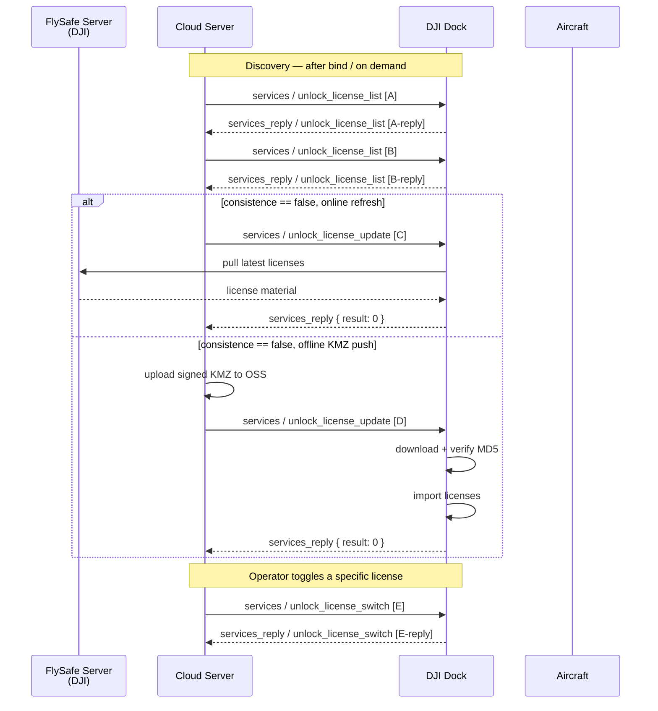
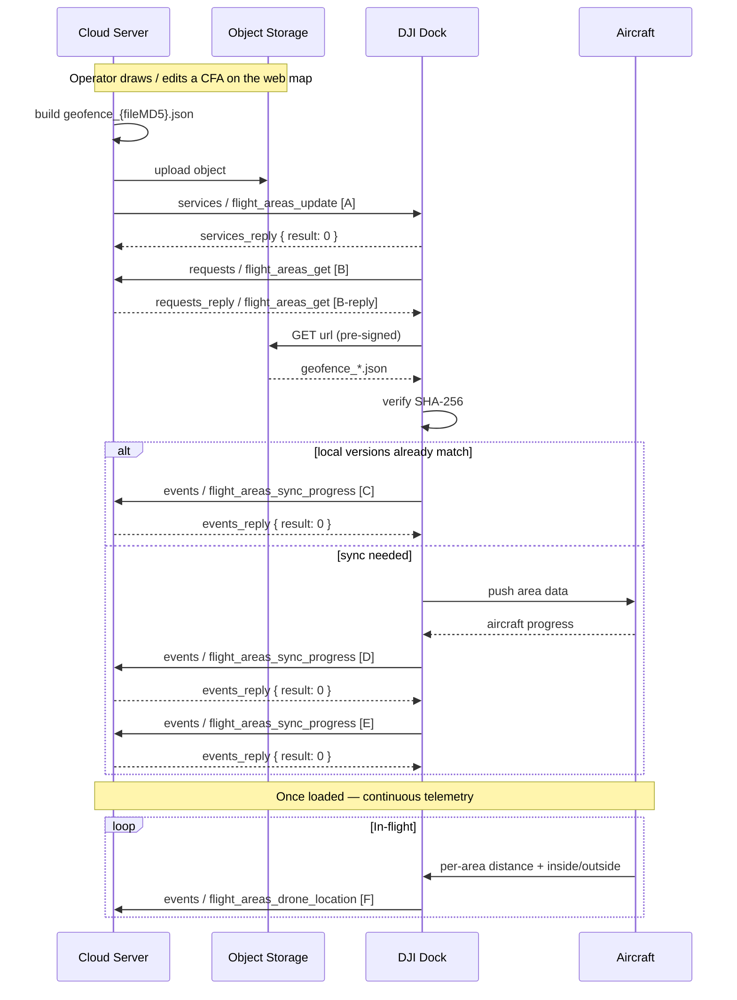

# FlySafe unlock & custom-flight-area sync

Two related-but-independent pre-flight data plane workflows that govern where the aircraft is *permitted* (FlySafe unlocking licenses) and where the operator has *configured* the aircraft to stay inside or outside (Custom Flight Areas, CFA). Both terminate in on-aircraft policy state that the flight controller enforces during wayline and DRC flight; neither is runtime-interactive once loaded.

Part of the Phase 9 workflow catalog. Wire-level schemas live in Phase 4f.

---

## Scope

| Aspect | Value |
|---|---|
| Cohorts | **Dock 2** + **Dock 3**. Pilot-path has no FlySafe / CFA MQTT surface — DJI Pilot 2 manages these through its own license flows off the corpus wire contract. |
| Direction | Mix. Cloud → device for license toggles, license updates, CFA trigger. Device → cloud for license listing reply, CFA file-list request, sync progress, and per-area aircraft distance push. |
| Transports | **MQTT** control plane + **OSS / S3 pre-signed URL** file plane for CFA file download and license KMZ download. |
| Preceding workflow | [`dock-bootstrap-and-pairing.md`](dock-bootstrap-and-pairing.md) — dock is paired; [`device-binding.md`](device-binding.md) — aircraft is reported via topology. Both workflows here should run before wayline authoring / execution per [`wayline-upload-and-execution.md`](wayline-upload-and-execution.md) so planned missions respect the loaded zones. |
| Related catalog entries | **FlySafe**: Phase 4f services [`unlock_license_switch`](../mqtt/dock-to-cloud/services/unlock_license_switch.md) · [`unlock_license_update`](../mqtt/dock-to-cloud/services/unlock_license_update.md) · [`unlock_license_list`](../mqtt/dock-to-cloud/services/unlock_license_list.md). **CFA**: Phase 4f service [`flight_areas_update`](../mqtt/dock-to-cloud/services/flight_areas_update.md) · request [`flight_areas_get`](../mqtt/dock-to-cloud/requests/flight_areas_get.md) · events [`flight_areas_drone_location`](../mqtt/dock-to-cloud/events/flight_areas_drone_location.md) · [`flight_areas_sync_progress`](../mqtt/dock-to-cloud/events/flight_areas_sync_progress.md). |

## Overview

The two surfaces are distinct:

- **FlySafe unlocking** removes DJI-enforced GEO restrictions on the aircraft via signed license files. DJI operates a FlySafe server that the dock can either pull licenses from directly (online mode) or accept licenses from via an offline `.kmz` file the cloud passes through. Seven license *types* exist — authorization zone, custom circular area, country/region, altitude limit, custom polygon area, power, RID — each with its own sub-struct. License inventory is enumerated by [`unlock_license_list`](../mqtt/dock-to-cloud/services/unlock_license_list.md); individual licenses are toggled on/off by [`unlock_license_switch`](../mqtt/dock-to-cloud/services/unlock_license_switch.md); the full set is refreshed by [`unlock_license_update`](../mqtt/dock-to-cloud/services/unlock_license_update.md).
- **Custom Flight Areas (CFA)** are operator-defined zones. Two behaviours: *Operation Area* = aircraft may operate only inside; *GEO Zone* = aircraft may operate only outside. The cloud hosts `geofence_{fileMD5}.json` files in object storage; the dock downloads them on trigger, pushes to the aircraft, and reports sync progress. Once loaded, the aircraft reports its geometric relationship to each area in real time via [`flight_areas_drone_location`](../mqtt/dock-to-cloud/events/flight_areas_drone_location.md).

Both are read-only at flight time: the flight controller enforces them without further cloud round-trips, so stale or missing data at takeoff causes either unexpected restrictions (missing unlock) or unexpected permissions (missing GEO zone).

## Actors

| Actor | Role |
|---|---|
| **FlySafe server** (DJI-operated) | Issues unlocking licenses. The dock pulls online, or the cloud relays offline via KMZ download URLs. |
| **Cloud Server** | Hosts CFA files in object storage. Signs download URLs. Drives the license lifecycle. |
| **DJI Dock** | MQTT peer. Downloads CFA files, imports FlySafe licenses, relays both to the aircraft. |
| **Aircraft** | Loads unlock licenses and custom-area geometry. Enforces at flight time. Pushes area-distance telemetry via the dock. |
| **Object storage** (OSS / S3 / MinIO) | Hosts CFA `geofence_*.json` files and offline FlySafe KMZ files with pre-signed URLs. |

## Sequence — FlySafe unlock



Payloads (verbatim from Phase 4f method docs — DJI source):

**[A]** — service `unlock_license_list` on `thing/product/{gateway_sn}/services` (query aircraft-imported licenses via `device_model_domain: 0`):

```json
{
  "bid": "xxxxxxxx-xxxx-xxxx-xxxx-xxxxxxxxxx",
  "data": {
    "device_model_domain": 0
  },
  "tid": "xxxxxxxx-xxxx-xxxx-xxxx-xxxxxxxxxx",
  "timestamp": 1654070968655
}
```

**[A-reply]** — `services_reply` on `thing/product/{gateway_sn}/services_reply` (full example showing the seven license sub-struct shapes from [`unlock_license_list.md`](../mqtt/dock-to-cloud/services/unlock_license_list.md)):

```json
{
  "bid": "xxxxxxxx-xxxx-xxxx-xxxx-xxxxxxxxxx",
  "data": {
    "consistence": false,
    "device_model_domain": 0,
    "licenses": [
      {
        "area_unlock": {
          "area_ids": [115001769, 8724]
        },
        "common_fields": {
          "begin_time": 1696948115,
          "device_sn": "xxxxxxxxx",
          "enabled": true,
          "end_time": 2145916800,
          "group_id": 2896,
          "license_id": 240330,
          "name": "Unlocking for XXX Area",
          "type": 0,
          "user_id": "xxxxxxxxx",
          "user_only": false
        }
      },
      {
        "circle_unlock": {
          "height": 500,
          "latitude": 22.60309,
          "longitude": 113.947815,
          "radius": 1581
        },
        "common_fields": {
          "begin_time": 1696948115,
          "device_sn": "xxxxxxxxx",
          "enabled": false,
          "end_time": 2145916800,
          "group_id": 2896,
          "license_id": 240331,
          "name": "Unlocking for XXX Circular Area",
          "type": 1,
          "user_id": "xxxxxxxxx",
          "user_only": false
        }
      },
      {
        "common_fields": {
          "begin_time": 1696948115,
          "device_sn": "xxxxxxxxx",
          "enabled": false,
          "end_time": 2145916800,
          "group_id": 2896,
          "license_id": 240332,
          "name": "Unlocking for China Country/Region",
          "type": 2,
          "user_id": "xxxxxxxxx",
          "user_only": false
        },
        "country_unlock": {
          "country_number": 156,
          "height": 500
        }
      },
      {
        "common_fields": {
          "begin_time": 1696948115,
          "device_sn": "xxxxxxxxx",
          "enabled": false,
          "end_time": 2145916800,
          "group_id": 2896,
          "license_id": 240333,
          "name": "Unlocking for XXX Altitude",
          "type": 3,
          "user_id": "xxxxxxxxx",
          "user_only": false
        },
        "height_unlock": {
          "height": 500
        }
      },
      {
        "common_fields": {
          "begin_time": 1696948115,
          "device_sn": "xxxxxxxxx",
          "enabled": false,
          "end_time": 2145916800,
          "group_id": 2896,
          "license_id": 240334,
          "name": "Unlocking for XXX Polygon Area",
          "type": 4,
          "user_id": "xxxxxxxxx",
          "user_only": false
        },
        "polygon_unlock": {
          "points": [
            {"latitude": 22.55403932, "longitude": 113.90488828},
            {"latitude": 22.55520018, "longitude": 113.92180215},
            {"latitude": 22.54656858, "longitude": 113.92051272}
          ]
        }
      },
      {
        "common_fields": {
          "begin_time": 1696948115,
          "device_sn": "xxxxxxxxx",
          "enabled": false,
          "end_time": 2145916800,
          "group_id": 2896,
          "license_id": 240335,
          "name": "Unlocking for XXX Power",
          "type": 5,
          "user_id": "xxxxxxxxx",
          "user_only": false
        },
        "power_unlock": {}
      },
      {
        "common_fields": {
          "begin_time": 1696948115,
          "device_sn": "xxxxxxxxx",
          "enabled": false,
          "end_time": 2145916800,
          "group_id": 2896,
          "license_id": 240336,
          "name": "Unlocking for XXX RID",
          "type": 6,
          "user_id": "xxxxxxxxx",
          "user_only": false
        },
        "rid_unlock": {
          "level": 1
        }
      }
    ],
    "result": 0
  },
  "gateway": "",
  "tid": "xxxxxxxx-xxxx-xxxx-xxxx-xxxxxxxxxx",
  "timestamp": 1654070968655
}
```

**[B]** — second `unlock_license_list` call with `device_model_domain: 3` to query the dock's server-approved set. Envelope identical to [A] with `device_model_domain: 3`. **[B-reply]** — same shape as [A-reply] with `device_model_domain: 3` echoed.

**[C]** — service `unlock_license_update` on `thing/product/{gateway_sn}/services`, **online mode** (`data: {}` — no `file`; dock pulls directly from FlySafe):

```json
{
  "bid": "xxxxxxxx-xxxx-xxxx-xxxx-xxxxxxxxxx",
  "data": {},
  "tid": "xxxxxxxx-xxxx-xxxx-xxxx-xxxxxxxxxx",
  "timestamp": 1654070968655
}
```

> Body-variant note: online mode omits `file` entirely. DJI's source only shows the populated `file` form below ([D]); an empty `data: {}` is the cloud-side representation of the "no file → online fallback" behaviour described in [`unlock_license_update.md`](../mqtt/dock-to-cloud/services/unlock_license_update.md).

**[D]** — service `unlock_license_update`, **offline mode** (populated `file` struct — dock downloads and verifies MD5):

```json
{
  "bid": "xxxxxxxx-xxxx-xxxx-xxxx-xxxxxxxxxx",
  "data": {
    "file": {
      "fingerprint": "xxxx",
      "url": "https://xx.oss-cn-hangzhou.aliyuncs.com/xx.kmz?Expires=xx&OSSAccessKeyId=xxx&Signature=xxx"
    }
  },
  "tid": "xxxxxxxx-xxxx-xxxx-xxxx-xxxxxxxxxx",
  "timestamp": 1654070968655
}
```

The `services_reply` for both [C] and [D] carries only `{ result: 0 }` (no `license_id` echo — see [`unlock_license_update.md`](../mqtt/dock-to-cloud/services/unlock_license_update.md)).

**[E]** — service `unlock_license_switch` on `thing/product/{gateway_sn}/services`:

```json
{
  "bid": "xxxxxxxx-xxxx-xxxx-xxxx-xxxxxxxxxx",
  "data": {
    "enable": true,
    "license_id": 240330
  },
  "tid": "xxxxxxxx-xxxx-xxxx-xxxx-xxxxxxxxxx",
  "timestamp": 1654070968655
}
```

**[E-reply]** — `services_reply` (echoes `license_id` so concurrent toggles correlate):

```json
{
  "bid": "xxxxxxxx-xxxx-xxxx-xxxx-xxxxxxxxxx",
  "data": {
    "license_id": 240330,
    "result": 0
  },
  "tid": "xxxxxxxx-xxxx-xxxx-xxxx-xxxxxxxxxx",
  "timestamp": 1234567890123
}
```

Field legend (non-obvious enums):

- `device_model_domain` — `0` Aircraft (already-imported licenses on the aircraft) · `3` Dock (licenses approved for the dock on the FlySafe website).
- `consistence` — `true` device-side licenses match server-approved set · `false` sync needed (trigger `unlock_license_update`).
- `common_fields.type` — `0` Authorization zone · `1` Custom circular area · `2` Country/region · `3` Altitude limit · `4` Custom polygon area · `5` Power · `6` RID. Selects which sibling sub-struct is populated (`area_unlock` / `circle_unlock` / `country_unlock` / `height_unlock` / `polygon_unlock` / `power_unlock` / `rid_unlock`).
- `rid_unlock.level` — `1` EU RID · `2` China RID.
- `country_unlock.country_number` — ISO-3166-1 numeric (e.g., `156` = China).
- `common_fields.begin_time` / `end_time` — **second-level** UNIX timestamps (not ms).
- `common_fields.user_only` — `true` = license active only when the specified DJI account is logged in.
- `common_fields.enabled` — mirrors the last `unlock_license_switch.enable` state (read-only status).
- `unlock_license_switch.enable` — `true` / `1` enable · `false` / `0` disable.

## Sequence — Custom-flight-area sync



Payloads (verbatim from Phase 4f method docs — DJI source):

**[A]** — service `flight_areas_update` on `thing/product/{gateway_sn}/services` (trigger resync; `data: null` — command carries no parameters):

```json
{
  "bid": "xxxxxxxx-xxxx-xxxx-xxxx-xxxxxxxxxx",
  "data": null,
  "method": "flight_areas_update",
  "tid": "xxxxxxxx-xxxx-xxxx-xxxx-xxxxxxxxxx",
  "timestamp": 1654070968655
}
```

`services_reply` returns `{ "result": 0 }` acknowledging receipt only — not sync completion (see [`flight_areas_update.md`](../mqtt/dock-to-cloud/services/flight_areas_update.md)).

**[B]** — dock-initiated request `flight_areas_get` on `thing/product/{gateway_sn}/requests` (`data: null`):

```json
{
  "bid": "xxxxxxxx-xxxx-xxxx-xxxx-xxxxxxxxxx",
  "data": null,
  "method": "flight_areas_get",
  "tid": "xxxxxxxx-xxxx-xxxx-xxxx-xxxxxxxxxx",
  "timestamp": 1654070968655
}
```

**[B-reply]** — `requests_reply` on `thing/product/{gateway_sn}/requests_reply` with the file manifest:

```json
{
  "bid": "xxxxxxxx-xxxx-xxxx-xxxx-xxxxxxxxxx",
  "data": {
    "output": {
      "files": [
        {
          "checksum": "sha256",
          "name": "geofence_xxx.json",
          "size": 500,
          "url": "https://xx.oss-cn-hangzhou.aliyuncs.com/xx.json?Expires=xx&OSSAccessKeyId=xxx&Signature=xxx"
        }
      ]
    },
    "result": 0
  },
  "method": "flight_areas_get",
  "tid": "xxxxxxxx-xxxx-xxxx-xxxx-xxxxxxxxxx",
  "timestamp": 1654070968655
}
```

An empty `output.files[]` signals the cloud currently has no CFAs for this device — the dock clears local state.

**[C]** — event `flight_areas_sync_progress` on `thing/product/{gateway_sn}/events`, **local-match fast path** (`status: "synchronized"` immediately; `need_reply: 1`):

```json
{
  "bid": "xxxxxxxx-xxxx-xxxx-xxxx-xxxxxxxxxx",
  "data": {
    "file": {
      "checksum": "sha256",
      "name": "geofence_xxx.json"
    },
    "reason": 0,
    "status": "synchronized"
  },
  "method": "flight_areas_sync_progress",
  "need_reply": 1,
  "tid": "xxxxxxxx-xxxx-xxxx-xxxx-xxxxxxxxxx",
  "timestamp": 16540709686556
}
```

**[D]** — event `flight_areas_sync_progress`, **in-progress push** — same envelope as [C] with `status: "synchronizing"`. See [`flight_areas_sync_progress.md`](../mqtt/dock-to-cloud/events/flight_areas_sync_progress.md) for the full status / reason enums.

**[E]** — event `flight_areas_sync_progress`, **terminal push** — same envelope; `status` is one of `synchronized` / `fail` / `switch_fail`. On `fail` / `switch_fail`, `reason` is populated (integer 1–13; see enum below).

`events_reply` for [C] / [D] / [E]: `{ "data": { "result": 0 }, ... }`.

**[F]** — event `flight_areas_drone_location` on `thing/product/{gateway_sn}/events` (`need_reply: 0` — fire-and-forget):

```json
{
  "bid": "xxxxxxxx-xxxx-xxxx-xxxx-xxxxxxxxxx",
  "data": {
    "drone_locations": [
      {
        "area_distance": 100.11,
        "area_id": "d275c4e1-d864-4736-8b5d-5f5882ee9bdd",
        "is_in_area": true
      }
    ]
  },
  "method": "flight_areas_drone_location",
  "need_reply": 0,
  "tid": "xxxxxxxx-xxxx-xxxx-xxxx-xxxxxxxxxx",
  "timestamp": 16540709686556
}
```

Field legend (non-obvious enums):

- `flight_areas_sync_progress.status` — `wait_sync` queued · `synchronizing` in progress · `synchronized` finished OK · `fail` sync failed (`reason` populated) · `switch_fail` enabling the new area set failed after sync (`reason` populated).
- `flight_areas_sync_progress.reason` — `1` parse-file-info failed · `2` get-aircraft-file-info failed · `3` cloud download failed · `4` link flip failed · `5` file transfer failed · `6` disable failed · `7` delete CFA failed · `8` load job-area data on aircraft failed · `9` enable failed · `10` dock enhanced image transmission cannot be turned off · `11` aircraft startup failed · `12` checksum verification failed · `13` sync timeout. DJI's success example sends `reason: 0` — not a documented enum value; treat as informational.
- `drone_locations[].area_id` — matches the `name`-stem of the loaded file (`geofence_{fileMD5}.json`) / ID embedded in the file.
- `drone_locations[].area_distance` — meters to the nearest area boundary (positive regardless of inside/outside).
- `drone_locations[].is_in_area` — `true` inside · `false` outside.
- Example `timestamp` `16540709686556` is 14-digit (DJI source typo). Canonical MQTT timestamps in the corpus are 13-digit epoch-ms — cloud should emit/accept 13-digit.

## Step-by-step — FlySafe

### 1. Discover current license inventory

- **Method:** [`unlock_license_list`](../mqtt/dock-to-cloud/services/unlock_license_list.md). Issue once per `device_model_domain` — `0` queries the aircraft's imported licenses, `3` queries the dock's server-approved set.
- The reply carries `consistence: bool` — `false` indicates the aircraft-imported set does not match the server-approved set for that device. That is the trigger to refresh. When `true`, the inventory is already in sync and no further action is needed.
- Each `licenses[]` entry has a `common_fields` block plus exactly one sub-struct sibling (`area_unlock` / `circle_unlock` / `country_unlock` / `height_unlock` / `polygon_unlock` / `power_unlock` / `rid_unlock`) selected by `common_fields.type`. See [`unlock_license_list.md`](../mqtt/dock-to-cloud/services/unlock_license_list.md) for the seven sub-struct shapes.
- `begin_time` / `end_time` are **second-level** UNIX timestamps — cloud UIs must not mis-scale these to milliseconds.
- Label-casing drift: v1.11 + v1.15 Dock 2 label unlock types in running-text form ("Authorization zone unlocking"); v1.15 Dock 3 uses title-case past-tense ("Authorization Zone Unlocked"). Numeric `type` is stable.

### 2. Refresh license file (when `consistence: false`)

- **Method:** [`unlock_license_update`](../mqtt/dock-to-cloud/services/unlock_license_update.md).
- **Online mode:** send `data: {}` with no `file`. Dock pulls fresh licenses from the FlySafe server directly. Simpler for typical deployments since DJI curates the licenses upstream.
- **Offline mode:** send `data: { file: { url, fingerprint } }`. `url` is a pre-signed OSS / S3 URL; `fingerprint` is the MD5 of the `.kmz` contents. The dock downloads, verifies MD5, and imports. Use when the cloud operator needs to control which licenses land (air-gapped networks, staged rollouts).
- Reply returns `{ result: 0 }`; no `license_id` echo (unlike `unlock_license_switch`).
- After the update completes, re-issue `unlock_license_list` to observe the new inventory and `consistence: true`.

### 3. Toggle individual license

- **Method:** [`unlock_license_switch`](../mqtt/dock-to-cloud/services/unlock_license_switch.md). Payload: `{ license_id, enable }`.
- `license_id` is the integer returned in a prior `unlock_license_list` reply (`common_fields.license_id`).
- Reply echoes `license_id` so concurrent toggles can be correlated back to their commands. Cloud implementations should treat the echo as the match key, not bid / tid.
- **`enabled` state on a list entry** reflects the last `unlock_license_switch` outcome; the field is a status mirror, not a settable attribute on `unlock_license_update` or `unlock_license_list`.

### 4. Safety

The user-facing operator flow typically pre-toggles the specific licenses the mission needs right before takeoff. `unlock_license_switch` is fast; toggling on cadence with mission planning is cheaper than a blanket "enable all" that would accumulate authorization beyond the immediate operator need. The `user_only: true` licenses add a further constraint — they are active only when the specified DJI user account is logged in to the dock.

## Step-by-step — CFA

### 1. Cloud prepares the file

- CFA files are JSON, named `geofence_{fileMD5}.json` where `{fileMD5}` is the MD5 of the file contents. **Filename is part of the contract** — per DJI's Dock 2 v1.15 docs the dock relies on this naming. Clouds generating CFA files must emit this convention; arbitrary names are not supported.
- Template schema is downloadable from DJI (linked from the Dock 2 v1.11 [`custom-flight-area.md`](../../Cloud-API-Doc/docs/en/30.feature-set/20.dock-feature-set/110.custom-flight-area.md)). The file encodes one or more areas with `type` = Operation Area or GEO Zone.
- Cloud uploads the file to its object storage and holds it ready. No MQTT traffic yet.

### 2. Trigger resync

- **Method:** [`flight_areas_update`](../mqtt/dock-to-cloud/services/flight_areas_update.md). Payload: `data: null` — command carries no parameters.
- Reply `{ result: 0 }` acknowledges receipt only; it does not indicate sync completion. That comes from [`flight_areas_sync_progress`](../mqtt/dock-to-cloud/events/flight_areas_sync_progress.md) events that follow.

### 3. Dock fetches file manifest

- **Method:** [`flight_areas_get`](../mqtt/dock-to-cloud/requests/flight_areas_get.md). This is a *dock-initiated request* — the dock asks the cloud for the current file inventory after being triggered by `flight_areas_update` (or on its own cadence — e.g. reboot).
- Reply `output.files[]` contains: `name`, `url` (pre-signed), `checksum` (SHA-256), `size`. The `url` expires per STS; dock should download promptly.
- Empty array means the cloud currently has no CFA files for this device — the dock should clear its local set.

### 4. Download and verify

- Dock fetches each `url` from object storage directly.
- Dock computes SHA-256 over the bytes and compares against `checksum`. Mismatch → sync fail with `reason: 12` (checksum verification failed).

### 5. Push to aircraft

- Dock forwards the file contents + intended behaviour to the aircraft over its internal link. Aircraft stores the areas, computes area geometry, and acknowledges back to the dock.
- If the dock's enhanced image transmission link cannot be closed (which DJI's tooling does to free bandwidth for large area files), sync fails with `reason: 10`.

### 6. Report sync progress

- **Method:** [`flight_areas_sync_progress`](../mqtt/dock-to-cloud/events/flight_areas_sync_progress.md). `need_reply: 1` — cloud must acknowledge each progress event with `{ result: 0 }` on `events_reply`.
- `status` is one of five enum strings:

| `status` | Meaning |
|---|---|
| `wait_sync` | Queued; aircraft not yet started sync. |
| `synchronizing` | In progress. |
| `synchronized` | Completed; areas active on the aircraft. |
| `fail` | Sync failed. `reason` populated. |
| `switch_fail` | Sync succeeded at the file level but enabling the new area set on the flight controller failed. `reason` populated. |

- On `fail` / `switch_fail`, `reason` is an integer 1–13. See [`flight_areas_sync_progress.md`](../mqtt/dock-to-cloud/events/flight_areas_sync_progress.md) for the full enum. Common values: `3` (download failed), `12` (checksum mismatch), `13` (timeout).
- DJI's success example sends `reason: 0` which is not a documented enum value — treat `0` as informational and rely on `status` for the outcome.

### 7. Ongoing: aircraft distance telemetry

- Once areas are active, the aircraft pushes [`flight_areas_drone_location`](../mqtt/dock-to-cloud/events/flight_areas_drone_location.md) via the dock whenever its distance / inside-outside state changes. `need_reply: 0` — fire-and-forget.
- Payload: `drone_locations[]` with one struct per loaded area — `area_id` matches the `name`-stem of the loaded file, `area_distance` is meters to the nearest boundary, `is_in_area` is the inside/outside flag.
- Cloud rendering: operators watch these for proximity alerts ("approaching operation-area boundary") even though the flight controller is the authoritative enforcer.

## Variants

### FlySafe — online vs offline license update

Choose based on network posture:
- **Online** (`unlock_license_update` with empty body): dock pulls from the FlySafe server. Preferred when the dock has outbound internet to `*.dji.com`.
- **Offline** (with `file` struct): cloud mediates the download. Required when the dock is on a closed network or when the operator must curate which licenses land.

### FlySafe — license type diversity

Seven unlock types with different sub-struct shapes. A single device can hold a mix. Important behaviours:
- **Authorization zone** (`type = 0`) unlocks DJI-designated zones by ID (`area_ids[]`).
- **Circle** / **polygon** (`type = 1` / `4`) let the operator unlock arbitrary custom geometry up to a height cap.
- **Country** (`type = 2`) uses ISO-3166-1 numeric country codes — e.g. `156` = China.
- **Altitude limit** (`type = 3`) raises the hard altitude ceiling (`height` in meters, max `65535`).
- **Power** (`type = 5`) has an empty sub-struct — it just toggles power-related gating.
- **RID** (`type = 6`) enables Remote ID broadcasting: `level: 1` = EU RID, `level: 2` = China RID.

### CFA — `wait_sync` transient state

Not all syncs emit `wait_sync` — fast local-network transfers may jump straight from the dock receiving the trigger to `synchronizing`. Treat `wait_sync` as informational.

### CFA — empty file set

When the cloud clears all CFAs for a device, `flight_areas_get` reply's `output.files[]` comes back empty. The dock should interpret this as "no areas" and clear its local state. A `flight_areas_sync_progress` event with an empty `file` struct may or may not follow depending on DJI's internal flow — cloud must not require it.

### Dock 3 source omission

Dock 3 v1.15 source's `drone_locations[]` schema table drops `area_id`, but the example carries it, and Dock 2 v1.11 + v1.15 both list it in the table. The field is authoritative on the wire; the Dock 3 table omission is a source-extraction bug (documented in [`flight_areas_drone_location.md`](../mqtt/dock-to-cloud/events/flight_areas_drone_location.md)).

## Error paths

| Failure | Signal | Handling |
|---|---|---|
| FlySafe server unreachable (online mode) | `unlock_license_update` `services_reply.result: <non-zero>` | Fall back to offline KMZ push, or retry with backoff. |
| License KMZ MD5 mismatch (offline mode) | `unlock_license_update` services_reply non-zero | Re-upload KMZ; recompute MD5; re-issue. |
| `unlock_license_switch` rejected (license expired) | `services_reply.result: <non-zero>`, `license_id` echoed | Check `common_fields.end_time` in the listing; request a renewed license from FlySafe. |
| `flight_areas_get` URL expired before dock downloads | `flight_areas_sync_progress` `status: "fail"`, `reason: 3` (download failed) | Re-trigger `flight_areas_update`; cloud regenerates pre-signed URLs with fresh expiry. |
| CFA file checksum mismatch | `status: "fail"`, `reason: 12` | Verify object store integrity; regenerate the file; re-trigger. |
| Aircraft-side job-area load failure | `status: "fail"`, `reason: 8` | Usually transient; retry once. Persistent failure suggests aircraft-side file format error — verify the JSON against DJI's CFA template. |
| `switch_fail` after apparent success | `status: "switch_fail"` + `reason` | Flight controller refused to activate. Retry after aircraft power cycle; escalate if reproducible. |
| Sync timeout | `status: "fail"`, `reason: 13` | Retry. Check dock ↔ aircraft link quality. |

FlySafe / CFA failures surface via per-method `services_reply` codes rather than a dedicated BC error-code module — the Phase 8 error-code catalog does not carry a module dedicated to FlySafe or CFA. Treat `reason` on `flight_areas_sync_progress` as authoritative for CFA sync failures.

## Provenance

| Source | Role |
|---|---|
| `[Cloud-API-Doc/docs/en/30.feature-set/20.dock-feature-set/110.custom-flight-area.md]` | v1.11 Dock 2 CFA feature-set. Primary choreography narrative + authoritative Mermaid sequence. |
| `[DJI_Cloud/DJI_CloudAPI-Dock2-Custom-Flight-Area.txt]` · `[DJI_CloudAPI-Dock3-Custom-Flight-Area.txt]` | v1.15 CFA wire (Phase 4f). |
| `[DJI_Cloud/DJI_CloudAPI-Dock2-FlySafe.txt]` · `[DJI_CloudAPI-Dock3-FlySafe.txt]` | v1.15 FlySafe wire (Phase 4f). No Cloud-API-Doc feature-set equivalent exists for FlySafe — the v1.11 page at `60.api-reference/.../170.flysafe.md` is a method reference, not a choreography narrative. |
| [`master-docs/mqtt/dock-to-cloud/services/unlock_license_switch.md`](../mqtt/dock-to-cloud/services/unlock_license_switch.md) · [`unlock_license_update`](../mqtt/dock-to-cloud/services/unlock_license_update.md) · [`unlock_license_list`](../mqtt/dock-to-cloud/services/unlock_license_list.md) | Phase 4f FlySafe method catalog. |
| [`master-docs/mqtt/dock-to-cloud/services/flight_areas_update.md`](../mqtt/dock-to-cloud/services/flight_areas_update.md) · [`requests/flight_areas_get.md`](../mqtt/dock-to-cloud/requests/flight_areas_get.md) · [`events/flight_areas_drone_location.md`](../mqtt/dock-to-cloud/events/flight_areas_drone_location.md) · [`events/flight_areas_sync_progress.md`](../mqtt/dock-to-cloud/events/flight_areas_sync_progress.md) | Phase 4f CFA method catalog. |
