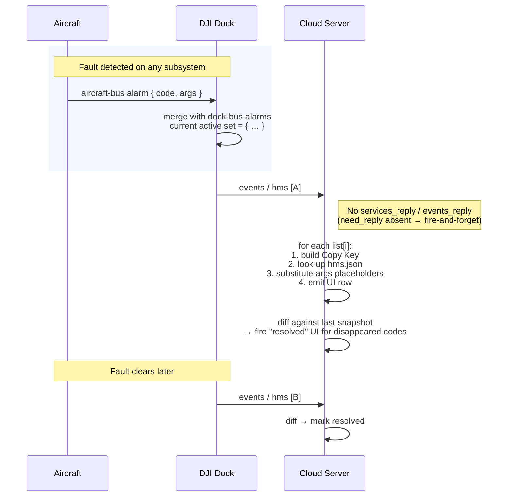

# HMS event reporting

How the dock pushes Health Management System (HMS) warnings to the cloud, how the cloud resolves each warning code into operator-facing copy, and how the "complete snapshot, disappearance = resolution" semantics let the cloud track alarm lifecycle without per-alarm clear events.

Part of the Phase 9 workflow catalog. Wire-level schema lives in Phase 4f; the 1,769-alarm code catalog lives in Phase 8 [`hms-codes/`](../hms-codes/README.md).

---

## Scope

| Aspect | Value |
|---|---|
| Cohorts | **Dock 2** + **Dock 3**. Pilot-path does not emit `hms` — only dock-path MQTT does. Aircraft-originated alarms reach the cloud via the dock in both cohorts. |
| Direction | Device → cloud push. `need_reply: 0` (the example omits `need_reply`, default applies) — fire-and-forget. |
| Transports | **MQTT** only. Cloud-side copy lookup is a local dictionary join against the bundled `hms.json`. |
| Preceding workflow | [`dock-bootstrap-and-pairing.md`](dock-bootstrap-and-pairing.md) + [`device-binding.md`](device-binding.md). |
| Related catalog entries | Phase 4f event: [`hms`](../mqtt/dock-to-cloud/events/hms.md). Phase 8 code catalog: [`hms-codes/README.md`](../hms-codes/README.md) (1,769 alarms across 14 first-byte prefix files + outliers). |

## Overview

An HMS warning cycle is three-legged:

1. **On-device detection.** The aircraft or dock subsystem detects a fault (IMU drift, compass interference, battery temperature, SD-card full, gimbal stall, etc.) and raises it to the dock's HMS aggregator. Each alarm has a hex `code` (e.g. `0x16100083`) whose first byte identifies the subsystem domain — see [`hms-codes/README.md`](../hms-codes/README.md) for the 14-prefix taxonomy.
2. **Batched MQTT push.** The dock publishes the current active-alarm set as `method: hms` on `thing/product/{gateway_sn}/events`. Each push is a **complete snapshot** of the active set (up to 20 alarms per event per DJI's `size: 20`). The cloud never receives a "clear" event — an alarm disappears from the set and that absence is the clear signal.
3. **Cloud-side copy resolution.** For each alarm the cloud joins `code` + `device_type` + `in_the_sky` into a `Copy Key`, looks that up in the bundled `hms.json` dictionary, then substitutes `%alarmid` / `%component_index` / `%sensor_index` / `%battery_index` / `%dock_cover_index` / `%charging_rod_index` placeholders from the alarm's `args` struct. The result is the human-readable copy shown in the operator UI.

The cloud must diff against its last-known set to drive UI state: *new* alarms render as fresh toasts; alarms that remained present remain visible; alarms that disappeared flip to resolved.

## Actors

| Actor | Role |
|---|---|
| **Aircraft subsystem** (FC / camera / gimbal / navigation / vision / …) | Raises alarms to the aircraft HMS bus. |
| **Dock subsystem** (charging / cover / battery / station) | Raises dock-specific alarms. |
| **DJI Dock** | Aggregates aircraft + dock alarms. Publishes the full current set on `events`. |
| **Cloud Server** | Parses list, resolves copy via `hms.json`, persists snapshot, diffs against prior snapshot, updates UI. |

## Sequence



Payloads (verbatim from [`events/hms.md`](../mqtt/dock-to-cloud/events/hms.md) — DJI source):

**[A]** — active-set push on `thing/product/{gateway_sn}/events`:

```json
{
  "bid": "xxxxxxxx-xxxx-xxxx-xxxx-xxxxxxxxxx",
  "data": {
    "list": [
      {
        "args": {
          "component_index": 0,
          "sensor_index": 0
        },
        "code": "0x16100083",
        "device_type": "0-67-0",
        "imminent": 1,
        "in_the_sky": 0,
        "level": 2,
        "module": 3
      }
    ]
  },
  "tid": "xxxxxxxx-xxxx-xxxx-xxxx-xxxxxxxxxx",
  "timestamp": 1654070968655,
  "method": "hms"
}
```

Field legend (non-obvious enums):

- `level` — `0` Notification · `1` Reminder · `2` Warning.
- `module` — `0` Flight mission · `1` Device management · `2` Media · `3` HMS (v1.11 + v1.15 Dock 2 label `"hms"` lowercase; v1.15 Dock 3 relabels to `"HMS"` — numeric value stable).
- `in_the_sky` — `0` on-ground · `1` in-flight. Load-bearing for Copy Key (`fpv_tip_{code}` vs `fpv_tip_{code}_in_the_sky`).
- `imminent` — `0` persistent · `1` transient (clears on its own).
- `code` — hex string; first byte identifies the subsystem. See [`hms-codes/README.md`](../hms-codes/README.md).
- `device_type` — `{domain}-{type}-{subtype}`.
- `args.component_index` / `args.sensor_index` — 0-indexed on the wire, 1-indexed after substitution into copy placeholders (see step 4).

No `events_reply`: `need_reply` is omitted from the example (envelope default applies — fire-and-forget). Cloud must not emit a reply.

**[B]** — clear push: same envelope as [A]; `data.list` now omits the resolved alarm's struct. No explicit "cleared" field — the cloud discovers the clear via snapshot diff by `(code, device_type, args.sensor_index, args.component_index)` tuple.

## Step-by-step

### 1. Fault detection

Subsystems raise alarms to the dock's HMS aggregator independently. The dock holds a single unified set of active alarms spanning aircraft and dock domains. There is no cloud-visible distinction between "aircraft-originated" and "dock-originated" beyond the `device_type` field on each alarm and the first-byte prefix of `code`.

### 2. Event push (`method: hms`)

- **Topic:** `thing/product/{gateway_sn}/events`. **Method:** `hms`. Full schema: [`mqtt/dock-to-cloud/events/hms.md`](../mqtt/dock-to-cloud/events/hms.md).
- **Cadence:** event-driven. DJI's feature-set page describes it as "complete alarm information" — i.e. the dock pushes on meaningful change (new / resolved alarm) and the payload is the full current set, not a delta.
- **`list[]`** carries up to 20 entries per event (DJI's stated `size: 20`). A dock with more than 20 concurrent alarms must either prioritize or split; the wire does not define that behavior. Treat `> 20` as an extraordinary condition.
- **Per-entry fields** — the cloud needs all of them for copy resolution:
  - `code` — hex string (e.g. `0x16100083`). Key into [`hms-codes/`](../hms-codes/README.md) and into `hms.json`.
  - `level` — `0` Notification, `1` Reminder, `2` Warning. Drives UI severity.
  - `module` — `0` Flight mission, `1` Device management, `2` Media, `3` HMS. v1.11 + v1.15 Dock 2 label module `3` as `"hms"`; v1.15 Dock 3 relabels to `"HMS"`. Numeric value is stable.
  - `in_the_sky` — `0` on-ground, `1` in-flight. **Load-bearing for Copy Key construction** — aircraft copy uses a different key when in-flight.
  - `device_type` — `{domain}-{type}-{subtype}` enum. Distinguishes alarms from different aircraft / payload models when the same `code` appears on multiple device types.
  - `imminent` — `0` persistent, `1` transient. A transient `imminent: 1` alarm clears on its own (e.g. wind spike subsides); persistent ones require explicit resolution.
  - `args.component_index` + `args.sensor_index` — integers used by the copy substitution step.
- **No reply.** The `hms` event alone in the 4f family does not require `events_reply`. Cloud must not send one.

### 3. Copy Key construction

Per DJI's feature-set splicing rules:

| Alarm origin | Copy Key |
|---|---|
| **Dock alarm** (code in `0x12` battery-station, `0x1E` PSDK-on-dock, cover / charging / station subsystems) | `dock_tip_{code}` |
| **Aircraft alarm — on the ground** (`in_the_sky: 0`) | `fpv_tip_{code}` |
| **Aircraft alarm — in flight** (`in_the_sky: 1`) | `fpv_tip_{code}_in_the_sky` |

Example — aircraft flight-control alarm `0x16100083` while in flight: Copy Key = `fpv_tip_0x16100083_in_the_sky`.

The `device_type` field — not the `module` field — is the reliable cloud-side signal for "is this dock-originated?" since DJI's splicing rules key off the originating device, not the alarm module.

### 4. Copy substitution (placeholders in `hms.json` entries)

Looked-up copy contains placeholder tokens that the cloud replaces from `args`:

| Placeholder | Replacement source | Rule |
|---|---|---|
| `%alarmid` | `code` itself | Substitute with the hex `code` literal (e.g. `0x16100001`). |
| `%index` | `args.sensor_index` | Substitute `sensor_index + 1`. (Off-by-one — DJI source is 0-indexed on the wire, 1-indexed in copy.) |
| `%component_index` | `args.component_index` | Substitute `component_index + 1`. Same off-by-one. |
| `%battery_index` | `args.sensor_index` | `0` → `"left"`, any other → `"right"`. Aircraft-side. |
| `%dock_cover_index` | `args.sensor_index` | `0` → `"left"`, any other → `"right"`. Dock-side. |
| `%charging_rod_index` | `args.sensor_index` | `0` → `"front"`, `1` → `"back"`, `2` → `"left"`, `3` → `"right"`. Dock-side. |

These are the complete substitution rules per DJI's feature-set page. Strings not containing any `%…` token are displayed verbatim.

### 5. Snapshot diff and UI update

After resolving copy for every `list[]` entry, the cloud compares the new set against the last-known set by `(code, device_type, args.sensor_index, args.component_index)` tuple:

| Transition | UI action |
|---|---|
| Code present now, absent previously | New alarm — toast / open row. |
| Code present both pushes | Persistent — leave visible. Cloud may update `level` / `imminent` if changed. |
| Code absent now, present previously | **Resolved** — close row / move to history. |

Because `hms` pushes are full snapshots, the cloud's database must be keyed on the current-snapshot identity, not accumulate an append-only log of alarm events.

### 6. Code catalog & `hms.json` dictionary

Two cloud-side references:

- **Corpus catalog** — [`hms-codes/`](../hms-codes/README.md). 14 first-byte prefix files + outliers, all 1,769 codes with curated English tip copy. Useful for human lookup, audit, and for a server-side fallback when the operator is browsing historical alarms.
- **Runtime dictionary** — DJI's `hms.json` file ([CDN link in DJI's feature-set page](https://terra-1-g.djicdn.com/fee90c2e03e04e8da67ea6f56365fc76/SDK%20%E6%96%87%E6%A1%A3/CloudAPI/hms.json), mirrored at [`DJI_Cloud/HMS.json`](../../DJI_Cloud/HMS.json)). Load this at cloud boot; it is the authoritative copy-resolution source. Refresh on DJI updates.

Both carry the same 1,769 codes; the corpus catalog additionally normalizes 531 CN-in-`tipEn` strings that DJI leaked into the English copy key (marked with trailing **+**). See [`hms-codes/README.md §5`](../hms-codes/README.md) for the CJK-in-English policy.

## Variants

### `level` severity

`0` Notification, `1` Reminder, `2` Warning. Cloud UIs typically map these to info / warning / error visual treatments. DJI does not prescribe a mapping.

### `module` semantics

DJI documents four values (`0` Flight mission, `1` Device management, `2` Media, `3` HMS). In practice most codes surface as `module: 3` (HMS) since that is the alarm delivery channel. The other values appear when an HMS alarm is surfaced from within a specific subsystem context (e.g. media-upload failure raised while a flight-task is in progress).

### Airborne vs on-ground copy

Only *aircraft* alarms toggle copy by `in_the_sky`. Dock alarms always use `dock_tip_{code}`. When the same `code` is defined for both `fpv_tip_{code}` and `fpv_tip_{code}_in_the_sky`, the latter is the strict-flight-specific variant; if only `fpv_tip_{code}` exists, use it regardless of `in_the_sky`.

### `device_type` enum

Format `{domain}-{type}-{subtype}`. See [`device-properties/`](../device-properties/README.md) for per-device enumerations. The cloud should display `device_type` alongside the alarm copy so operators can tell which aircraft on a multi-dock deployment raised which alarm.

### Transient (`imminent: 1`) alarms

Display with a "may clear soon" affordance — the dock will drop it from the next `hms` snapshot once the condition subsides. These are typical for environmental conditions (wind, temperature) and do not require operator action.

## Error paths

HMS is a one-way device-to-cloud push with no reply required, so there is no protocol-level error path. Cloud implementers do need to handle:

| Failure | Cloud-side impact | Handling |
|---|---|---|
| Unknown `code` (not in `hms.json`) | Copy lookup miss | Display the raw hex `code` + `level` + `device_type`. Log for later catalog update. |
| Stale `hms.json` (DJI added codes after the cloud's last dictionary refresh) | Some alarms render as raw code | Refresh from DJI CDN; rebuild [`hms-codes/`](../hms-codes/README.md) via [`_build/generate_hms_codes.py`](../_build/generate_hms_codes.py) after pulling new `HMS.json`. |
| Malformed / truncated payload | Parse failure | Drop the event — next full snapshot will resupply complete state. Do not infer alarm state from partial data. |
| Cloud restart — no prior snapshot | First `hms` arrival treated as entirely-new | Fine. Subsequent snapshots drive diffs normally. |

HMS alarms themselves do not map to BC error-code modules (BC modules govern HTTP / MQTT error replies — see [`error-codes/README.md`](../error-codes/README.md)); the two catalogs are orthogonal. Source filename irony: DJI's source file `DJI_CloudAPI-HMS-Codes.txt` contains BC error codes, not HMS alarms, despite the name (see [`error-codes/README.md §6`](../error-codes/README.md)).

## Provenance

| Source | Role |
|---|---|
| `[Cloud-API-Doc/docs/en/30.feature-set/20.dock-feature-set/60.hms.md]` | v1.11 Dock 2 feature-set — Copy Key splicing rules + placeholder substitution rules. Only authoritative choreography narrative. |
| `[DJI_Cloud/DJI_CloudAPI-Dock2-HMS.txt]` · `[DJI_CloudAPI-Dock3-HMS.txt]` | v1.15 wire-level payload (Phase 4f). |
| [`master-docs/mqtt/dock-to-cloud/events/hms.md`](../mqtt/dock-to-cloud/events/hms.md) | Phase 4f HMS event schema. |
| [`master-docs/hms-codes/README.md`](../hms-codes/README.md) | Phase 8 curated code catalog — 1,769 alarms across 14 first-byte prefixes. |
| `[DJI_Cloud/HMS.json]` | DJI's authoritative `hms.json` copy-resolution dictionary (CDN-mirrored). |
| [`master-docs/_build/generate_hms_codes.py`](../_build/generate_hms_codes.py) | Regeneration script for Phase 8 catalog; re-run after DJI `HMS.json` refreshes. |
