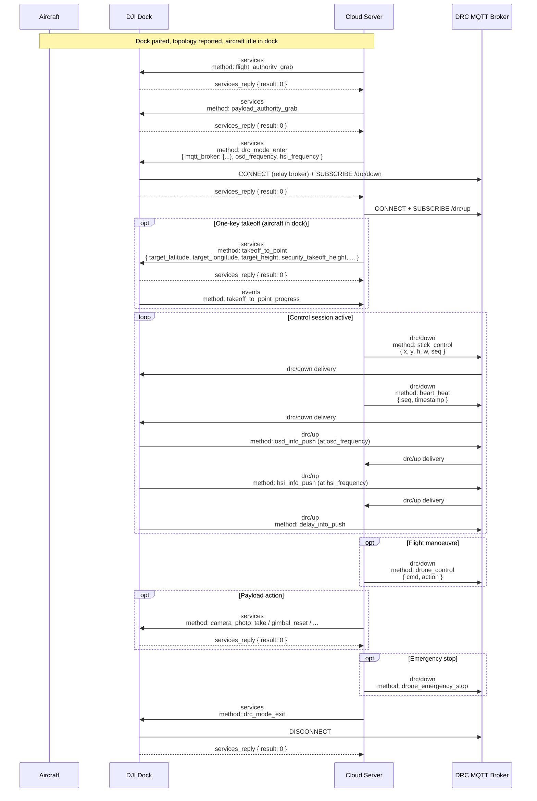
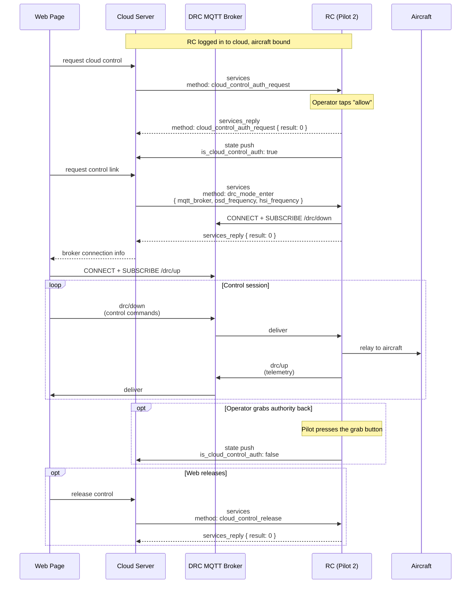

# Live flight controls (DRC)

How the cloud takes direct remote control of an aircraft — authority grab, DRC mode entry, the low-latency control channel (`drc/up` + `/drc/down`), and the control surfaces exposed on top (stick, drone-control, fly-to / takeoff-to, camera / gimbal, payload-extra). Covers both dock-path (Dock 2 / Dock 3) and pilot-path (RC Plus 2 / RC Pro via Pilot 2).

Part of the Phase 9 workflow catalog. Schema bodies live in Phase 4c (dock DRC) / Phase 4e-2 (Dock-3 DRC extras) / Phase 4h (pilot DRC).

---

## Scope

| Aspect | Value |
|---|---|
| Cohorts | **Dock path**: Dock 2 + M3D / M3TD; Dock 3 + M4D / M4TD. **Pilot path**: RC Plus 2 Enterprise + M4D; RC Pro Enterprise + M3D / M3TD. |
| Direction | Cloud → device for commands; device → cloud for HSI / OSD / delay / state push. Uses a **relay EMQX broker** distinct from the standard gateway MQTT broker. |
| Transports | **MQTT (gateway broker)** for setup — authority grabs, `drc_mode_enter` / `_exit`, service-class commands like fly-to / takeoff-to / camera / gimbal. **MQTT (DRC relay broker)** for low-latency control — `drc/up` + `/drc/down` topic pair carrying `stick_control` / `drone_control` / `heart_beat` / `drone_emergency_stop` + the push streams. **WebSocket (pilot path)** for cloud → browser fan-out. |
| Preceding workflow | [`dock-bootstrap-and-pairing.md`](dock-bootstrap-and-pairing.md) + [`device-binding.md`](device-binding.md) (dock path). Pilot-path also requires Pilot-2-side operator consent via `cloud_control_auth_request`. |
| Related catalog entries | Dock setup services: [`flight_authority_grab`](../mqtt/dock-to-cloud/services/flight_authority_grab.md) · [`payload_authority_grab`](../mqtt/dock-to-cloud/services/payload_authority_grab.md) · [`drc_mode_enter`](../mqtt/dock-to-cloud/services/drc_mode_enter.md) · [`drc_mode_exit`](../mqtt/dock-to-cloud/services/drc_mode_exit.md). Dock `drc/` channel (Phase 4c): [`stick_control`](../mqtt/dock-to-cloud/drc/stick_control.md) · [`drone_control`](../mqtt/dock-to-cloud/drc/drone_control.md) · [`drone_emergency_stop`](../mqtt/dock-to-cloud/drc/drone_emergency_stop.md) · [`heart_beat`](../mqtt/dock-to-cloud/drc/heart_beat.md) · [`hsi_info_push`](../mqtt/dock-to-cloud/drc/hsi_info_push.md) · [`osd_info_push`](../mqtt/dock-to-cloud/drc/osd_info_push.md) · [`delay_info_push`](../mqtt/dock-to-cloud/drc/delay_info_push.md). Service-class flight commands: [`fly_to_point`](../mqtt/dock-to-cloud/services/fly_to_point.md) + [`_stop`](../mqtt/dock-to-cloud/services/fly_to_point_stop.md) / [`_update`](../mqtt/dock-to-cloud/services/fly_to_point_update.md) · [`takeoff_to_point`](../mqtt/dock-to-cloud/services/takeoff_to_point.md) + [`fly_to_point_progress`](../mqtt/dock-to-cloud/events/fly_to_point_progress.md) / [`takeoff_to_point_progress`](../mqtt/dock-to-cloud/events/takeoff_to_point_progress.md). Payload (Phase 4c): `camera_*` / `gimbal_reset` in [`services/`](../mqtt/dock-to-cloud/services/). Dock-3 DRC extras (Phase 4e-2): [`drc_force_landing`](../mqtt/dock-to-cloud/drc/drc_force_landing.md) · speaker / light / AI-identify / PSDK-widget families in [`drc/`](../mqtt/dock-to-cloud/drc/). Pilot path: [`cloud_control_auth_request`](../mqtt/pilot-to-cloud/services/cloud_control_auth_request.md) · [`cloud_control_auth_notify`](../mqtt/pilot-to-cloud/events/cloud_control_auth_notify.md) · [`cloud_control_release`](../mqtt/pilot-to-cloud/services/cloud_control_release.md) · pilot `drc/` in [`pilot-to-cloud/drc/`](../mqtt/pilot-to-cloud/drc/). |

## Overview

DRC (Drone Remote Control) runs four phases:

1. **Authority grab.** The cloud must hold flight control authority before `drone_control` (flight manoeuvring) works, and payload authority before camera / gimbal setters work. [`flight_authority_grab`](../mqtt/dock-to-cloud/services/flight_authority_grab.md) and [`payload_authority_grab`](../mqtt/dock-to-cloud/services/payload_authority_grab.md) are separate — either can be cloud- or operator-held.
2. **Mode entry.** [`drc_mode_enter`](../mqtt/dock-to-cloud/services/drc_mode_enter.md) delivers the relay-broker MQTT credentials + OSD / HSI reporting frequencies. The device connects to that broker and subscribes to `/drc/down`; cloud publishes on the same broker to reach the device.
3. **Control stream.** Commands flow on `thing/product/{gateway_sn}/drc/down` (cloud → device): `stick_control` for manual flight, `drone_control` for mode / RTH / motor switches, `heart_beat` as keepalive, `drone_emergency_stop` for e-stop. Telemetry flows on `/drc/up` (device → cloud): `osd_info_push` + `hsi_info_push` at the entered frequencies, `delay_info_push` for link quality.
4. **Exit.** [`drc_mode_exit`](../mqtt/dock-to-cloud/services/drc_mode_exit.md) tears down the relay session. On the pilot path, [`cloud_control_release`](../mqtt/pilot-to-cloud/services/cloud_control_release.md) also tells the RC operator that control has been released (state push updates `is_cloud_control_auth`).

Service-class flight commands (fly-to, takeoff-to, camera / gimbal setters) ride on the **standard** `/services` topic, not the DRC channel. The DRC channel is reserved for the low-latency inner loop.

## Actors

| Actor | Role |
|---|---|
| **Aircraft** | Executes commands. Reports HSI / OSD / state. |
| **DJI Dock** (dock path) | Owns `{gateway_sn}`. Bridges cloud DRC commands to aircraft; streams HSI / OSD / delay on `drc/up`. |
| **RC (Pilot 2)** (pilot path) | Owns `{gateway_sn}`. Operator **must consent** before cloud control engages. Publishes authority state via `state`. |
| **Cloud Server** | Dispatches authority grabs + `drc_mode_enter`, opens DRC relay session, sources stick / drone-control commands, consumes telemetry, fans out to web clients. |
| **DRC MQTT Broker** | Relay EMQX broker issued by cloud to the device — dedicated to `/drc/up` + `/drc/down` for lower latency than the standard gateway broker. Credentials carried in `drc_mode_enter.mqtt_broker`. |
| **Web Page / Pilot 2 UI** (pilot path) | Browser-side operator console. Connects directly to the relay broker after `drc_mode_enter`. |

## Sequence

### Dock-path DRC

### Pilot-path DRC

## Step-by-step

### 1. Authority grab

- [`flight_authority_grab`](../mqtt/dock-to-cloud/services/flight_authority_grab.md) — mandatory before `drone_control`. Not required for `stick_control` or payload operations, per DJI's DRC feature-set note: *"DRC commands usually do not limited by flight control authority, but the DRC-flight control Method: drone_control must need the flight control authority."*
- [`payload_authority_grab`](../mqtt/dock-to-cloud/services/payload_authority_grab.md) — mandatory before camera / gimbal services.
- **Pilot-path equivalent**: [`cloud_control_auth_request`](../mqtt/pilot-to-cloud/services/cloud_control_auth_request.md). Unlike the dock path, it requires *operator consent on the physical RC* — the request appears as a dialog in Pilot 2. The operator can also grab authority back at any time; when they do, the RC pushes a state update with `is_cloud_control_auth: false` and the DRC channel stops receiving control commands.
- The pilot path is single-authority — there is no separate flight / payload split. The feature-set page explicitly says "there is no distinction between the flight control authority and payload control authority" for Pilot-to-Cloud DRC.

### 2. Enter DRC mode

- [`drc_mode_enter`](../mqtt/dock-to-cloud/services/drc_mode_enter.md). Cloud supplies MQTT relay credentials + reporting frequencies.
- **Relay broker rationale**: DJI runs a dedicated low-latency EMQX relay broker for the DRC channel, separate from the standard gateway broker used by `services` / `events` / `state` / `osd`. The `drc/up` + `/drc/down` pair exist only on this relay broker. Credentials are JWT-based, with `expire_time` marking the reuse window (not a forced disconnect).
- **Frequencies**: `osd_frequency` + `hsi_frequency` each accept 1–30 Hz. Higher = more bandwidth; 10 Hz OSD + 1 Hz HSI is the example default in v1.15 / v1.11.
- The same `drc_mode_enter` schema works for both dock-path and pilot-path — the difference is who consents (dock-path: cloud-only; pilot-path: operator).

### 3. Control stream (`drc/down`)

Topic: `thing/product/{gateway_sn}/drc/down`. Methods:

- [`stick_control`](../mqtt/dock-to-cloud/drc/stick_control.md) — four-channel stick input (`x` pitch, `y` roll, `h` throttle, `w` yaw) + `seq` monotonic counter. Fire-and-forget; cloud should publish at 10+ Hz for smooth input.
- [`drone_control`](../mqtt/dock-to-cloud/drc/drone_control.md) — discrete drone-level commands: mode switch, auto-RTH trigger, motor start / stop. Requires flight authority.
- [`heart_beat`](../mqtt/dock-to-cloud/drc/heart_beat.md) — keepalive + link-health probe. Cloud publishes at 1 Hz; device echoes via `delay_info_push`.
- [`drone_emergency_stop`](../mqtt/dock-to-cloud/drc/drone_emergency_stop.md) — immediate motor cut. **Dock-path only**; pilot path does not expose an e-stop on the DRC channel.

### 4. Telemetry stream (`drc/up`)

Topic: `thing/product/{gateway_sn}/drc/up`. Methods:

- [`osd_info_push`](../mqtt/dock-to-cloud/drc/osd_info_push.md) — high-rate OSD scoped to DRC: attitude, velocity, position, home, battery, gimbal. At `osd_frequency`.
- [`hsi_info_push`](../mqtt/dock-to-cloud/drc/hsi_info_push.md) — Heading / Situational Indicator: up-down vision obstacle sensing, horizontal obstacle directions, height limits. At `hsi_frequency`.
- [`delay_info_push`](../mqtt/dock-to-cloud/drc/delay_info_push.md) — round-trip latency measurements paired with `heart_beat` seq.

These streams are distinct from the standard `thing/product/{device_sn}/osd` / `state` — DRC-scoped push is higher-cadence, payload-smaller, and only lives for the DRC session.

### 5. Service-class flight commands

These ride on standard `/services` (not `/drc/down`):

- [`takeoff_to_point`](../mqtt/dock-to-cloud/services/takeoff_to_point.md) — aircraft in dock takes off and flies to `(target_latitude, target_longitude, target_height)`. With DRC 2.0 (Cloud API v1.7+), if `security_takeoff_height` differs from `commander_flight_height`, aircraft climbs to the higher.
- [`fly_to_point`](../mqtt/dock-to-cloud/services/fly_to_point.md) — aircraft already airborne flies to a new point. In DRC 2.0, aircraft climbs to the `commander_flight_height` thing-model property (writable per Phase 6b — M4D-only pilot-path writable).
- [`fly_to_point_stop`](../mqtt/dock-to-cloud/services/fly_to_point_stop.md) / [`_update`](../mqtt/dock-to-cloud/services/fly_to_point_update.md) — cancel / amend target.
- Progress streams on `/events`: [`takeoff_to_point_progress`](../mqtt/dock-to-cloud/events/takeoff_to_point_progress.md), [`fly_to_point_progress`](../mqtt/dock-to-cloud/events/fly_to_point_progress.md).

### 6. Payload-class commands

All ride on standard `/services`; all require payload authority grab. Full set in Phase 4c: `camera_aim`, `camera_look_at`, `camera_photo_take` + `_stop`, `camera_recording_start` + `_stop`, `camera_mode_switch`, `camera_exposure_*`, `camera_focus_*`, `camera_focal_length_set`, `camera_frame_zoom`, `camera_point_focus_action`, `camera_screen_drag`, `camera_screen_split`, `gimbal_reset`.

Progress events land on `/events`: [`camera_photo_take_progress`](../mqtt/dock-to-cloud/events/camera_photo_take_progress.md).

### 7. Remote-Control DRC extras (Phase 4e-2)

Phase 4e-2 documents the Remote-Control family (53 methods) layered on top of Phase 4c. Split into **shared** (Dock 2 + Dock 3), **Dock-2-only**, and **Dock-3-only**. All ride on the DRC relay broker — commands on `/drc/down`, state / progress pushes on `/drc/up`.

- **Shared safety** (Dock 2 + Dock 3): [`drc_force_landing`](../mqtt/dock-to-cloud/drc/drc_force_landing.md), [`drc_emergency_landing`](../mqtt/dock-to-cloud/drc/drc_emergency_landing.md), [`drc_initial_state_subscribe`](../mqtt/dock-to-cloud/drc/drc_initial_state_subscribe.md).
- **Shared aircraft / camera settings** (Dock 2 + Dock 3): [`drc_night_lights_state_set`](../mqtt/dock-to-cloud/drc/drc_night_lights_state_set.md) · [`drc_stealth_state_set`](../mqtt/dock-to-cloud/drc/drc_stealth_state_set.md) · [`drc_camera_aperture_value_set`](../mqtt/dock-to-cloud/drc/drc_camera_aperture_value_set.md) · [`drc_camera_shutter_set`](../mqtt/dock-to-cloud/drc/drc_camera_shutter_set.md) · [`drc_camera_iso_set`](../mqtt/dock-to-cloud/drc/drc_camera_iso_set.md) · [`drc_camera_mechanical_shutter_set`](../mqtt/dock-to-cloud/drc/drc_camera_mechanical_shutter_set.md) · [`drc_camera_dewarping_set`](../mqtt/dock-to-cloud/drc/drc_camera_dewarping_set.md).
- **Dock-2-only camera / video setters**: [`drc_camera_mode_switch`](../mqtt/dock-to-cloud/drc/drc_camera_mode_switch.md) · [`drc_linkage_zoom_set`](../mqtt/dock-to-cloud/drc/drc_linkage_zoom_set.md) · [`drc_video_resolution_set`](../mqtt/dock-to-cloud/drc/drc_video_resolution_set.md) · [`drc_video_storage_set`](../mqtt/dock-to-cloud/drc/drc_video_storage_set.md) · [`drc_photo_storage_set`](../mqtt/dock-to-cloud/drc/drc_photo_storage_set.md) · [`drc_interval_photo_set`](../mqtt/dock-to-cloud/drc/drc_interval_photo_set.md). Dock-3 equivalents live in Phase 4c standard services.
- **Dock-3-only — night vision / IR / searchlight**: [`drc_camera_night_mode_set`](../mqtt/dock-to-cloud/drc/drc_camera_night_mode_set.md) · [`drc_camera_night_vision_enable`](../mqtt/dock-to-cloud/drc/drc_camera_night_vision_enable.md) · [`drc_infrared_fill_light_enable`](../mqtt/dock-to-cloud/drc/drc_infrared_fill_light_enable.md) · [`drc_light_brightness_set`](../mqtt/dock-to-cloud/drc/drc_light_brightness_set.md) · [`drc_light_mode_set`](../mqtt/dock-to-cloud/drc/drc_light_mode_set.md) · [`drc_light_fine_tuning_set`](../mqtt/dock-to-cloud/drc/drc_light_fine_tuning_set.md) · [`drc_light_calibration`](../mqtt/dock-to-cloud/drc/drc_light_calibration.md).
- **Dock-3-only — speaker**: [`drc_speaker_play_mode_set`](../mqtt/dock-to-cloud/drc/drc_speaker_play_mode_set.md) · [`_volume_set`](../mqtt/dock-to-cloud/drc/drc_speaker_play_volume_set.md) · [`_stop`](../mqtt/dock-to-cloud/drc/drc_speaker_play_stop.md) · [`_replay`](../mqtt/dock-to-cloud/drc/drc_speaker_replay.md) · [`_tts_set`](../mqtt/dock-to-cloud/drc/drc_speaker_tts_set.md) · [`_tts_play_start`](../mqtt/dock-to-cloud/drc/drc_speaker_tts_play_start.md).
- **Dock-3-only — PSDK widget**: [`drc_psdk_input_box_text_set`](../mqtt/dock-to-cloud/drc/drc_psdk_input_box_text_set.md) · [`drc_psdk_widget_value_set`](../mqtt/dock-to-cloud/drc/drc_psdk_widget_value_set.md).
- **Dock-3-only — camera extras**: [`drc_camera_photo_format_set`](../mqtt/dock-to-cloud/drc/drc_camera_photo_format_set.md) · [`drc_camera_denoise_level_set`](../mqtt/dock-to-cloud/drc/drc_camera_denoise_level_set.md).
- **Dock-3-only — AI identify** (11 methods): [`drc_ai_*`](../mqtt/dock-to-cloud/drc/) model select, target subscribe/spotlight, score filter, confirm.
- **State push on `/drc/up`**: [`drc_drone_state_push`](../mqtt/dock-to-cloud/drc/drc_drone_state_push.md) · [`drc_camera_state_push`](../mqtt/dock-to-cloud/drc/drc_camera_state_push.md) · [`drc_camera_osd_info_push`](../mqtt/dock-to-cloud/drc/drc_camera_osd_info_push.md) · [`drc_ai_info_push`](../mqtt/dock-to-cloud/drc/drc_ai_info_push.md) · [`drc_speaker_play_progress`](../mqtt/dock-to-cloud/drc/drc_speaker_play_progress.md) · [`drc_psdk_state_info`](../mqtt/dock-to-cloud/drc/drc_psdk_state_info.md) · [`drc_psdk_floating_window_text`](../mqtt/dock-to-cloud/drc/drc_psdk_floating_window_text.md) · [`drc_psdk_ui_resource`](../mqtt/dock-to-cloud/drc/drc_psdk_ui_resource.md). [`drc_camera_photo_info_push`](../mqtt/dock-to-cloud/drc/drc_camera_photo_info_push.md) is Dock-2-only (Dock 3 equivalent is Phase 4c's `camera_photo_take_progress` on `/events`).

### 8. Pilot-path payload variants

The pilot path has its own lightweight DRC-class payload setters in [`mqtt/pilot-to-cloud/drc/`](../mqtt/pilot-to-cloud/drc/) — 20 methods mirroring the dock-path Phase 4c payload services but delivered via the DRC channel instead of `/services`. Full list in the Phase 4h cross-reference table.

### 9. Exit

- Dock path: [`drc_mode_exit`](../mqtt/dock-to-cloud/services/drc_mode_exit.md) closes the relay session.
- Pilot path: [`cloud_control_release`](../mqtt/pilot-to-cloud/services/cloud_control_release.md). The RC pushes an updated `state` with `is_cloud_control_auth: false`. A follow-up `drc_mode_exit` is also sent to tear down the relay session.

## Variants

### DRC 2.0 (Cloud API v1.7+)

`takeoff_to_point` takes the higher of `security_takeoff_height` and `commander_flight_height`. `fly_to_point` uses the writable `commander_flight_height` thing-model property. If the device runs DRC 2.0 firmware but receives DRC 1.0 payloads (no `commander_flight_height` field), it defaults to 2 m minimum. Per Phase 6b, `commander_flight_height` is **M4D-pilot-path-only writable**, so the DRC 2.0 elevation-aware behavior is primarily a pilot-path / M4D concern.

### Authority split vs unified

- **Dock path**: flight + payload authority are **separate**. Cloud can hold one without the other.
- **Pilot path**: single authority (`is_cloud_control_auth`). Applies to both flight and payload.

### Simulated DRC

`simulate_mission` in the aircraft's DRC-adjacent structures: preparatory boot-up runs, but aircraft stays on the ground. Same caveats as wayline simulation — no RTK; outdoor flight afterwards must re-acquire stable RTK.

### Relay-broker credential expiry

`expire_time` marks the reusability window for establishing new relay connections. It does **not** force-terminate an already-open connection. Cloud must refresh by issuing a new `drc_mode_enter` before the expiry if the session will outlive it — re-issuing is additive, not destructive to the active stream.

### Pilot-side authority pre-emption

At any point during a pilot-path DRC session, the physical RC operator can tap the authority-grab button and take control back. The RC pushes `state { is_cloud_control_auth: false }`. Cloud treats this as a hard stop — it must pause outgoing DRC commands and surface the state change to the web operator. Cloud may re-request via `cloud_control_auth_request`, but the operator must consent again.

## Error paths

| Failure | Signal | Handling |
|---|---|---|
| `drone_control` issued without flight authority | `services_reply` or DRC-channel error | Cloud re-issues `flight_authority_grab` and retries. |
| Camera service issued without payload authority | `services_reply.result: <non-zero>` | Cloud re-issues `payload_authority_grab`. |
| Relay broker credentials expired | DRC publish fails on reconnect; existing connection stays up | Cloud re-issues `drc_mode_enter` proactively before expiry. |
| Operator (pilot path) revokes consent mid-session | `state { is_cloud_control_auth: false }` push | Cloud halts command publishing; may request reauthorization. |
| Lost heartbeats | Device stops receiving `heart_beat` → drops back to RC control or triggers link-lost behavior per aircraft settings | Cloud must maintain 1 Hz `heart_beat`; `delay_info_push` flags rising latency. |
| Takeoff / fly-to target outside geofence | `services_reply` error — see Phase 8 BC module `514` (`ControlErrorCodeEnum`) | Check `flight_areas_*` state before commanding; see [`workflows/flysafe-custom-flight-area-sync.md`](flysafe-custom-flight-area-sync.md) *(pending 9c)*. |
| Obstacle avoidance intervention | Aircraft enters avoidance state reported via `hsi_info_push` | Cloud should yield control or reduce velocity until clear. |
| Joystick invalid (stick deflection rejected) | [`joystick_invalid_notify`](../mqtt/dock-to-cloud/events/joystick_invalid_notify.md) | Surface to operator; typically caused by DRC mode not entered or authority lost. |

## Provenance

| Source | Role |
|---|---|
| `[Cloud-API-Doc/docs/en/30.feature-set/20.dock-feature-set/100.drc.md]` | v1.11 dock-path DRC feature-set. Authoritative narrative on authority / mode-entry / DRC channel / DRC 2.0 semantics. |
| `[Cloud-API-Doc/docs/en/30.feature-set/10.pilot-feature-set/90.drc.md]` | v1.11 pilot-path DRC feature-set. Authoritative sequence diagram for `cloud_control_auth_request` / `cloud_control_release`. |
| `[DJI_Cloud/DJI_CloudAPI-Dock3-Live-Flight-Controls.txt]` · `[DJI_CloudAPI-Dock2-Live-Flight-Controls.txt]` | v1.15 dock-path DRC wire (Phase 4c — 42 methods). |
| `[DJI_Cloud/DJI_CloudAPI-Dock3-Remote-Control.txt]` · `[DJI_CloudAPI-Dock2-Remote-Control.txt]` | v1.15 Dock-3 DRC extras (Phase 4e-2 — 53 methods). |
| `[DJI_Cloud/DJI_CloudAPI_RC-Plus-2-Enterprise-Live-Flight-Controls.txt]` · `[DJI_CloudAPI_RC-Plus-2-Enterprise-Remote-Control.txt]` · `[DJI_CloudAPI_RC-Pro-Enterprise-Live-Flight-Controls.txt]` · `[DJI_CloudAPI_RC-Pro-Enterprise-Remote-Control.txt]` | v1.15 pilot-path DRC wire (Phase 4h — 27 pilot-specific docs + 67 cross-references). |
| [`master-docs/mqtt/dock-to-cloud/drc/`](../mqtt/dock-to-cloud/drc/) · [`services/`](../mqtt/dock-to-cloud/services/) | Phase 4c + Phase 4e-2 dock DRC catalog. |
| [`master-docs/mqtt/pilot-to-cloud/drc/`](../mqtt/pilot-to-cloud/drc/) · [`services/`](../mqtt/pilot-to-cloud/services/) · [`events/`](../mqtt/pilot-to-cloud/events/) | Phase 4h pilot DRC catalog. |
| [`master-docs/error-codes/README.md`](../error-codes/README.md) | Phase 8 DRC error codes (BC module `514` `ControlErrorCodeEnum`). |
