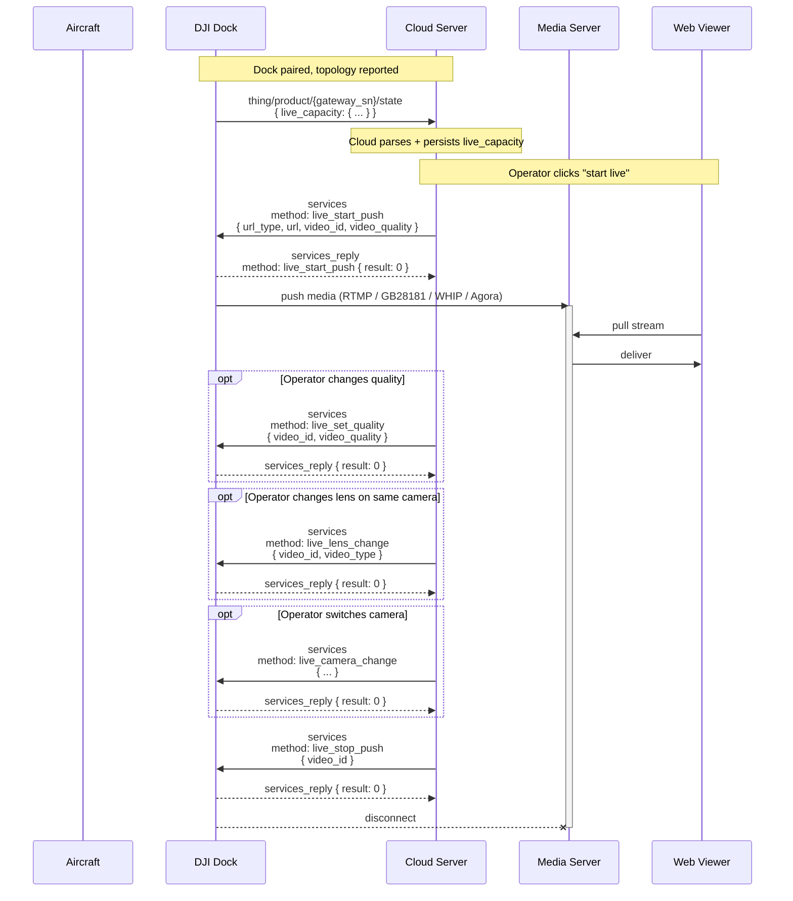
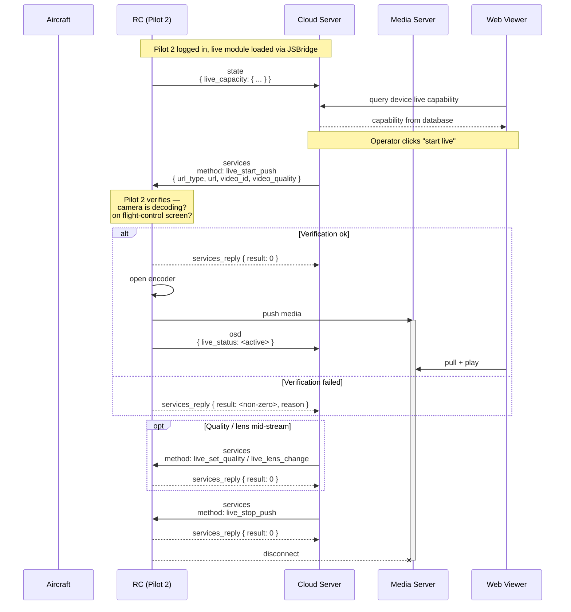
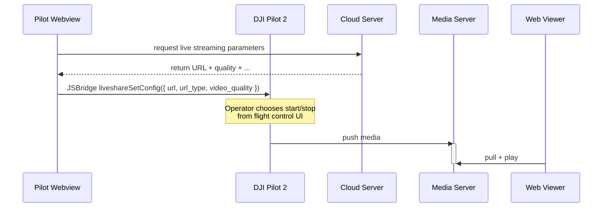

# Livestream start / stop

How the cloud starts, controls, and stops a live video stream from a dock or a Pilot-2-connected aircraft — capability discovery, `live_start_push` → media transport → `live_stop_push`, with mid-stream quality / lens / camera changes, and pilot-path JSBridge pre-setup.

Part of the Phase 9 workflow catalog. Media-transport wire specifics live in [`livestream-protocols/`](../livestream-protocols/README.md) (Phase 7); control-plane schemas live in Phase 4d (dock-path) / Phase 4h (pilot-path).

---

## Scope

| Aspect | Value |
|---|---|
| Cohorts | **Dock path**: Dock 2 + M3D / M3TD; Dock 3 + M4D / M4TD. **Pilot path**: RC Plus 2 + M4D; RC Pro + M3D / M3TD. |
| Direction | Device → cloud state push announces capability. Cloud → device `services` initiates + controls stream. Device → media server for the media payload itself (not MQTT). |
| Transports | **MQTT** (control plane) — `state` push for `live_capacity`, `services` + `services_reply` for `live_start_push` / `_stop` / `_set_quality` / `_lens_change` / `_camera_change`. **RTMP / GB28181 / WebRTC (WHIP) / Agora** (media plane) per Phase 7. **JSBridge** (pilot-path preload + manual path). |
| Preceding workflow | [`dock-bootstrap-and-pairing.md`](dock-bootstrap-and-pairing.md) + [`device-binding.md`](device-binding.md). Pilot-path: Pilot 2 must have loaded the live streaming module via JSBridge. |
| Related catalog entries | Phase 4d services: [`live_start_push`](../mqtt/dock-to-cloud/services/live_start_push.md) · [`live_stop_push`](../mqtt/dock-to-cloud/services/live_stop_push.md) · [`live_set_quality`](../mqtt/dock-to-cloud/services/live_set_quality.md) · [`live_lens_change`](../mqtt/dock-to-cloud/services/live_lens_change.md) · [`live_camera_change`](../mqtt/dock-to-cloud/services/live_camera_change.md). Pilot-path DRC variant: [`drc_live_lens_change`](../mqtt/pilot-to-cloud/drc/drc_live_lens_change.md). Phase 7 media transports: [`rtmp`](../livestream-protocols/rtmp.md) · [`gb28181`](../livestream-protocols/gb28181.md) · [`webrtc`](../livestream-protocols/webrtc.md) · [`agora`](../livestream-protocols/agora.md). State / OSD: [`dock-to-cloud/state/`](../mqtt/dock-to-cloud/state/README.md) for `live_capacity`; [`dock-to-cloud/osd/`](../mqtt/dock-to-cloud/osd/README.md) for `live_status`. Phase 6 property catalogs: [`device-properties/README.md`](../device-properties/README.md). |

## Overview

A livestream goes through five control-plane steps, plus a parallel media-plane flow:

1. **Capability announcement.** Device pushes `live_capacity` inside `state` whenever it changes (power-up, camera attach, payload swap). Cloud parses the struct — total concurrent streams + supported `video_id`s + per-`video_id` supported `url_type` values + supported `video_quality`s. Cloud persists this as the authoritative capability per gateway.
2. **Start.** Cloud issues [`live_start_push`](../mqtt/dock-to-cloud/services/live_start_push.md) with `{url_type, url, video_id, video_quality}`. Dock / RC validates, opens the encoder, and begins pushing media to the URL. `services_reply` returns `result` — 0 for success, non-zero with an error code for rejection.
3. **Media.** Device streams to the URL over the chosen transport — RTMP, GB28181, WebRTC/WHIP, or Agora (Dock 2 only). Viewers pull from the same media server. The MQTT control plane does not carry media bytes.
4. **Mid-stream adjustments.** Cloud can issue [`live_set_quality`](../mqtt/dock-to-cloud/services/live_set_quality.md) (bitrate change), [`live_lens_change`](../mqtt/dock-to-cloud/services/live_lens_change.md) (switch lens on the same camera), or [`live_camera_change`](../mqtt/dock-to-cloud/services/live_camera_change.md) (switch camera on the same aircraft). All reply on `services_reply`. OSD `live_status` reflects the current state.
5. **Stop.** [`live_stop_push`](../mqtt/dock-to-cloud/services/live_stop_push.md) terminates the stream. Encoder closes; media server sees the RTMP / WHIP / Agora disconnect (GB28181 sends a BYE).

## Actors

| Actor | Role |
|---|---|
| **Aircraft camera / payload** | Source of the video. Streams through the gateway. |
| **DJI Dock** (dock path) | Owns `{gateway_sn}`. Encodes and publishes media to the chosen transport. |
| **RC (Pilot 2)** (pilot path) | Owns `{gateway_sn}`. Must preload the live module via JSBridge. Verifies camera state + flight-control UI before starting. |
| **Cloud Server** | Consumes `live_capacity`, issues `live_start_push` etc., brokers the URL for the media server. |
| **Media Server** | Receives RTMP / GB28181 / WHIP / Agora. Re-broadcasts to web viewers. Deployed by the cloud operator; see [`livestream-protocols/`](../livestream-protocols/README.md) for per-protocol requirements. |
| **Web viewer** | Pulls from the media server. Not in the MQTT control plane. |

## Sequence

### Dock-path livestream

### Pilot-path server-initiated livestream

### Pilot-path app-initiated livestream (JSBridge `liveshareSetConfig`)

## Step-by-step

### 1. Capability announcement (`live_capacity`)

- **Topic:** `thing/product/{gateway_sn}/state`. Pushed **only on change** — power-up, camera swap, Pilot 2 `liveshareSetConfig`, dock cover state.
- **Struct** (abbreviated): `{available_video_number, coexist_video_number_max, video_list: [{sn, camera_index, available_video_types, coexist_video_number_max, video_protocol_list}, ...]}`. See [`dock-to-cloud/state/`](../mqtt/dock-to-cloud/state/README.md) and [`device-properties/`](../device-properties/README.md) for field-level definitions.
- **Per-camera video types**: `wide`, `zoom`, `ir`, `visible`, `normal` — depend on payload model. M3D / M3TD / M4D / M4TD diverge per Phase 6b; dock-path vs pilot-path feed reports different subsets of the same aircraft.
- **Per-camera protocol list**: which `url_type` values are permitted for *this specific `video_id`*. **Not universal** — e.g. an aircraft camera on Dock 3 may support `{1, 3, 4}` but not `0` (Agora removed from Dock 3); an RC Pro pilot-path camera may support `{0, 1, 3}` but not `4` (no WebRTC on RC Pro per Phase 7).

### 2. Start (`live_start_push`)

- **Topic (down):** `thing/product/{gateway_sn}/services`. **Method:** `live_start_push`. Full schema: [`live_start_push.md`](../mqtt/dock-to-cloud/services/live_start_push.md).
- **Required fields**: `url_type`, `url`, `video_id`, `video_quality`.
- **`url_type`** enum — **cohort-dependent**:
  - Dock 2: `0` Agora, `1` RTMP, `3` GB28181, `4` WebRTC.
  - Dock 3: `1` RTMP, `3` GB28181, `4` WebRTC. **Agora (`0`) removed.**
  - Pilot (RC Plus 2): `1` RTMP, `3` GB28181, `4` WebRTC.
  - Pilot (RC Pro): `0` Agora, `1` RTMP, `3` GB28181. **WebRTC (`4`) not supported.**
- **`url`** shape depends on protocol — see [`livestream-protocols/`](../livestream-protocols/README.md):
  - RTMP: `rtmp://host:port/app/stream`.
  - GB28181: amp-delimited kv pairs — `serverIP` / `serverPort` / `serverID` / `agentID` / `agentPassword` / `localPort` / `channel`. SIP registration + PS-over-RTP media.
  - WebRTC (WHIP): `http://host:port/{whip-path}?app=...&stream=...`.
  - Agora: `channel=...&sn=...&token=...&uid=...`. Tokens may contain `+` characters — **URL-encode once** (per Phase 7 RTMP/Agora callout). Double-encoding breaks authentication.
- **`video_id`**: `{sn}/{camera_index}/{video_index}` where `camera_index` = `{type-subtype-gimbalindex}`. Must match one of the `video_list[i].sn/camera_index` from the latest `live_capacity`.
- **`video_quality`** enum: `0` Adaptive · `1` Smooth · `2` SD · `3` HD · `4` UHD. Bitrate tables diverge across v1.11 Dock 2 / v1.15 Dock 2 / v1.15 Dock 3 — treat as source noise; device negotiates actual bitrate at run time.
- **Pilot-path verification** (per pilot feature-set page): Pilot 2 checks that the relevant camera is decoding and that the operator is on the flight-control screen. If either fails, `services_reply` returns non-zero with a reason and the media push never starts.

### 3. Media plane

Device pushes media directly to the URL. MQTT plays no part at this layer.

- **RTMP** (`url_type: 1`) — TCP PUSH. Media server accepts any RTMP ingress; nginx-rtmp / SRS common. See [`livestream-protocols/rtmp.md`](../livestream-protocols/rtmp.md).
- **GB28181** (`url_type: 3`) — SIP REGISTER + INVITE handshake, then PS-encapsulated MPEG over RTP. Media server needs a full GB28181 SIP domain and 20-digit ID allocation. See [`gb28181.md`](../livestream-protocols/gb28181.md).
- **WebRTC / WHIP** (`url_type: 4`) — HTTP POST to WHIP endpoint with SDP offer, receives SDP answer, ICE exchange (STUN/TURN typically required). See [`webrtc.md`](../livestream-protocols/webrtc.md).
- **Agora** (`url_type: 0`) — SDK-driven channel join using token. Viewer-side Agora SDK subscriber or Cloud Recording. Dock 2 + RC Pro only. See [`agora.md`](../livestream-protocols/agora.md).

### 4. Mid-stream adjustments

- [`live_set_quality`](../mqtt/dock-to-cloud/services/live_set_quality.md) — switch `video_quality` without re-negotiating the media connection. Payload: `{video_id, video_quality}`. Device re-encodes at the new target.
- [`live_lens_change`](../mqtt/dock-to-cloud/services/live_lens_change.md) — swap lens on the **same camera** (wide / zoom / IR). Payload: `{video_id, video_type}`. Stream continues; viewer sees the image switch without re-connecting. Feature-set note: *"The live stream function can change the lens without influencing the live stream progress."*
- [`live_camera_change`](../mqtt/dock-to-cloud/services/live_camera_change.md) — swap to a different camera entirely (e.g. dock-camera → aircraft-camera). Payload: `{video_id (old), video_id_new}` (schema details in [`live_camera_change.md`](../mqtt/dock-to-cloud/services/live_camera_change.md)).
- **Pilot-path DRC variant**: [`drc_live_lens_change`](../mqtt/pilot-to-cloud/drc/drc_live_lens_change.md) — pilot-side DRC-channel lens switch. Equivalent to the dock-path `live_lens_change`, but delivered via the DRC relay broker when Pilot 2 is in DRC mode.
- **OSD reporting**: `live_status` in the OSD topic reflects the current stream state. Consumers should monitor this as authoritative rather than assuming `services_reply.result: 0` means the stream is still up.

### 5. Stop (`live_stop_push`)

- **Method:** `live_stop_push`. Full schema: [`live_stop_push.md`](../mqtt/dock-to-cloud/services/live_stop_push.md).
- Payload typically includes the `video_id` to stop a specific stream (when multiple are active on the gateway). Empty body may stop all, per DJI's side note.
- Device closes the encoder, disconnects the media-plane socket (or sends BYE for GB28181).
- Cloud observes the `live_status` change via OSD; media server sees the transport-level disconnect.

### 6. Pilot-path JSBridge preload

- Before any `live_start_push`, Pilot 2 must have loaded the mission / live streaming module via JSBridge: `window.djiBridge.platformLoadComponent(String name, String param)`.
- Recommended to preload during the login phase so the first `live_start_push` does not race the module load. If the module is not loaded, `services_reply` returns non-zero.

### 7. Pilot-path app-initiated mode

Alternative to server-initiated start. Web view pulls params from cloud, then calls `window.djiBridge.liveshareSetConfig(...)`. Pilot 2 begins pushing immediately. Operator can start / stop / restart from the flight control UI. Streaming image follows whichever camera Pilot 2 has on the main preview.

## Variants

### Cohort × protocol matrix

Cross-cohort availability (per Phase 7):

| Protocol | Dock 2 | Dock 3 | RC Plus 2 | RC Pro |
|---|---|---|---|---|
| **RTMP** (`url_type: 1`) | ✓ | ✓ | ✓ | ✓ |
| **GB28181** (`url_type: 3`) | ✓ | ✓ | ✓ | ✓ |
| **WebRTC / WHIP** (`url_type: 4`) | ✓ | ✓ | ✓ | ✗ |
| **Agora** (`url_type: 0`) | ✓ | ✗ | ✗ | ✓ |

Always validate `url_type` against the device's latest `live_capacity` before issuing — the device's own reported list is authoritative for run-time capability.

### Adaptive quality (`video_quality: 0`)

Device auto-selects bitrate based on network conditions. Preferred for high-churn links; gives up deterministic behaviour for robustness. All four cohorts support adaptive.

### Multi-stream (concurrent)

`live_capacity.coexist_video_number_max` caps concurrent streams per gateway. Typical limit is 2 — e.g. dock-camera + aircraft-camera streaming simultaneously. Exceeding the cap causes `services_reply.result: <non-zero>` on the offending `live_start_push`.

### Livestream during wayline mission

Running a livestream concurrent with a wayline mission is supported. The livestream control plane is independent of `flighttask_*`; media continues through mission execution. Media files generated by payload actions during the mission are still handled by the [media-upload workflow](media-upload-from-dock.md) *(pending 9c)* — livestream does not replace file upload.

### Livestream during DRC

Supported. The DRC relay broker carries `stick_control` / HSI / OSD push; the media plane uses its own transport. Operators commonly use livestream + DRC together for remote ISR flights.

## Error paths

| Failure | Signal | Handling |
|---|---|---|
| `url_type` not in device capability | `services_reply.result: <non-zero>` | Refresh `live_capacity` from state; retry with supported `url_type`. Errors cluster in BC module `513` (`LiveErrorCodeEnum`) — see [`error-codes/README.md`](../error-codes/README.md). |
| `video_id` not in capability | `services_reply.result: <non-zero>` | Same — check `live_capacity.video_list`. |
| URL parse / authentication failure (media server side) | No MQTT signal — `services_reply: 0` then media connection fails | Monitor `live_status` OSD; media server logs. |
| Agora token with unencoded `+` | Agora auth fail — media server logs, no MQTT signal | Encode tokens once per [`agora.md`](../livestream-protocols/agora.md). |
| Pilot 2 not on flight-control UI | `services_reply.result: <non-zero>` (Pilot-2-side verification) | Operator must navigate to the flight control screen before retry. |
| Live module not loaded (pilot path) | `services_reply.result: <non-zero>` | JSBridge preload at login. |
| Coexist limit exceeded | `services_reply.result: <non-zero>` | Stop an existing stream first. |
| Camera decoder not ready | `services_reply.result: <non-zero>` (Pilot-2 check failure) | Wait; aircraft power / stream warm-up. |
| Network / media-plane outage mid-stream | `live_status` changes in OSD; control plane silent | Cloud observes OSD + media-server health; reissues `live_start_push` as recovery. |

## Provenance

| Source | Role |
|---|---|
| `[Cloud-API-Doc/docs/en/30.feature-set/20.dock-feature-set/30.dock-livestream.md]` | v1.11 dock-path livestream feature-set. Authoritative framework + sequence diagram. |
| `[Cloud-API-Doc/docs/en/30.feature-set/10.pilot-feature-set/30.pilot-livestream.md]` | v1.11 pilot-path livestream feature-set. Four Mermaid sub-sequences (module load, server-triggered start, verification pass/fail, app-triggered start). |
| `[DJI_Cloud/DJI_CloudAPI-Dock3-Live-Stream.txt]` · `[DJI_CloudAPI-Dock2-Live-Stream.txt]` | v1.15 dock-path livestream wire (Phase 4d). |
| `[DJI_Cloud/DJI_CloudAPI_RC-Plus-2-Enterprise-Live-Stream.txt]` · `[DJI_CloudAPI_RC-Pro-Enterprise-Live-Stream.txt]` | v1.15 pilot-path livestream wire (Phase 4h). |
| [`master-docs/mqtt/dock-to-cloud/services/`](../mqtt/dock-to-cloud/services/) | Phase 4d livestream control-plane catalog. |
| [`master-docs/livestream-protocols/`](../livestream-protocols/) | Phase 7 per-protocol wire reference. |
| [`master-docs/mqtt/pilot-to-cloud/drc/drc_live_lens_change.md`](../mqtt/pilot-to-cloud/drc/drc_live_lens_change.md) | Phase 4h pilot DRC lens-switch variant. |
| [`master-docs/device-properties/README.md`](../device-properties/README.md) | Phase 6 per-device `live_capacity` + `live_status` property definitions. |
| [`master-docs/error-codes/README.md`](../error-codes/README.md) | Phase 8 livestream error codes (BC module `513` `LiveErrorCodeEnum`). |
