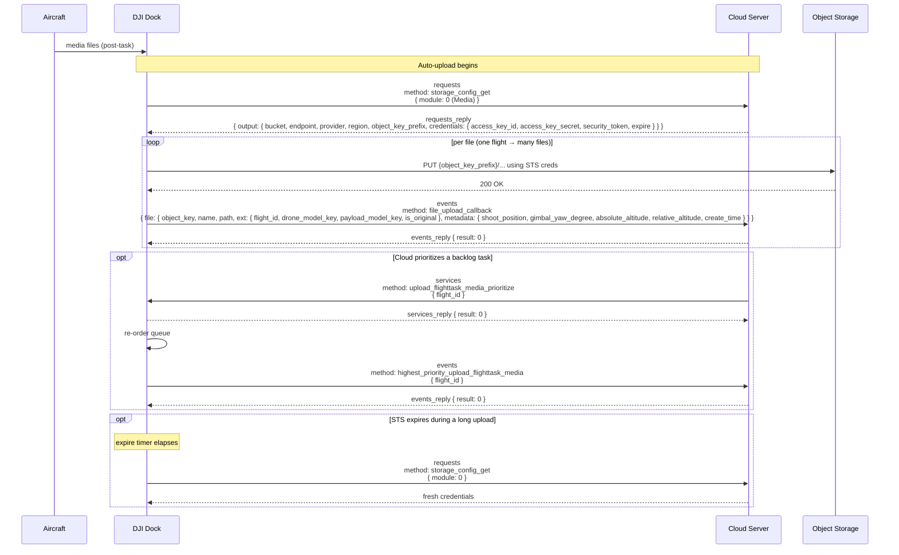
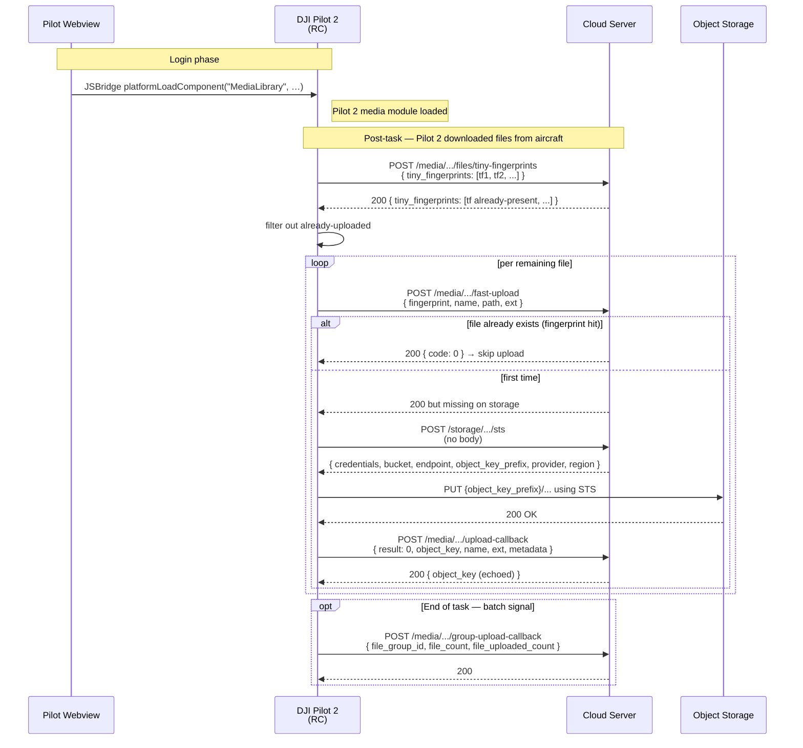

# Media upload (dock & pilot)

How captured photos, videos, SRT subtitles, PPK files, and RTCM data make the trip from the aircraft's SD card to cloud-operator object storage, across the two parallel device paths: **dock-path** (Dock 2 / Dock 3 auto-upload via MQTT) and **pilot-path** (Pilot 2 auto/manual upload via HTTPS + JSBridge). The two paths share object-storage mechanics and the callback pattern but differ in the signaling transport.

Part of the Phase 9 workflow catalog. Wire-level schemas live in Phase 4d (MQTT) and Phase 3 (HTTP).

---

## Scope

| Aspect | Value |
|---|---|
| Cohorts | **Dock path**: Dock 2 + M3D / M3TD; Dock 3 + M4D / M4TD. **Pilot path**: RC Plus 2 + M4D; RC Pro + M3D / M3TD. |
| Direction | Device → cloud for STS request, file bytes (direct to storage), and upload report. Cloud → device for prioritization hint (dock-path). |
| Transports | **Dock path**: MQTT for STS + callback + prioritization. **Pilot path**: HTTPS for STS + callback + fast-upload, plus JSBridge to load the Pilot 2 media module. **Object store** (OSS / S3 / MinIO) carries the bytes in both paths. |
| Preceding workflow | [`dock-bootstrap-and-pairing.md`](dock-bootstrap-and-pairing.md) + [`device-binding.md`](device-binding.md). Pilot-path: Pilot 2 must load the media library module via JSBridge (recommended at login). |
| Related catalog entries | **Dock path (Phase 4d)**: [`storage_config_get`](../mqtt/dock-to-cloud/requests/storage_config_get.md) (request) · [`file_upload_callback`](../mqtt/dock-to-cloud/events/file_upload_callback.md) (event) · [`upload_flighttask_media_prioritize`](../mqtt/dock-to-cloud/services/upload_flighttask_media_prioritize.md) (service) · [`highest_priority_upload_flighttask_media`](../mqtt/dock-to-cloud/events/highest_priority_upload_flighttask_media.md) (event). **Pilot path (Phase 3)**: [`storage/sts-credential`](../http/storage/sts-credential.md) · [`media/fast-upload`](../http/media/fast-upload.md) · [`media/tiny-fingerprint`](../http/media/tiny-fingerprint.md) · [`media/upload-callback`](../http/media/upload-callback.md) · [`media/group-upload-callback`](../http/media/group-upload-callback.md). |

## Overview

A flight produces a set of media files on the aircraft's SD card:

- **Photos** (JPEG) and **videos** (MP4) in visible / IR / split-screen variants.
- **SRT subtitle files** — aircraft position, altitude, gimbal attitude timecoded to video (older firmware only; newer Dock 2 firmware embeds this metadata into the video container itself per DJI's feature-set note).
- **PPK files** (`.obs`, `.rtk`, `.mrk`, `.nav`) and **RTCM data** (`.dat`) — generated when the aircraft is doing RTK-corrected photogrammetry. Dock 2 newer-firmware behaviour: PPK + RTCM files are uploaded alongside media files.

The files need to reach the cloud operator's object storage. Two paths exist and they are selected by which gateway the aircraft is bound to:

- **Dock path** — MQTT-signaled auto-upload. The dock has no human operator to decide what uploads when; it runs continuously on its own schedule and drives the whole flow from device side. Auto-upload only.
- **Pilot path** — Pilot 2 on the RC drives upload via JSBridge to the Cloud API. Auto-upload *or* manual upload (operator selects). HTTP-signaled.

Both paths converge on the same object-storage semantics: short-lived STS credentials, direct upload by the device, callback to the cloud with object key + capture metadata.

## Actors

| Actor | Role |
|---|---|
| **Aircraft** | Holds files on SD card. Downloaded to gateway (dock or RC) after task. |
| **DJI Dock** (dock path) | Auto-uploads on its own. Requests credentials, uploads, reports callback. |
| **RC (Pilot 2)** (pilot path) | Runs the Pilot 2 media module (loaded via JSBridge). Decides auto vs manual. |
| **Cloud Server** | Issues STS credentials. Receives file-upload callbacks. Optionally hints upload ordering for dock. |
| **Object Storage** (OSS / S3 / MinIO) | Receives bytes. Authenticated by the STS token — not by the cloud's auth token. |
| **Cloud media pipeline** | Downstream consumer — registers file, extracts metadata, triggers inference, notifies users. |

## Sequence — dock path

## Sequence — pilot path

## Step-by-step — dock path

### 1. Request STS credentials

- **Method:** [`storage_config_get`](../mqtt/dock-to-cloud/requests/storage_config_get.md) with `{ module: 0 }` (Media). `module: 1` is the PSDK UI resources subsystem — not this workflow.
- **Reply shape:** `output.credentials` (`access_key_id`, `access_key_secret`, `security_token`, `expire` in seconds) + `output.bucket` + `output.endpoint` + `output.provider` (`ali` / `aws` / `minio`) + `output.region` + `output.object_key_prefix`.
- The dock prepends `object_key_prefix` to every object key; the prefix is typically a UUID scoping the dock's uploads to a workspace-specific folder.

### 2. Direct upload to storage

- Dock uses the STS bundle with the appropriate SDK for the `provider`. This is HTTPS / TLS against the storage backend — **not MQTT, not the cloud's API**.
- The cloud's auth token does not authenticate the storage call; only the STS creds do. Clouds running on non-managed object storage (MinIO) must configure their STS backend accordingly.
- Long uploads may straddle the STS `expire` boundary. The dock re-requests credentials as needed; the cloud must not rely on sticky sessions.

### 3. Upload callback

- **Method:** [`file_upload_callback`](../mqtt/dock-to-cloud/events/file_upload_callback.md). One event per file. A wayline task producing 14 photos generates 14 events.
- `need_reply: 1` — cloud acknowledges with `{ result: 0 }` on `events_reply`.
- Key fields the cloud uses downstream:

| Field | Use |
|---|---|
| `file.object_key` | Where the file lives in storage (joins to the PUT done in step 2). |
| `file.name`, `file.path` | Display / logical organization. |
| `file.cloud_to_cloud_id` | `"DEFAULT"` unless routing to a customer-supplied bucket. Table dropped in v1.15 but example still carries the field — wire-authoritative. |
| `file.ext.flight_id` | Ties the file back to the wayline task that produced it. |
| `file.ext.drone_model_key`, `file.ext.payload_model_key` | Enums from Phase 6 [`device-properties/`](../device-properties/README.md). |
| `file.ext.is_original` | `true` = original; `false` = thumbnail / derived. |
| `file.metadata.*` | Capture position, gimbal yaw, absolute / relative altitude, timestamp. |

### 4. Optional: `flight_task` counters (v1.11 only)

v1.11 Dock 2 documented a sibling `flight_task` struct on `file_upload_callback` with `uploaded_file_count` / `expected_file_count` / `flight_type`. v1.15 dropped these from the schema table. Cloud should treat them as present-but-optional — older firmware still emits; newer firmware may not.

### 5. Optional: cloud-driven prioritization

- **Method:** [`upload_flighttask_media_prioritize`](../mqtt/dock-to-cloud/services/upload_flighttask_media_prioritize.md). Cloud passes `{ flight_id }` — dock moves that task's media to the front of its internal queue.
- Dock responds with `services_reply { result: 0 }` to acknowledge the command; the queue re-order effect is confirmed by the subsequent [`highest_priority_upload_flighttask_media`](../mqtt/dock-to-cloud/events/highest_priority_upload_flighttask_media.md) event carrying the same `flight_id`. Cloud must reply to the event with `{ result: 0 }` on `events_reply`.
- Used when an operator wants to see a recent task's results ahead of any backlog. Cloud UIs typically gate this behind an explicit "prioritize this task" affordance.

## Step-by-step — pilot path

### 1. Load the media library module (pre-task, during login)

- Via JSBridge: `window.djiBridge.platformLoadComponent("MediaLibrary", param)`. Per DJI's feature-set page, preload at login so the first file upload does not race the module load.
- Without this module loaded, the Pilot-HTTPS media endpoints are not called and no files upload.

### 2. Probe tiny-fingerprints

- **Endpoint:** [`POST /media/api/v1/workspaces/{workspace_id}/files/tiny-fingerprints`](../http/media/tiny-fingerprint.md).
- Pilot 2 computes a lightweight hash for each candidate file and sends the set; the server returns the subset that already exists.
- This is the cheap first-pass dedupe — media files are multi-MB each and skipping already-uploaded files via fingerprint-only saves substantial bandwidth.

### 3. Fast-upload attempt

- **Endpoint:** [`POST /media/api/v1/workspaces/{workspace_id}/fast-upload`](../http/media/fast-upload.md). Sent per file not filtered out in step 2.
- On success, the server effectively "accepts" the file without requiring bytes. Per DJI's note — *"as the transfer of files may exist in the cloud of existing images, then DJI Pilot 2 or dock will start the file fast transfer interface when uploading files, the server needs to check whether the file has been uploaded exists, if it exists, directly return the upload success."*
- If the file does not already exist (the fast path misses), fall through to step 4.

### 4. STS + direct PUT

- **Endpoint:** [`POST /storage/api/v1/workspaces/{workspace_id}/sts`](../http/storage/sts-credential.md). Same single endpoint that waypoint upload uses — shared STS bucket. The `provider` enum includes `minio` on the media side.
- Pilot 2 uploads directly to the storage backend using the returned STS bundle, exactly like the dock-path step 2.

### 5. Upload callback

- **Endpoint:** [`POST /media/api/v1/workspaces/{workspace_id}/upload-callback`](../http/media/upload-callback.md). One request per uploaded file.
- Schema is identical in spirit to the MQTT `file_upload_callback` (object key, capture metadata) but carries additional pilot-path-specific fields: `file_group_id` (shared across the task), `tinny_fingerprint` (yes — DJI spells it `tinny` on the wire), `sub_file_type` (0 = normal, 1 = panorama).
- Response echoes the persisted `object_key`.

### 6. Group upload callback

- **Endpoint:** [`POST /media/api/v1/workspaces/{workspace_id}/group-upload-callback`](../http/media/group-upload-callback.md). Fired once at the end of the task, after all per-file callbacks.
- Payload: `file_group_id` + `file_count` + `file_uploaded_count`. Tells the cloud the full task set has settled — useful for triggering dataset assembly, notifications, or deferred processing.
- Dock path has no equivalent; the cloud must infer task completion from wayline progress + file-event quiescence, or use task correlation via `file.ext.flight_id`.

## Variants

### Auto vs manual upload

- **Dock** has auto-upload only. There is no operator-facing toggle at the dock — uploads happen on the dock's own schedule.
- **Pilot** supports both. Per DJI's 50.pilot-media-management page and linked FlightHub 2 user manual note: payload control commands' generated media only upload when the "Media File Upload" switch is enabled on Pilot.

### PPK / RTCM artefacts

Dock 2 newer firmware bundles PPK (`.obs`, `.rtk`, `.mrk`, `.nav`) and RTCM (`.dat`) files into the same auto-upload flow alongside JPEGs and MP4s. Cloud implementations routing RTK photogrammetry datasets should watch for the extended extensions on `file.name` and segregate storage / downstream processing accordingly.

### SRT subtitle handling

Older firmware: separate `.srt` file alongside each `.mp4` with timecoded position / altitude / gimbal attitude. Newer firmware (Dock 2 per DJI's page): the same metadata is inside the MP4 container, and no separate `.srt` file is emitted. Cloud media pipelines should handle both presentations.

### Cloud-to-cloud routing

`file.cloud_to_cloud_id: "DEFAULT"` means the file is bound for the primary cloud bucket. Non-`DEFAULT` values route to alternate (customer-supplied) buckets — not documented in detail on the wire. Cloud implementations exposing this feature must allocate IDs and plumb the routing logic themselves.

### PSDK UI resource reuse of `storage_config_get`

`storage_config_get` serves two subsystems by `module` enum. Media upload uses `module: 0`; PSDK UI resources use `module: 1`. A dock running PSDK widgets fetches STS credentials separately per module. See [`storage_config_get.md`](../mqtt/dock-to-cloud/requests/storage_config_get.md) + [`psdk_ui_resource_upload_result.md`](../mqtt/dock-to-cloud/events/psdk_ui_resource_upload_result.md).

### Livestream concurrency

Media upload and livestream coexist — both run through their own transports. A wayline mission can be streamed live AND auto-upload media files for the same task; the two workflows do not interact. Live video over RTMP / GB28181 / WHIP / Agora does not reach object storage via this workflow.

## Error paths

| Failure | Path | Signal | Handling |
|---|---|---|---|
| STS request rejected | Both | `storage_config_get` `result != 0` (dock) or `/sts` non-200 (pilot) | Cloud bug — verify STS backend is up and token issuing rights are configured. |
| STS token expires mid-upload | Both | 403 / auth-fail from storage | Device re-requests STS; restart the PUT. |
| PUT fails (network / auth / bucket policy) | Both | Storage 4xx / 5xx | Device retries with backoff. Cloud sees neither the PUT nor the callback; ghost file on SD until retry. |
| `file_upload_callback` times out waiting on `events_reply` | Dock | Dock sees MQTT ack miss | Dock retries. Cloud must be idempotent on `object_key`. |
| `upload-callback` 4xx from server | Pilot | HTTP 4xx | Pilot logs + retries (limits vary by firmware). Cloud bug if the schema shape has drifted. |
| Fast-upload hit but server lacks actual bytes (split-brain) | Pilot | Later fetch attempt 404s | Pilot must fall back to full upload; server should verify storage-side existence before accepting `fast-upload`. |
| Dock queue overflow (too many concurrent tasks) | Dock | Slow cadence of `file_upload_callback` events | Cloud uses `upload_flighttask_media_prioritize` to front-load the most-wanted task. |
| Wrong `object_key_prefix` used | Both | PUT succeeds to wrong path; callback references wrong object_key | Cloud should validate the returned `object_key` starts with the expected `object_key_prefix` for that workspace. Mismatch indicates STS misconfiguration. |

Media-upload errors surface via MQTT `result` codes on dock-path callbacks and HTTP status codes on pilot-path endpoints. The Phase 8 error-code catalog does not carry a dedicated media-management BC module — most failures are transport or STS-level rather than business-logic.

## DJI source quirks

- **`tinny_fingerprint` spelling.** DJI's source misspells "tiny" as `tinny` on the HTTP surface. The field name on the wire is `tinny_fingerprint`; cloud implementations must match exactly. The tiny-fingerprints endpoint itself uses the correct spelling in the path segment.
- **`flight_task` disappeared in v1.15.** v1.11 Dock 2 documented the optional counters struct; v1.15 Dock 2 and Dock 3 tables drop it. Server-side: accept it when present, don't require it.
- **`cloud_to_cloud_id` in the example but not the v1.15 table.** Example shows the field consistently; treat example as authoritative.

## Provenance

| Source | Role |
|---|---|
| `[Cloud-API-Doc/docs/en/30.feature-set/20.dock-feature-set/40.dock-media-management.md]` | v1.11 Dock feature-set — dock-path Mermaid + upload behaviour description. |
| `[Cloud-API-Doc/docs/en/30.feature-set/10.pilot-feature-set/50.pilot-media-management.md]` | v1.11 Pilot feature-set — pilot-path flow description + JSBridge preload note. |
| `[DJI_Cloud/DJI_CloudAPI-Dock2-Media-Management.txt]` · `[DJI_CloudAPI-Dock3-Media-Management.txt]` | v1.15 dock-path Media-Management wire (Phase 4d). |
| `[DJI_Cloud/DJI_CloudAPI_Pilot-HTTPS-Media-Fast-Upload.txt]` · `[…-Media-Obtain-Exist-File-Tiny-Fingerprint.txt]` · `[…-Media-Obtain-Temporary-Credential.txt]` · `[…-Media-File-Upload-Result-Report.txt]` · `[…-Media-Group-Upload-Callback.txt]` | v1.15 Pilot-HTTPS wire (Phase 3). |
| [`master-docs/mqtt/dock-to-cloud/requests/storage_config_get.md`](../mqtt/dock-to-cloud/requests/storage_config_get.md) · [`events/file_upload_callback.md`](../mqtt/dock-to-cloud/events/file_upload_callback.md) · [`services/upload_flighttask_media_prioritize.md`](../mqtt/dock-to-cloud/services/upload_flighttask_media_prioritize.md) · [`events/highest_priority_upload_flighttask_media.md`](../mqtt/dock-to-cloud/events/highest_priority_upload_flighttask_media.md) | Phase 4d dock-path method catalog. |
| [`master-docs/http/storage/sts-credential.md`](../http/storage/sts-credential.md) · [`http/media/fast-upload.md`](../http/media/fast-upload.md) · [`tiny-fingerprint.md`](../http/media/tiny-fingerprint.md) · [`upload-callback.md`](../http/media/upload-callback.md) · [`group-upload-callback.md`](../http/media/group-upload-callback.md) | Phase 3 pilot-path endpoint catalog. |
