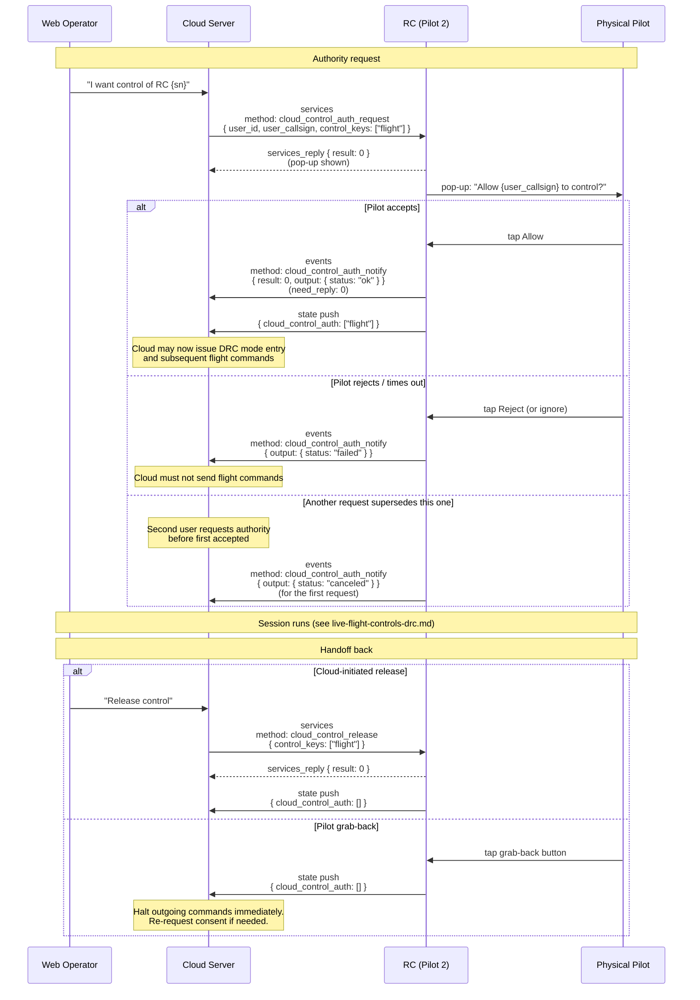

# Remote-control handoff (pilot-path cloud-control authorization)

How flight authority crosses between the physical pilot (holding an RC) and a cloud-side operator (viewing the fleet on a web dashboard) — the consent-gated pop-up, the pilot's accept / reject response, the state-push confirmation, and the two ways authority can return to the pilot (cloud-initiated release or pilot-initiated grab-back). Pilot-path only: the dock-path equivalent uses `flight_authority_grab` / `payload_authority_grab` without consent (see [`live-flight-controls-drc.md`](live-flight-controls-drc.md)).

Part of the Phase 9 workflow catalog. Wire-level schemas live in Phase 4h.

---

## Scope

| Aspect | Value |
|---|---|
| Cohorts | **RC Plus 2 Enterprise + M4D / M4TD** and **RC Pro Enterprise + M3D / M3TD**. Pilot-path only — this workflow does not apply to dock-path cohorts. |
| Direction | Cloud → device for `cloud_control_auth_request` + `cloud_control_release`. Device → cloud for `cloud_control_auth_notify` (outcome) + state push (persistent flag). |
| Transports | **MQTT** only. No WebSocket fan-out here — the corpus's WebSocket surface is for map-elements / situation-awareness push, not authority lifecycle. |
| Preceding workflow | [`device-binding.md`](device-binding.md). The RC must be paired and reporting to the cloud before an authority request makes sense. Pilot 2 is on the flight-control screen. |
| Following workflow | [`live-flight-controls-drc.md`](live-flight-controls-drc.md) — once authority is granted, DRC mode entry and stick-control traffic follow. |
| Related catalog entries | Phase 4h services: [`cloud_control_auth_request`](../mqtt/pilot-to-cloud/services/cloud_control_auth_request.md) · [`cloud_control_release`](../mqtt/pilot-to-cloud/services/cloud_control_release.md). Phase 4h event: [`cloud_control_auth_notify`](../mqtt/pilot-to-cloud/events/cloud_control_auth_notify.md). Phase 6c state property: [`rc-plus-2.md`](../device-properties/rc-plus-2.md) + [`rc-pro.md`](../device-properties/rc-pro.md) `cloud_control_auth` (v1.15) / `is_cloud_control_auth` (v1.11 narrative). |

## Overview

Unlike dock-path authority (which is a unilateral cloud grab since a dock has no seated operator), pilot-path authority is **consent-gated** — a physical human on the ground must tap "allow" before the cloud's flight commands are accepted. The lifecycle is:

1. **Cloud requests consent.** [`cloud_control_auth_request`](../mqtt/pilot-to-cloud/services/cloud_control_auth_request.md) delivered over `services`. The RC displays a pop-up identifying the requesting user. The cloud receives a `services_reply` only as a transport-level ACK that the pop-up was shown — it is not the pilot's answer.
2. **Pilot answers.** Pilot taps accept / reject on the RC. The answer arrives as an [`cloud_control_auth_notify`](../mqtt/pilot-to-cloud/events/cloud_control_auth_notify.md) event. This event is `need_reply: 0` — fire-and-forget.
3. **State confirms.** On accept, the RC pushes `state` with the `cloud_control_auth` array populated (or v1.11-narrative `is_cloud_control_auth: true`). Cloud treats that state as the authoritative "can issue commands now" signal.
4. **Session runs** — typically followed by [DRC mode entry](live-flight-controls-drc.md) and live control.
5. **Handoff back.** Either side can return authority:
   - **Cloud-initiated**: [`cloud_control_release`](../mqtt/pilot-to-cloud/services/cloud_control_release.md) over `services`. Clean session end.
   - **Pilot-initiated**: operator taps the grab-back button on the RC. State push updates to `cloud_control_auth: []` (or `is_cloud_control_auth: false`). Cloud must pause command traffic immediately.

The consent dialog can also be **superseded**: if a second cloud user's request arrives while the first is still pending, the first one is canceled (`cloud_control_auth_notify` with `status: "canceled"`). Only one pending consent at a time.

## Actors

| Actor | Role |
|---|---|
| **Cloud Server** | Issues `cloud_control_auth_request` / `_release`. Receives `_notify` + state pushes. |
| **Web operator** | Human on the cloud side. Drives request / release via the web UI. |
| **RC (Pilot 2)** | Displays the consent pop-up. Carries the physical operator. Publishes `_notify` + state. |
| **Physical pilot** | Accepts / rejects the pop-up. Can grab back anytime. |

## Sequence

## Step-by-step

### 1. Request consent (`cloud_control_auth_request`)

- **Topic (down):** `thing/product/{gateway_sn}/services`. **Method:** `cloud_control_auth_request`. Full schema: [`cloud_control_auth_request.md`](../mqtt/pilot-to-cloud/services/cloud_control_auth_request.md).
- **Payload:** `{ user_id, user_callsign, control_keys: ["flight"] }`. `user_id` + `user_callsign` are shown on the RC pop-up so the pilot knows who is asking. `control_keys` is an array but DJI documents only `"flight"` as an allowed value — size `= 1`.
- **`services_reply` semantics:** `result: 0` means the pop-up was successfully displayed, not that the pilot accepted. This is the cloud's cue that the request is in flight; the outcome follows asynchronously. Non-zero reply means the pop-up could not be shown (invalid `control_keys`, RC disconnected, etc.) — a terminal error.
- **Undocumented `output.status` in the reply example.** DJI's example shows `output: { status: "ok" }` alongside `result: 0`. Not in the schema table. Treat `result` as authoritative; `output.status` may be missing on some firmware.

### 2. Pilot responds (`cloud_control_auth_notify`)

- **Topic (up):** `thing/product/{gateway_sn}/events`. **Method:** `cloud_control_auth_notify`. Full schema: [`cloud_control_auth_notify.md`](../mqtt/pilot-to-cloud/events/cloud_control_auth_notify.md).
- **`need_reply: 0`** — cloud does not acknowledge. This is unusual for events in the 4f / 4h families (most require reply) — worth noting for implementers accustomed to the pervasive ack pattern.
- **Payload:** `{ result, output: { status } }`. `output.status` is the load-bearing field:

| `output.status` | Meaning |
|---|---|
| `"ok"` | Pilot accepted. Cloud may proceed. |
| `"failed"` | Pilot rejected, or an error occurred. Cloud must not send flight commands. |
| `"canceled"` | A *second* cloud user's request arrived before this one was answered; the RC canceled this pop-up to serve the newer request. Cloud re-requests if still wanted. |

- There is no documented timeout on the pop-up. If the pilot simply ignores it, no `_notify` arrives. Cloud UIs should surface a timer after some reasonable window and re-request as needed.

### 3. State confirmation

- **Topic:** `thing/product/{gateway_sn}/state`. Pushed on transition.
- **v1.15 property:** `cloud_control_auth` — `array` of `string` identifying granted control permissions. Populated as `["flight"]` when granted; `[]` when revoked. See [Phase 6c `rc-pro.md`](../device-properties/rc-pro.md) + [`rc-plus-2.md`](../device-properties/rc-plus-2.md). v1.11 did not publish this; it was added in v1.15.
- **v1.11 narrative form:** the DJI v1.11 pilot-path DRC feature-set page uses `is_cloud_control_auth: true / false` as a boolean on the state push. Cloud implementations targeting current firmware should rely on the v1.15 array form; the v1.11 form is documented in DJI's own Mermaid sequence diagram and is the origin of the feature-name string "is_cloud_control_auth".
- Cloud should treat the state push as the **authoritative** signal, not the `_notify` event. The two are redundant on accept but state is what the flight stack watches.

### 4. Session runs

Authority granted → cloud can now proceed to [`live-flight-controls-drc.md`](live-flight-controls-drc.md) → [`drc_mode_enter`](../mqtt/dock-to-cloud/services/drc_mode_enter.md) (the method name is shared across paths even though this is pilot-path; the dock-to-cloud catalog is canonical) → relay-broker MQTT → stick-control + drone-control streams.

On the pilot path, there is **no separate payload authority**. Per DJI's pilot feature-set: *"there is no distinction between the flight control authority and payload control authority"* for pilot-to-cloud DRC. One consent, unified scope. This contrasts with the dock path which splits `flight_authority_grab` from `payload_authority_grab`.

### 5. Cloud-initiated release (`cloud_control_release`)

- **Topic (down):** `thing/product/{gateway_sn}/services`. **Method:** `cloud_control_release`. Full schema: [`cloud_control_release.md`](../mqtt/pilot-to-cloud/services/cloud_control_release.md).
- **Payload:** `{ control_keys: ["flight"] }` — the same single-element array as in the request. Releases the named keys; in practice only `"flight"` is defined so this is an all-or-nothing release.
- **Reply:** `services_reply { result: 0 }`. Same `output.status: "ok"` echo-in-example quirk as the request.
- After reply, the RC pushes an updated state with `cloud_control_auth: []`. Cloud should block outgoing DRC commands on that state transition, not just on the reply.

### 6. Pilot grab-back

- No command arrives at the cloud. The pilot physically taps the grab-back button on the RC and the RC updates its state:
  - v1.15: `state { cloud_control_auth: [] }`.
  - v1.11 narrative: `state { is_cloud_control_auth: false }`.
- **Cloud's responsibility:** halt outgoing DRC and service commands immediately. Surface the revocation to the web operator. The DRC relay session may still be open at the transport level but the RC will reject any flight-authority-requiring command; this shows up as `services_reply.result: <non-zero>` on subsequent `drone_control`, and as [`joystick_invalid_notify`](../mqtt/dock-to-cloud/events/joystick_invalid_notify.md) on stick-control.
- To recover, cloud re-issues `cloud_control_auth_request`. The pilot must consent again; there is no "remembered consent" across revocations.

## Variants

### Pop-up supersession (`canceled`)

If cloud user A requests authority and before the pilot answers, cloud user B also requests authority, the RC cancels A's pop-up and shows B's. A gets `cloud_control_auth_notify` with `output.status: "canceled"`. Behaviour for load balancing is up to the cloud — typical pattern is first-come-first-served with a cloud-side mutex to prevent concurrent requests from a single organization.

### Wording drift between RCs

[`cloud_control_auth_notify.md`](../mqtt/pilot-to-cloud/events/cloud_control_auth_notify.md) documents:
- **RC Pro** source: *"Another user initiated an authorization request, this request was canceled"*.
- **RC Plus 2** source: *"Authorization request popup was canceled due to another user's request"*.

Same semantics; the cloud parses only the `output.status` enum value, not the human string.

### `cloud_control_auth_notify` `need_reply: 0` is atypical

Unlike [`airsense_warning`](airsense-events.md) or [`flight_areas_sync_progress`](flysafe-custom-flight-area-sync.md) which require `events_reply`, `cloud_control_auth_notify` is fire-and-forget. Cloud must not send an events_reply; doing so may confuse some firmware. DJI's choice here reflects the RC's interactive-UI origin — the RC has already committed to the user's choice and doesn't need cloud acknowledgement.

### Dock path has no analog

Dock 2 and Dock 3 use [`flight_authority_grab`](../mqtt/dock-to-cloud/services/flight_authority_grab.md) and [`payload_authority_grab`](../mqtt/dock-to-cloud/services/payload_authority_grab.md). These are unilateral — no consent dialog because there is no seated operator at a dock. That workflow is covered under [`live-flight-controls-drc.md`](live-flight-controls-drc.md), not this doc.

### Multiple cloud instances

Cloud-side load-balanced deployments must coordinate: only one cloud instance should hold authority at a time, since the RC state is a single enum. If instance A issues `cloud_control_auth_request` and instance B issues `cloud_control_release` while A is mid-session, the relay traffic will stop despite A still thinking it has authority. Cloud-side coordination (leader election, distributed lock) is cloud-side responsibility; DJI's wire contract does not model it.

## Error paths

| Failure | Signal | Handling |
|---|---|---|
| Pop-up fails to show | `cloud_control_auth_request` `services_reply.result: <non-zero>` | Check RC connectivity; re-attempt after reconnect. |
| Pilot rejects | `cloud_control_auth_notify { output: { status: "failed" } }` | Respect the rejection; surface to web operator. Do not retry aggressively. |
| Pilot ignores pop-up | No `_notify` arrives | Cloud UI timer; re-issue `_request` or present "no answer" to the web operator. |
| Supersession | `_notify { status: "canceled" }` | Inform the losing cloud user; queue or re-request per policy. |
| Release rejected (already released, cloud race) | `cloud_control_release services_reply.result: <non-zero>` | Idempotent recovery — check `state.cloud_control_auth`; if empty, accept as "already released". |
| Pilot grab-back mid-session | `state { cloud_control_auth: [] }` | Halt outgoing commands. Pause WebSocket DRC control fan-out. Surface to web operator. |
| State push lost (MQTT backpressure) | Cloud sees `_notify { ok }` but never sees state update | Treat `_notify ok` as sufficient for session start; log; trigger a later `update_topo` to re-sync state cache. |
| `drone_control` issued without authority | `services_reply.result: <non-zero>` — see BC module `514` (`ControlErrorCodeEnum`) in [`error-codes/README.md`](../error-codes/README.md) | Re-request consent. |
| `joystick_invalid_notify` fires | DRC channel event | Usually pilot grabbed authority back; sometimes DRC mode wasn't entered properly. Verify state; surface to operator. |

## Provenance

| Source | Role |
|---|---|
| `[Cloud-API-Doc/docs/en/30.feature-set/10.pilot-feature-set/90.drc.md]` | v1.11 pilot-path DRC feature-set — authoritative Mermaid sequence including the authority request → state confirmation → DRC entry flow and the grab-back loop. Uses v1.11 narrative form `is_cloud_control_auth`. |
| `[DJI_Cloud/DJI_CloudAPI_RC-Pro-Enterprise-Live-Flight-Controls.txt]` · `[DJI_CloudAPI_RC-Plus-2-Enterprise-Live-Flight-Controls.txt]` | v1.15 pilot-path wire — `cloud_control_auth_request` / `_notify` / `_release` schemas (Phase 4h). Wording drift between the two sources noted inline. |
| `[Cloud-API-Doc/docs/en/60.api-reference/10.pilot-to-cloud/00.mqtt/20.rc-pro/30.drc.md]` | v1.11 RC Pro method reference (filed under "drc.md"). Source of truth for `_notify`'s `output.status` enum values. |
| [`master-docs/mqtt/pilot-to-cloud/services/cloud_control_auth_request.md`](../mqtt/pilot-to-cloud/services/cloud_control_auth_request.md) · [`cloud_control_release.md`](../mqtt/pilot-to-cloud/services/cloud_control_release.md) · [`events/cloud_control_auth_notify.md`](../mqtt/pilot-to-cloud/events/cloud_control_auth_notify.md) | Phase 4h pilot-path authority catalog. |
| [`master-docs/device-properties/rc-pro.md`](../device-properties/rc-pro.md) · [`rc-plus-2.md`](../device-properties/rc-plus-2.md) | Phase 6c — v1.15 `cloud_control_auth` state property definition. |
| [`master-docs/workflows/live-flight-controls-drc.md`](live-flight-controls-drc.md) | Phase 9b — the DRC session that follows consent. |
| [`master-docs/error-codes/README.md`](../error-codes/README.md) | Phase 8 — BC module `514` `ControlErrorCodeEnum` for `drone_control` authority failures. |
