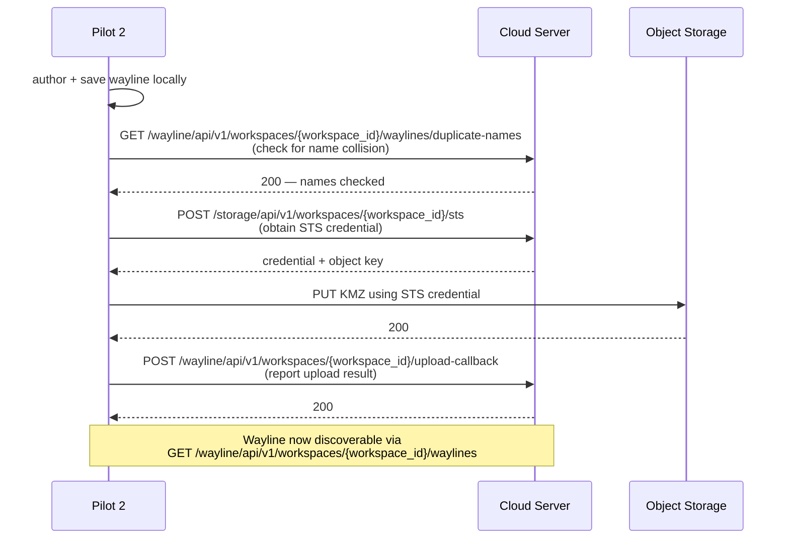
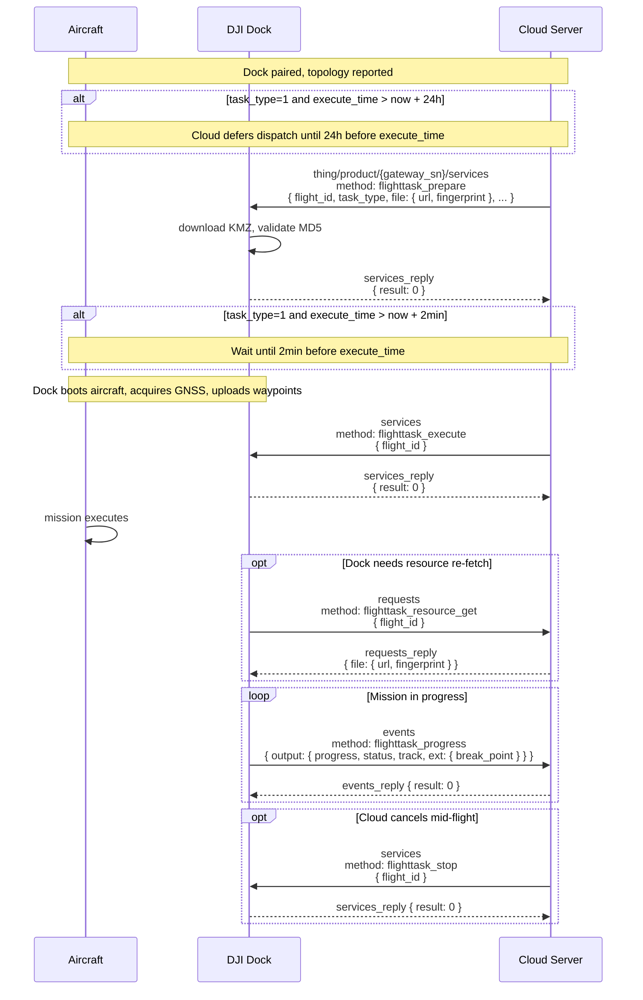
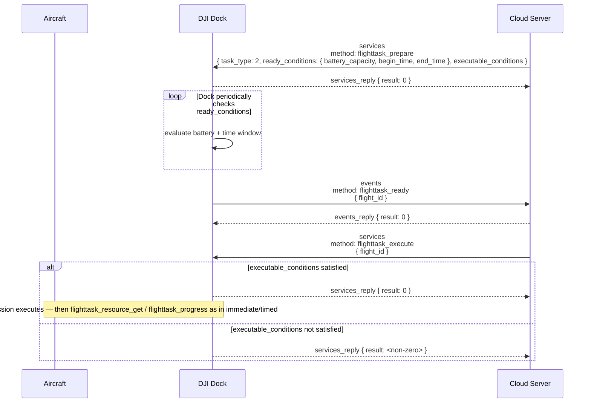

# Wayline upload and mission execution

How a KMZ wayline file gets from authoring (Pilot 2 or server-side) into the cloud, then dispatched to a Dock-scheduled aircraft for execution — prepare → execute → progress → completion, with variants for immediate / timed / conditional tasks, breakpoint resume, and pause / recovery.

Part of the Phase 9 workflow catalog. Schema bodies live in Phase 3 (HTTP) / Phase 4 (MQTT) / Phase 7 (WPML).

---

## Scope

| Aspect | Value |
|---|---|
| Cohorts | **Dock-scheduled missions** — Dock 2 (with M3D / M3TD) and Dock 3 (with M4D / M4TD). Pilot-path authoring covers all four aircraft via RC Plus 2 / RC Pro. |
| Direction | HTTPS upload (Pilot 2 → cloud → OSS). MQTT cloud → dock for mission dispatch. MQTT dock → cloud for progress / events. |
| Transports | **HTTPS** (wayline authoring + list + download + upload-callback). **MQTT** (mission prepare / execute / progress / cancel / pause / recovery). **Object storage** (STS-credentialed upload / download). |
| Preceding workflow | [`dock-bootstrap-and-pairing.md`](dock-bootstrap-and-pairing.md) and [`device-binding.md`](device-binding.md) must have landed — the dock must be bound and topology-reported before it can accept a mission. |
| Related catalog entries | Phase 3 wayline: [`list`](../http/wayline/list.md) · [`download`](../http/wayline/download.md) · [`upload-callback`](../http/wayline/upload-callback.md) · [`duplicate-name`](../http/wayline/duplicate-name.md) · [`favorites-add`](../http/wayline/favorites-add.md) · [`favorites-remove`](../http/wayline/favorites-remove.md) · [`storage/sts-credential`](../http/storage/sts-credential.md). Phase 4b services: [`flighttask_prepare`](../mqtt/dock-to-cloud/services/flighttask_prepare.md) · [`flighttask_execute`](../mqtt/dock-to-cloud/services/flighttask_execute.md) · [`flighttask_undo`](../mqtt/dock-to-cloud/services/flighttask_undo.md) · [`flighttask_pause`](../mqtt/dock-to-cloud/services/flighttask_pause.md) · [`flighttask_recovery`](../mqtt/dock-to-cloud/services/flighttask_recovery.md) · [`flighttask_stop`](../mqtt/dock-to-cloud/services/flighttask_stop.md) · [`return_home`](../mqtt/dock-to-cloud/services/return_home.md) · [`return_home_cancel`](../mqtt/dock-to-cloud/services/return_home_cancel.md) · [`return_specific_home`](../mqtt/dock-to-cloud/services/return_specific_home.md) · [`in_flight_wayline_deliver`](../mqtt/dock-to-cloud/services/in_flight_wayline_deliver.md) + [`_stop`](../mqtt/dock-to-cloud/services/in_flight_wayline_stop.md) / [`_recover`](../mqtt/dock-to-cloud/services/in_flight_wayline_recover.md) / [`_cancel`](../mqtt/dock-to-cloud/services/in_flight_wayline_cancel.md). Phase 4b events: [`flighttask_ready`](../mqtt/dock-to-cloud/events/flighttask_ready.md) · [`flighttask_progress`](../mqtt/dock-to-cloud/events/flighttask_progress.md) · [`return_home_info`](../mqtt/dock-to-cloud/events/return_home_info.md) · [`device_exit_homing_notify`](../mqtt/dock-to-cloud/events/device_exit_homing_notify.md) · [`in_flight_wayline_progress`](../mqtt/dock-to-cloud/events/in_flight_wayline_progress.md). Phase 4b requests: [`flighttask_resource_get`](../mqtt/dock-to-cloud/requests/flighttask_resource_get.md) · [`flighttask_progress_get`](../mqtt/dock-to-cloud/requests/flighttask_progress_get.md). Phase 7: [`wpml/overview.md`](../wpml/overview.md) for the KMZ file format. |

## Overview

A wayline mission cycles through four phases:

1. **Author + upload.** A KMZ file (`template.kml` + `waylines.wpml` zipped per Phase 7) is produced. Pilot 2 users author in-app and upload via HTTPS + STS-credentialed object storage. Server-authored missions skip the upload step and publish the KMZ to object storage directly.
2. **Dispatch.** Cloud sends [`flighttask_prepare`](../mqtt/dock-to-cloud/services/flighttask_prepare.md) to the dock with a URL + MD5 fingerprint + task parameters. Dock downloads the KMZ and validates it.
3. **Execute + report.** Cloud sends [`flighttask_execute`](../mqtt/dock-to-cloud/services/flighttask_execute.md). Dock opens cover, aircraft takes off, flies the wayline. Dock pulls the resource via [`flighttask_resource_get`](../mqtt/dock-to-cloud/requests/flighttask_resource_get.md) if it needs re-fetch. The aircraft streams [`flighttask_progress`](../mqtt/dock-to-cloud/events/flighttask_progress.md) at a recurring cadence with position, wayline index, and breakpoint info.
4. **Terminate.** Task ends by reaching the last waypoint (normal completion), cloud cancellation ([`flighttask_undo`](../mqtt/dock-to-cloud/services/flighttask_undo.md) pre-execution / [`flighttask_stop`](../mqtt/dock-to-cloud/services/flighttask_stop.md) mid-execution), or a fault triggering return-to-home. Breakpoint data is persisted in the final `flighttask_progress` for potential resume.

## Actors

| Actor | Role |
|---|---|
| **Aircraft** | Executes the wayline. Reports progress through the dock. Never talks directly to cloud for dock-scheduled missions. |
| **DJI Dock** | Owns `{gateway_sn}` for all mission-related MQTT traffic. Downloads KMZ, validates, relays commands to aircraft, streams progress. |
| **Pilot 2 (optional)** | Authors waylines; uploads via HTTPS. Does not participate in dock-scheduled mission execution. |
| **Cloud Server** | Dispatches `flighttask_prepare` / `_execute`, consumes events, exposes HTTPS endpoints for Pilot 2 authoring. |
| **Object Storage** | Hosts KMZ files. Cloud issues short-lived STS credentials; dock and Pilot 2 transact directly against storage. |

## Sequence

### Pilot 2 wayline upload (HTTPS)

### Immediate / timed task (MQTT)

### Conditional task

## Step-by-step

### 1. Author + upload (Pilot 2 path only)

- **KMZ structure** per [`wpml/overview.md`](../wpml/overview.md): zipped archive containing `wpmz/template.kml` + `wpmz/waylines.wpml` (+ optional resources).
- **Upload flow** (see [Pilot 2 wayline feature-set](../../Cloud-API-Doc/docs/en/30.feature-set/10.pilot-feature-set/60.pilot-wayline-management.md)):
  1. `GET /wayline/api/v1/workspaces/{workspace_id}/waylines/duplicate-names` — [`duplicate-name`](../http/wayline/duplicate-name.md) — checks for naming collision.
  2. `POST /storage/api/v1/workspaces/{workspace_id}/sts` — [`sts-credential`](../http/storage/sts-credential.md) — obtains short-lived object-storage credential + object key.
  3. Direct PUT to object storage using the credential.
  4. `POST /wayline/api/v1/workspaces/{workspace_id}/upload-callback` — [`upload-callback`](../http/wayline/upload-callback.md) — reports upload result so cloud can persist metadata.
- **Server-authored missions** skip Pilot 2 entirely. The cloud writes the KMZ to its own object storage out-of-band, then issues `flighttask_prepare` with the resulting URL.
- **Discovery** (Pilot 2): `GET /wayline/api/v1/workspaces/{workspace_id}/waylines` ([`list`](../http/wayline/list.md)) for browsing; `GET .../waylines/{wayline_id}/url` ([`download`](../http/wayline/download.md)) for re-download; `POST .../waylines/favorites` ([`favorites-add`](../http/wayline/favorites-add.md)) + `DELETE` ([`favorites-remove`](../http/wayline/favorites-remove.md)) for starring.

### 2. Dispatch — `flighttask_prepare`

- **Topic (down):** `thing/product/{gateway_sn}/services`. **Method:** `flighttask_prepare`. Full schema: [`flighttask_prepare.md`](../mqtt/dock-to-cloud/services/flighttask_prepare.md).
- **`task_type` enum** — `0` immediate, `1` timed, `2` conditional.
- **`execute_time`** required for `task_type=0` / `1`. Immediate tasks have a 30 s clock-skew tolerance — if device receives the command more than 30 s after `execute_time`, it rejects the task.
- **Timed tasks**: cloud may hold dispatch until 24 h before `execute_time` (so the dock isn't sitting on a distant mission); dock holds boot until 2 min before `execute_time`.
- **`ready_conditions`** required for `task_type=2` — `{battery_capacity, begin_time, end_time}`. Dock periodically checks; when all satisfied, emits [`flighttask_ready`](../mqtt/dock-to-cloud/events/flighttask_ready.md).
- **`executable_conditions`** applies at execute time — currently just `{storage_capacity}` minimum free storage. Missing means no execution gate.
- **`file`** struct — `{url, fingerprint}`. Fingerprint is the MD5 of the KMZ. Dock downloads, validates, caches.
- **`break_point`** struct (optional) — see [breakpoint resume variant](#breakpoint-resume).
- **`rth_altitude`** range 20–1500 m. When resuming from breakpoint, this value **replaces** the `wpml:takeOffSecurityHeight` in the KMZ (per DJI feature-set note) — to reduce obstacle risk on a mid-mission resume.
- **`rth_mode`** — DJI documents `0` optimal / `1` preset; dock currently only supports preset.
- **`simulate_mission`** struct — `{is_enable, latitude, longitude, altitude}`. Simulated flights run the preparatory sequence (cover open, aircraft boot) but the aircraft does not take off. OSD still emits. Used for indoor integration testing; Dock 3 adds the `altitude` field that v1.11 Dock 2 lacked.
- **`flight_safety_advance_check`** — `0`/`1`. If `1`, dock pulls updated flight-safety files from cloud when local differs. Default `0`.

### 3. Execute — `flighttask_execute`

- **Topic (down):** `thing/product/{gateway_sn}/services`. **Method:** `flighttask_execute`. Full schema: [`flighttask_execute.md`](../mqtt/dock-to-cloud/services/flighttask_execute.md).
- **Payload minimum**: `{flight_id}` — references the already-prepared task.
- **Precondition**: dock already accepted a `flighttask_prepare` for this `flight_id`. A second `flighttask_prepare` for the same `flight_id` is **not** the right way to re-execute — use `_execute` against the existing preparation.
- **Behavior**: if `task_type=2`, `_execute` is rejected until `ready_conditions` + `executable_conditions` are both satisfied.
- **Concurrency**: if the aircraft is already executing a wayline and receives a second `_execute`, the second is rejected — per DJI's own note in the feature-set page.

### 4. Resource fetch — `flighttask_resource_get`

- **Topic (up):** `thing/product/{gateway_sn}/requests`. **Method:** `flighttask_resource_get`. Full schema: [`flighttask_resource_get.md`](../mqtt/dock-to-cloud/requests/flighttask_resource_get.md).
- Device-initiated. Dock asks cloud for the current `file` struct for a given `flight_id`. Used when dock needs to re-download the KMZ (cache flush, URL expiry, etc.). Cloud replies with the same `{url, fingerprint}` shape as `flighttask_prepare.file`.

### 5. Progress reporting — `flighttask_progress`

- **Topic (up):** `thing/product/{gateway_sn}/events`. **Method:** `flighttask_progress`. Full schema: [`flighttask_progress.md`](../mqtt/dock-to-cloud/events/flighttask_progress.md).
- Reported at a recurring cadence during execution. Payload includes `{progress, status, track, ext: {break_point}}`.
- **Breakpoint fields** ride inside `ext.break_point` — `{index, state, progress, wayline_id}`. Cloud should persist the latest breakpoint per `flight_id` to enable resume-from-breakpoint.
- **Cloud-initiated polling** available via [`flighttask_progress_get`](../mqtt/dock-to-cloud/requests/flighttask_progress_get.md) — rarely needed because the push cadence covers the common case.

### 6. Cancellation / pause / stop

Three distinct operations with different scopes:

| Operation | Schema | Scope |
|---|---|---|
| **Cancel pre-execution** | [`flighttask_undo`](../mqtt/dock-to-cloud/services/flighttask_undo.md) | Removes the assignment before `flighttask_execute` has fired. Supports batch cancel. Cannot cancel an already-executing mission. |
| **Pause mid-execution** | [`flighttask_pause`](../mqtt/dock-to-cloud/services/flighttask_pause.md) | Aircraft hovers in place. Resume with [`flighttask_recovery`](../mqtt/dock-to-cloud/services/flighttask_recovery.md). |
| **Stop mid-execution** | [`flighttask_stop`](../mqtt/dock-to-cloud/services/flighttask_stop.md) | Aborts the mission; aircraft returns to home. Breakpoint info preserved for later resume. |

### 7. Return-to-home controls

Auxiliary services that manipulate RTH independently of mission state:

- [`return_home`](../mqtt/dock-to-cloud/services/return_home.md) — force RTH now.
- [`return_home_cancel`](../mqtt/dock-to-cloud/services/return_home_cancel.md) — cancel an active RTH (used to recover if RTH was triggered erroneously).
- [`return_specific_home`](../mqtt/dock-to-cloud/services/return_specific_home.md) — return to a named home point (alternate dock / specific coordinate).
- [`return_home_info`](../mqtt/dock-to-cloud/events/return_home_info.md) event — streamed during RTH with distance + ETA.
- [`device_exit_homing_notify`](../mqtt/dock-to-cloud/events/device_exit_homing_notify.md) — fired when aircraft enters/exits the **RTH-exiting state** (obstacle avoidance triggered during RTH). Cloud should surface this to an operator because manual intervention may be required to bring the aircraft out of the state.

### 8. In-flight wayline modification (Dock 3 / M4 cohort)

The cloud can push a replacement wayline mid-flight without reseating a full prepare/execute:

- [`in_flight_wayline_deliver`](../mqtt/dock-to-cloud/services/in_flight_wayline_deliver.md) — swap wayline on a running mission.
- [`in_flight_wayline_stop`](../mqtt/dock-to-cloud/services/in_flight_wayline_stop.md) — abort the in-flight delivery.
- [`in_flight_wayline_recover`](../mqtt/dock-to-cloud/services/in_flight_wayline_recover.md) — resume after a paused in-flight delivery.
- [`in_flight_wayline_cancel`](../mqtt/dock-to-cloud/services/in_flight_wayline_cancel.md) — cancel the in-flight delivery.
- [`in_flight_wayline_progress`](../mqtt/dock-to-cloud/events/in_flight_wayline_progress.md) — progress stream for the in-flight-delivered wayline.

Feature is Dock-3-primary in v1.15 sources; Dock 2 support is limited — per-method docs flag cohort.

## Variants

### Immediate task (`task_type=0`)

Simplest variant. `execute_time` must be within 30 s of current device time. Dock boots aircraft immediately, executes. Used for operator-initiated ad-hoc missions.

### Timed task (`task_type=1`)

Cloud dispatches `flighttask_prepare` ahead of schedule; dock + aircraft stay idle until close to `execute_time`. Cloud may defer dispatch up to 24 h before; dock defers boot until 2 min before. Useful for scheduled daily patrols.

### Conditional task (`task_type=2`)

`ready_conditions` + `executable_conditions` gate execution. `flighttask_ready` event fires when ready; cloud must still send `flighttask_execute`. Used for condition-driven missions (battery above threshold + weather window).

### Breakpoint resume

When a mission terminates early (manual stop, weather, battery), `flighttask_progress` carries `ext.break_point` with the last executed waypoint index + local progress. To resume: cloud issues a new `flighttask_prepare` with the saved `break_point` struct. Aircraft flies to the breakpoint waypoint, then continues the wayline. **Crucial**: `rth_altitude` in the new prepare replaces the KMZ's `wpml:takeOffSecurityHeight` to avoid obstacle risk — DJI calls this out explicitly in the feature-set page.

### Simulated flight

`simulate_mission.is_enable: 1` runs the full choreography — cover open, aircraft boot, OSD stream — but the aircraft stays on the ground. Dock 3 adds `altitude`. Props should be removed. Note: RTK is not used in simulated flights; if the next flight is outdoor, stable RTK must re-acquire before launch.

### Pilot-side wayline authoring only

If the mission is flown manually by an operator with Pilot 2 (no dock), the MQTT choreography here does not apply. The pilot-path authoring endpoints (Pilot 2 HTTPS) still populate the same workspace wayline library — see the pilot feature-set page for authoring flow. Dock-to-cloud execution is dock-only.

## Error paths

| Failure | Signal | Handling |
|---|---|---|
| KMZ download or MD5 mismatch | `flighttask_prepare` `services_reply.result: <non-zero>` | Cloud re-issues with correct URL / fingerprint, or refreshes STS credential. Errors cluster in BC module `517` (`WaylineErrorCodeEnum`) — see [`error-codes/README.md`](../error-codes/README.md). |
| Duplicate `flight_id` already executing | `flighttask_execute` `services_reply.result: <non-zero>` | Caller should query task state before re-dispatch. |
| Timed task clock skew > 30 s on immediate | `services_reply` error from dock | Cloud checks device OSD heartbeat to estimate skew before dispatch. |
| `ready_conditions` never met within window | Task silently stays pending until `end_time`, then rejected | Cloud should age out conditional missions; optionally pre-cancel via `flighttask_undo`. |
| Aircraft enters RTH-exiting state (obstacle during RTH) | `device_exit_homing_notify` event with entry | Surface to operator; manual RTH re-issue may be required. |
| Mid-flight link loss | Cloud loses OSD + progress; dock continues executing per `exit_wayline_when_rc_lost` + `out_of_control_action` | On reconnection, dock resumes progress stream. Breakpoint is in the last delivered `flighttask_progress` before the outage. |
| Wayline KMZ rejects per WPML validation | Dock emits `flighttask_progress` with error status | Validate authored KMZ client-side before upload. See Phase 7 [`wpml/overview.md`](../wpml/overview.md). |

## Provenance

| Source | Role |
|---|---|
| `[Cloud-API-Doc/docs/en/30.feature-set/20.dock-feature-set/50.dock-wayline-management.md]` | v1.11 DJI dock wayline feature-set — authoritative choreography source (two sequence diagrams: immediate/timed + conditional). |
| `[Cloud-API-Doc/docs/en/30.feature-set/10.pilot-feature-set/60.pilot-wayline-management.md]` | v1.11 DJI pilot wayline feature-set — authoritative Pilot 2 authoring narrative (HTTPS + STS + upload-callback). |
| `[DJI_Cloud/DJI_CloudAPI-Dock3-WaylineManagement.txt]` · `[DJI_CloudAPI-Dock2-Wayline-Management.txt]` | v1.15 wire-level method definitions. |
| `[DJI_Cloud/DJI_CloudAPI_Pilot-HTTPS-Waypoint-*.txt]` | v1.15 Pilot-HTTPS endpoints. |
| [`master-docs/http/wayline/`](../http/wayline/) | Phase 3 HTTP wayline endpoints. |
| [`master-docs/http/storage/sts-credential.md`](../http/storage/sts-credential.md) | Phase 3 STS credential endpoint. |
| [`master-docs/mqtt/dock-to-cloud/services/`](../mqtt/dock-to-cloud/services/) · [`events/`](../mqtt/dock-to-cloud/events/) · [`requests/`](../mqtt/dock-to-cloud/requests/) | Phase 4b wayline method catalog (21 methods). |
| [`master-docs/wpml/`](../wpml/) | Phase 7 KMZ / WPML file-format reference. |
| [`master-docs/error-codes/README.md`](../error-codes/README.md) | Phase 8 wayline error codes (BC module `517` = `WaylineErrorCodeEnum`). |
